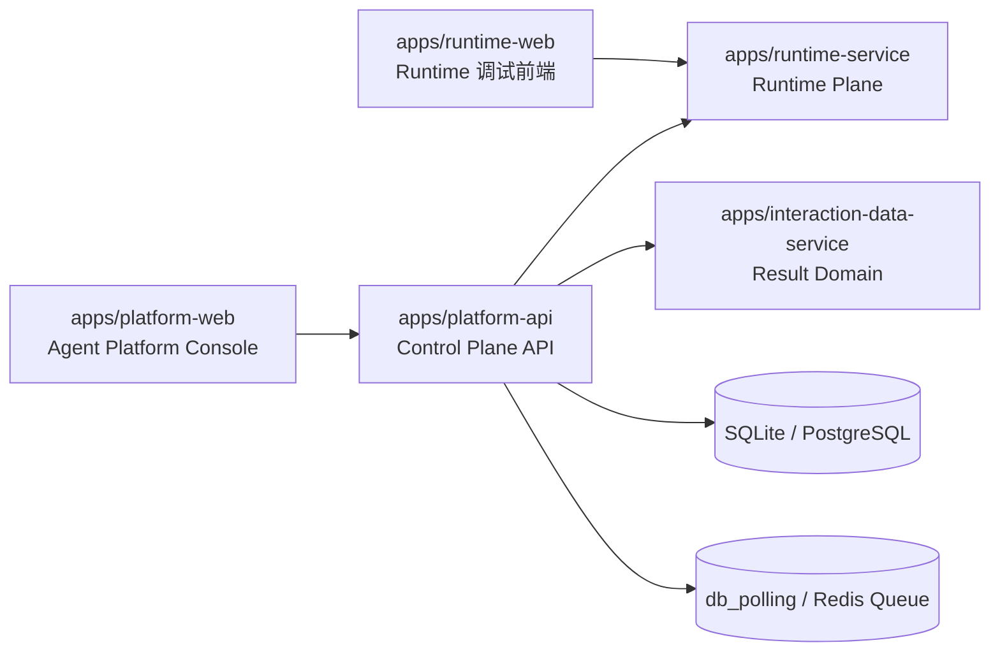

# Platform API 架构说明

文档类型：`Current Architecture`

本文说明 `platform-api` 作为当前正式 control plane 的服务级架构；它描述的是服务边界和当前组织方式，不替代仓库级正式部署 contract。

这份文档只回答一个问题：

> `apps/platform-api` 这套正式平台控制面是如何组织和演进的。

## 1. 服务定位

`platform-api` 是当前正式平台控制面后端。

它负责：

- 平台级身份与授权
- 项目、成员、Agent、catalog 等控制面主数据
- 受控访问 runtime upstream
- 审计、公告、配置、operation/job
- 对前端 `apps/platform-web` 提供稳定平台契约

它不负责：

- 智能体 graph 运行逻辑
- tool / MCP 装配逻辑
- 模型选择执行逻辑
- testcase 结果域真实存储

## 2. 服务边界

### 2.1 整体架构图



### 2.2 上游与下游关系

```text
platform-web
  -> platform-api
       -> platform postgres
       -> runtime-service
       -> interaction-data-service
       -> future: redis / worker / notification adapters
```

### 2.3 三条原则

- `platform-api` 只做 control plane
- `runtime-service` 继续做 runtime plane
- `interaction-data-service` 继续做结果域服务

### 2.4 数据库策略

当前数据库策略直接定死：

- `platform-api` 默认使用独立数据库或独立 schema
- 物理表名复用以当前语义清晰稳定为前提
- 新模块按当前标准组织，字段语义必须保持清晰稳定

这意味着：

- control-plane 数据边界独立维护
- 数据演进采用显式变更，不做“同库盲共存”
- 审计、权限、operation 这些治理能力以后接 PostgreSQL / Redis / queue 时不用推翻重来

## 3. 代码结构

```text
app/
  core/
  modules/
  adapters/
  entrypoints/
```

### 3.1 `core/`

全局共享但不属于某个具体业务模块的能力：

- settings
- request context
- actor context / project context / tenant context
- security primitives
- db session / unit of work
- shared errors
- observability

### 3.2 `modules/`

所有业务都按领域模块组织。

当前目标模块：

- `identity`
- `iam`
- `tenants`
- `projects`
- `agents`（实现目录当前保留 `assistants` 兼容路径）
- `runtime_catalog`
- `runtime_gateway`
- `testcase`
- `announcements`
- `audit`
- `operations`

每个模块最终都要收敛成四层：

```text
module/
  domain/
  application/
  infra/
  presentation/
```

### 3.3 `adapters/`

所有外部系统接入统一收在这里。

当前已确认的 adapter 方向：

- `langgraph`
- `interaction_data`

后续可扩展：

- `redis`
- `notifications`
- `object_storage`
- `oidc`

### 3.4 `entrypoints/`

入口层只负责协议接入：

- `http/`
- `worker/`

入口层不允许承接复杂业务逻辑。

## 4. 模块职责

### 4.1 `identity`

负责：

- 登录
- refresh token
- 修改密码
- 当前用户资料

不负责：

- 项目权限判定
- project membership

### 4.2 `iam`

负责：

- 平台级角色
- 项目级角色
- 权限判定策略
- 授权依赖与 policy helper

当前必须明确分开两层：

- 平台级：如 `platform_super_admin`
- 项目级：如 `project_admin/project_editor/project_executor`

### 4.3 `projects`

负责：

- 项目主数据
- 项目成员关系
- 项目级治理边界

### 4.4 Agent（公开模块名 `agents`，实现目录 `assistants` 兼容）

负责：

- 平台 Agent 主数据，稳定执行键为 `agent_key = graph_id`
- Agent 配置与治理字段
- 旧 `assistant` 字段和 URL 仅作有 fixture 支撑的读取兼容

当前实现暂保留 `assistants` 目录和 Python 符号，避免历史导入与数据迁移产生无证据破坏；新接口
统一使用 `/agents` 路径，且不再创建、更新或删除 GraphHarbor upstream Assistant。后续只有在历史
fixture 和 migration 证据齐备后，才允许物理迁移目录和删除兼容字段。

不负责：

- 真正执行 run
- 真正管理 thread 历史

### 4.5 `runtime_catalog`

负责：

- `graph/model/tool` catalog snapshot
- 项目级 policy overlay

不负责：

- 替代 runtime 成为执行真相源

### 4.6 `runtime_gateway`

负责：

- 受控代理 LangGraph upstream
- 上下文注入
- 项目边界校验
- 统一错误映射
- SSE / streaming 包装

### 4.7 `testcase`

负责：

- testcase 平台管理接口
- 协议整形
- 导出聚合
- interaction-data-service 权限边界收口

不负责：

- 结果域主数据持久化

### 4.8 `announcements`

负责：

- 公告中心
- 公告可见性
- 公告读状态

### 4.9 `audit`

负责：

- 审计事件模型
- 审计查询
- action/plane/target 标准

### 4.10 `operations`

负责：

- 长任务状态
- 后台执行协调
- 重试/取消/失败归档

优先纳入：

- catalog refresh
- export
- future batch sync

## 5. 权限模型

### 5.1 平台级权限

至少保留：

- `platform_super_admin`
- `platform_operator`
- `platform_viewer`

### 5.2 项目级权限

至少保留：

- `project_admin`
- `project_editor`
- `project_executor`

### 5.3 设计铁律

- 项目级 admin 不等于平台级 admin
- 平台级资源和项目级资源必须分开授权
- 不能再出现“任一项目 admin 可全局管理用户”的情况

## 6. 审计模型

### 6.1 plane

后续统一三类：

- `control_plane`
- `runtime_gateway`
- `system_internal`

### 6.2 action

action 必须语义化，例如：

- `identity.login.succeeded`
- `project.member.upserted`
- `agent.created`（历史 `assistant.created` 仅作审计兼容）
- `catalog.graph.refresh_requested`
- `runtime.run.created`

### 6.3 target

至少保留：

- `target_type`
- `target_id`
- `project_id`
- `tenant_id`
- `actor_user_id`
- `request_id`

## 7. 分布式演进预留

`platform-api` 设计时要默认允许以后接入：

- Redis
- worker
- task queue
- metrics / trace

所以当前目录和模块要保证：

- API 层无状态
- 业务层不依赖 FastAPI `Request`
- 长任务可抽象为 `operation/job`
- adapter 层可替换

## 8. 前端对接边界

当前拍板：

- 继续使用 `apps/platform-web` 作为唯一正式前端宿主
- 前端通过服务层与契约接入 `platform-api`
- 不新增并行的正式前端宿主

原因：

- 避免双份前端维护
- 避免模板、组件、样式体系再分叉
- 把演进重点集中在控制面后端与稳定契约

## 9. 当前不追求的事情

- 不追求先拆微服务
- 不追求先上复杂消息总线
- 不追求为了兼容遗留 API 而让当前结构妥协
- 不追求重复复制现有模块目录

## 10. 当前阶段的验收标准

第一阶段只要求做到：

- 新控制面应用目录和文档入口完整
- 模块边界定义明确
- 后续实现都能按模块化单体方式落地
- 前端切换策略与重构顺序明确
