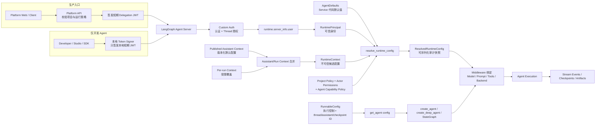

# RuntimeContext、运行时配置与本地调试架构设计（Draft）

> 文档类型：Draft
>
> 状态：讨论结论，暂不替代 `docs/standards/` 下的现行规范
>
> 关联文档：`11-agent-service-directory-architecture.md`
>
> 后续精确契约：五类类型、Policy snapshot 和 Resolver 失败语义以
> `14-runtime-contracts-and-resolution-design.md` 为准
>
> 冻结范围：身份、Assistant/Run Context、配置决议、运行快照与 Agent 独立调试
>
> 暂不展开：Policy 数据存储、控制面 UI、可观测实现和 Legacy 迁移

## 1. 本轮结论

目标架构不再让一个 `RuntimeContext` 同时承担身份、权限和用户可配置参数。运行时输入
拆成五个来源，各自只有一个职责：

| 输入 | 职责 | 是否可信 | 生命周期 |
| --- | --- | --- | --- |
| `RuntimePrincipal` | 用户、租户、项目、角色和权限 | 是，只来自 Agent Server Auth | Request / Run |
| `RuntimeContext` | 模型参数和 Optional Tools 等可配置依赖 | 否，必须校验和授权 | Assistant + Run |
| `RunnableConfig` | 执行控制、trace 和 Agent Server 生成的 ID | 部分可信，按字段判断 | Run |
| `AgentDefaults` | Service 代码中的默认模型、Prompt 和工具策略 | 是，随部署版本发布 | Deployment |
| `ResolvedRuntimeConfig` | 本次 Run 的有效、可序列化决议结果 | 是，由公共 resolver 生成 | Run snapshot |

核心规则：

1. `runtime.server_info.user` 是正式执行链路唯一可信身份源，并转换为
   `RuntimePrincipal`。
2. `runtime.context` 只表示 Assistant/Run 提供的可配置依赖，不再用于认证。
3. 目标架构删除公共 `configurable.platform_runtime`；模型、生成参数和 Optional Tools
   回到真正的 `RuntimeContext`。
4. `config.configurable` 只保留 `thread_id`、`assistant_id`、`checkpoint_id` 和确实只能在
   graph factory 阶段使用的少量 Service 私有字段。
5. Run 不允许直接覆盖完整 `system_prompt`。Prompt 由 Service 版本管理；以后确有需求时，
   只开放受策略约束的 Prompt Profile，而不是任意文本注入。
6. Runtime resolver 必须严格拒绝未知字段，不能像当前 `coerce_runtime_options()` 一样静默
   丢弃拼错的参数。
7. 本地调试不建立第二套业务协议，也不允许请求通过 `platform_local_debug=true` 自行打开
   信任旁路。

本文描述目标架构，不兼容当前 Legacy Agent，也不要求迁移现有 Service。

## 2. 整体链路

生产调用和 Agent 独立调试在进入 Agent Server 前来源不同，进入后必须走同一条链：



这张图有两个关键含义：

- 本地开发只替换“谁签发调用凭证”，不替换 Agent Server、Auth、resolver、middleware 和
  graph。
- `get_agent(config)` 负责图和构图期资源，`resolve_runtime_config(...)` 负责每次 Run 的
  模型、Prompt、工具和权限决议，二者不能揉成万能 Builder。

## 3. 核心类型伪代码

以下代码只表达契约，不是最终实现文件：

```python
from dataclasses import dataclass


@dataclass(frozen=True)
class RuntimePrincipal:
    """只由 Agent Server Auth 创建，调用方不能通过 context 伪造。"""

    user_id: str
    tenant_id: str
    project_id: str
    role: str
    permissions: frozenset[str]


@dataclass(frozen=True)
class RuntimeContext:
    """Assistant/Run 可配置依赖；所有字段都必须经过 policy。"""

    model_id: str | None = None
    temperature: float | None = None
    max_tokens: int | None = None
    top_p: float | None = None
    tools: tuple[str, ...] | None = None


@dataclass(frozen=True)
class AgentDefaults:
    model_id: str
    prompt_version: str
    system_prompt: str
    temperature: float | None = None
    max_tokens: int | None = None
    top_p: float | None = None
    optional_tool_names: tuple[str, ...] = ()


@dataclass(frozen=True)
class ResolvedRuntimeConfig:
    """可序列化决议，不保存 Model、Tool、Client 或 secret 对象。"""

    principal: RuntimePrincipal
    model_id: str
    temperature: float | None
    max_tokens: int | None
    top_p: float | None
    prompt_version: str
    prompt_hash: str
    optional_tool_names: tuple[str, ...]
    policy_version: str
    config_hash: str
```

公共 `RuntimeContext` 只放多个 Service 都真正需要的字段。某个新 Service 第一次出现真实
私有业务参数时，在该 Service 的 `schemas.py` 定义自己的 context schema；不要提前增加
`extensions: dict`、`extra: Any` 或一个包打天下的参数袋。

## 4. Assistant Context 与 Run Context

### 4.1 语义

```text
Service Defaults
  <- Published Assistant Context
  <- Per-run Context Override
  = Candidate RuntimeContext
```

- Assistant Context 是发布配置，随 Assistant 版本保存，适合模型和默认 Optional Tools。
- Run Context 只覆盖本次执行；字段缺省时继承 Assistant Context。
- 列表采用整体替换，不做隐式追加。
- `tools` 缺省表示沿用 Assistant/Service 默认 Optional Tools。
- `tools=[]` 表示本次禁用全部 Optional Tools。
- Required Tools 是 Agent 正确运行所必需的能力，不受 `tools` 控制。

LangGraph 官方明确支持 Assistant 持久化 context、Assistant 版本和 per-run context。目标实现
必须用集成测试确认当前锁定版本对 Assistant/Run context 的具体合并行为。如果上游行为与
上述字段级覆盖契约不一致，应在唯一的 Platform Gateway 入口物化完整 context，不能让每个
Agent 自己发明合并规则。

### 4.2 为什么不保存 Thread Settings

Open SWE 会把模型、Subagent 模型和仓库说明冻结成 Thread Settings Snapshot，这是因为它的
Thread 是多人参与、长期存在的 GitHub/Slack 工作单元。该需求不是所有 Agent Service 的
共同事实。

目标架构 v1 不增加公共 Thread Settings 层：

- Assistant Context 管长期默认值和版本；
- Run Context 管本次显式覆盖；
- `ResolvedRuntimeConfig` 记录本次实际使用的结果；
- 只有某个 Service 出现“同一 Thread 必须冻结业务设置”的真实需求时，才在该 Service 内
  增加线程快照。

## 5. 配置决议伪代码

### 5.1 主决议器

```python
def resolve_runtime_config(
    *,
    runtime: Runtime,
    defaults: AgentDefaults,
    project_policy: ProjectPolicy,
    agent_policy: AgentCapabilityPolicy,
) -> ResolvedRuntimeConfig:
    # 1. 身份只来自 Auth；缺字段直接失败。
    principal = RuntimePrincipal.from_server_user(
        runtime.server_info.user
    )

    # 2. context 是候选配置，未知字段和非法值直接失败。
    context = RuntimeContext.strict_validate(runtime.context)

    # 3. LangGraph Server 已应用 Assistant Context 与 Run Context；
    #    这里显式补 Service 默认值，不读取 configurable.platform_runtime。
    model_id = context.model_id or defaults.model_id
    temperature = (
        context.temperature
        if context.temperature is not None
        else defaults.temperature
    )
    max_tokens = (
        context.max_tokens
        if context.max_tokens is not None
        else defaults.max_tokens
    )
    top_p = context.top_p if context.top_p is not None else defaults.top_p
    requested_optional_tools = (
        context.tools
        if context.tools is not None
        else defaults.optional_tool_names
    )

    # 4. 模型必须同时满足项目策略、身份权限和 Agent 能力声明。
    require_allowed_model(
        model_id,
        project_policy=project_policy,
        principal=principal,
        agent_policy=agent_policy,
    )

    # 5. Optional Tools 取交集；Required Tools 不进入该列表。
    require_known_tools(
        requested_optional_tools,
        agent_policy.optional_tool_names,
    )
    optional_tools = intersect_in_request_order(
        requested_optional_tools,
        agent_policy.optional_tool_names,
        project_policy.allowed_tool_names,
        tools_allowed_for(principal),
    )

    # 6. 结果只含可序列化标识，随后才绑定真实对象。
    return ResolvedRuntimeConfig.create(
        principal=principal,
        model_id=model_id,
        temperature=temperature,
        max_tokens=max_tokens,
        top_p=top_p,
        prompt_version=defaults.prompt_version,
        prompt_hash=sha256(defaults.system_prompt),
        optional_tool_names=optional_tools,
        policy_version=project_policy.version,
    )
```

`ProjectPolicy` 和 `AgentCapabilityPolicy` 在这里表示业务规则，不表示现在就要创建两个抽象
基类。实施时先使用最小的不可变数据结构和纯函数；只有出现第二个真实实现时才抽接口。

### 5.2 运行时对象绑定

```python
async def bind_runtime_resources(
    resolved: ResolvedRuntimeConfig,
    *,
    system_prompt: str,
    required_tools: tuple[BaseTool, ...],
    optional_tool_catalog: Mapping[str, BaseTool],
) -> BoundRequest:
    require_hash_match(system_prompt, resolved.prompt_hash)
    model = resolve_model_by_id(resolved.model_id).bind(
        temperature=resolved.temperature,
        max_tokens=resolved.max_tokens,
        top_p=resolved.top_p,
    )
    optional_tools = [
        optional_tool_catalog[name]
        for name in resolved.optional_tool_names
    ]
    return BoundRequest(
        model=model,
        system_prompt=system_prompt,
        tools=dedupe_by_name([*required_tools, *optional_tools]),
    )
```

`ResolvedRuntimeConfig` 和 `BoundRequest` 必须分开。前者可审计、可 hash、可写入 Run
metadata；后者含进程内对象，只活在执行阶段。

## 6. 与 `get_agent(config)` 的边界

统一部署入口仍按 11 号文档执行：

```python
async def get_agent(config: RunnableConfig) -> Pregel:
    ...
```

静态 Agent：

```python
_AGENT = create_agent(
    model=DEFAULT_MODEL,
    tools=ALL_REGISTERED_TOOLS,
    middleware=[runtime_config_middleware],
    context_schema=RuntimeContext,
)


async def get_agent(_config: RunnableConfig) -> Pregel:
    return _AGENT
```

需要 Thread Sandbox 的动态 Agent：

```python
async def get_agent(config: RunnableConfig) -> Pregel:
    thread_id = require_server_id(config, "thread_id")
    backend = await get_or_create_thread_backend(thread_id)
    return create_deep_agent(
        model=DEFAULT_MODEL,
        tools=ALL_REGISTERED_TOOLS,
        middleware=[runtime_config_middleware],
        backend=backend,
        context_schema=RuntimeContext,
    )
```

`get_agent` 可以读取构图期必需的 `thread_id` / `assistant_id`，但不能从
`config.configurable` 解析身份、模型、Prompt 和工具权限。动态 factory 也不能因为 schema
探测、状态读取而创建 Sandbox；需要资源 setup/teardown 时，按官方 graph factory 的
`ServerRuntime.execution_runtime` 语义单独评审 async context manager factory。

## 7. Prompt 与 Tools 契约

### 7.1 Prompt

目标 v1：

- `system_prompt` 属于 Service 发布版本；
- Assistant/Run Context 不接受完整 `system_prompt`；
- 运行快照保存 `prompt_version + prompt_hash`，不保存重复的完整 Prompt；
- 将来需要业务配置时，新增有限的 `prompt_profile_id`，由 Service 映射到已审核模板。

用户输入和任务说明仍然进入 messages/state，它们不是 System Prompt 覆盖。

### 7.2 Tools

```text
Effective Tools
  = Required Tools
  + Requested Optional Tools
      ∩ Agent Optional Tools
      ∩ Project Allowed Tools
      ∩ Actor Permissions
      ∩ Approval State
```

规则：

- Tool catalog 是部署时注册的稳定全集；Run 只能选，不能上传实现。
- Optional Tool 在模型调用和实际 Tool 调用前都要重新检查，防止恢复 Run 后权限已经变化。
- 未知 Tool 名称直接报错；无权限 Tool 不能静默加入，也不能只从模型可见列表隐藏而保留
  执行通道。
- Service 私有字段如 `multimodal_parser_model_id` 不进入公共 RuntimeContext。

## 8. Run 快照与可重放性

每个 Run 至少记录：

```text
graph_id + deployment/version
assistant_id + assistant_version
model_id + generation params
prompt_version + prompt_hash
effective optional tool names
policy_version
runtime config hash
principal user_id / tenant_id / project_id
```

不记录：

- API Key、OAuth Token、Delegation JWT；
- 完整 System Prompt；
- Model、Tool、Backend、Client 等 Python 对象；
- 原始权限对象或无关个人信息。

快照用于审计和解释“当时为何这样运行”，不保证外部模型和第三方 API 永远可位级重放。

## 9. 不经过 Platform API 的 Agent 调试

### 9.1 两档调试

| 档位 | 用途 | 是否启动 Agent Server | 身份来源 |
| --- | --- | --- | --- |
| 本地单元/组件测试 | resolver、Prompt、Tool、factory 和图加载 | 否 | 测试 fixture |
| 本地真实运行 | stream、checkpoint、interrupt、subagent、Auth 和 middleware | 是，`langgraph dev` | 本地短期 Delegation JWT |

直接调用适合快速定位纯逻辑：

```python
def test_runtime_resolution():
    runtime = fake_runtime(
        authenticated_user={
            "identity": "debug-user",
            "tenant_id": "debug-tenant",
            "project_id": "debug-project",
            "role": "developer",
            "permissions": ["agent:run", "tool:search"],
        },
        context={"model_id": "debug-model", "tools": []},
    )
    resolved = resolve_runtime_config(
        runtime=runtime,
        defaults=TEST_DEFAULTS,
        project_policy=TEST_POLICY,
        agent_policy=TEST_AGENT_POLICY,
    )
    assert resolved.principal.project_id == "debug-project"
```

fixture 只能位于 tests，不得进入 production resolver 的 fallback 分支。

### 9.2 本地真实运行

真实模型 E2E 与 fake model 单测分开执行。fake model 只用于快速验证 Graph 组合和失败分支；
涉及模型输出、消息协议或多模态解析的 E2E 必须调用真实中转模型：文本 Agent 使用
`DEEPSEEK_PROXY_URL`、`DEEPSEEK_PROXY_API_KEY`、`DEEPSEEK_PROXY_DEFAULT_MODEL`，多模态能力
使用 `GPT_PROXY_URL`、`GPT_PROXY_API_KEY`、`GPT_PROXY_DEFAULT_MODEL`。这些变量从本机
`~/.my_best/.env` 注入到未跟踪的 `apps/runtime-service/.env`，密钥不得写入文档、测试 fixture
或日志。

只有显式设置 `RUNTIME_E2E=1` 才运行真实模型 E2E。凭据缺失时测试必须报告“未执行”并使 E2E
门禁失败，不能自动降级为 fake model。

目标开发流程：

```text
1. 使用专用本地 secret 和 `local-runtime-debug` issuer 启动 langgraph dev
2. 公共 debug helper 签发 10~15 分钟的本地 Delegation JWT
3. Studio / SDK 携带 Authorization: Bearer <token>
4. 直接调用本地 Agent Server 的 graph_id
5. 观察 stream、checkpoint、interrupt、subagent namespace 和 LangSmith trace
```

命令形态如下，具体脚本在实施阶段创建：

```bash
# Terminal A：只启动 runtime-service，不启动 platform-api
PLATFORM_RUNTIME_DELEGATION_SECRET="<at-least-32-byte-local-only-secret>" \
PLATFORM_RUNTIME_DELEGATION_ISSUER="local-runtime-debug" \
uv run langgraph dev \
  --config langgraph.json \
  --port 8123 \
  --no-browser

# Terminal B：签发短期本地凭证；脚本不得支持生产 issuer/secret
uv run python scripts/issue_local_delegation.py \
  --user-id debug-user \
  --tenant-id debug-tenant \
  --project-id debug-project
```

SDK 调用伪代码：

```python
from langgraph_sdk import get_client

client = get_client(
    url="http://127.0.0.1:8123",
    api_key=None,
    headers={"Authorization": f"Bearer {local_token}"},
)
thread = await client.threads.create()

async for event in client.runs.stream(
    thread["thread_id"],
    "reference_agent",
    input={"messages": [{"role": "user", "content": "debug this task"}]},
    context={
        "model_id": "openai:gpt-5.5",
        "tools": [],
    },
    stream_mode=["updates", "messages-tuple", "custom"],
    subgraphs=True,
):
    print(event.event, event.data)
```

Studio 使用同一个 `http://127.0.0.1:8123`，并在连接设置中附加同一 Authorization header。
`langgraph dev` 提供热重载和 Debug Adapter Protocol，可用于 IDE 断点。涉及动态 Sandbox 的
Agent 仍可使用本地实现或测试 Sandbox，但选择必须由进程环境/Service 默认值决定，不能由
请求打开生产信任旁路。

### 9.3 为什么不使用独立 Debug Auth

单独的 `auth/debug.py` 或 `langgraph.debug.json` 看起来省事，实际会让 AuthN、AuthZ、Thread
过滤和 `runtime.server_info.user` 的行为偏离生产。短期本地 JWT 已经能复用正式 Auth，额外
Debug Auth 没有必要。

唯一可增加的公共开发辅助是一个很小的本地 Token Signer。每个 Service 不创建自己的
`debug.py`、JWT 实现或本地 resolver。

## 10. 从 Open SWE 借鉴什么

Open SWE 的有效配置顺序可以概括为：

```text
Team Defaults
  -> User Profile
  -> Thread Settings Snapshot
  -> Per-run Override
  -> Deployment Feature Gate
  -> Model / Tools / Prompt / Backend
```

本项目借鉴：

- 明确配置优先级；
- Assistant/Run 级配置分层；
- 动态资源延迟到真实执行；
- schema/introspection 不创建 Sandbox；
- `PrepareRun` 必须幂等，恢复执行时不能重复产生不可逆副作用；
- 把有效配置冻结为可审计快照。

本项目不照搬：

- 不复制 Open SWE 的 GitHub/Slack 身份推断；
- 不让 graph factory 每次读取多个控制面服务；
- 不在共享 Runtime 中增加通用 Thread Settings；
- 不原地修改调用方传入的 `config`；
- 不把所有配置、Prompt、工具和 Backend 继续堆进大型 `server.py`。

## 11. 安全硬规则

1. `RuntimePrincipal` 缺少 `user_id`、`tenant_id`、`project_id` 或角色时 fail-closed。
2. `RuntimeContext` 中出现身份字段、未知字段、secret 或未支持 Tool 时直接拒绝。
3. `platform_local_debug` 从公共请求契约中删除；请求不能开启内部信任模式。
4. 本地 Token 只能使用专用本地 secret、10~15 分钟 TTL 和固定的
   `local-runtime-debug` issuer，不得复用生产 secret。
5. Platform API 的校验用于尽早反馈，Runtime Service 的校验用于守住执行边界；二者语义
   必须由同一契约测试约束。
6. Factory 的 `thread_id` / `assistant_id` 只用于资源作用域，不能替代 Auth 身份。
7. 日志、trace、checkpoint 和 artifact 禁止保存 Delegation JWT 或 provider secret。

## 12. 后续实施边界

该设计一旦进入实现，会同时改变 `platform-api` 与 `runtime-service` 的公共契约、认证语义和
本地调试方式，属于 B3 Governed Change。实施前必须创建独立 OpenSpec change，并经过 owner
的 pre-apply review。

推荐拆成以下顺序，但不在本 Draft 中创建代码骨架：

1. 用契约测试钉死 Assistant Context、Run Context 和 SDK 的实际覆盖行为。
2. 定义 `RuntimePrincipal`、严格 `RuntimeContext` 和可序列化 `ResolvedRuntimeConfig`。
3. 统一 Platform API 与 Runtime Service 的字段和校验语义，删除
   `configurable.platform_runtime`。
4. 删除 `platform_local_debug` 请求旁路，增加公共本地 Token Signer。
5. 在第一个全新 reference Agent 上接入 resolver、middleware 和本地调试链路。
6. 验证 Auth、stream、checkpoint、interrupt、Subagent events 和 Run snapshot。
7. 验收后再更新 `docs/standards/02`、`03`、`06`，消除当前互相冲突的 Current Standard。

当前不做：Legacy Service 迁移、兼容层、万能 Builder、公共 Thread Settings、任意 Prompt
覆盖和每 Service 一套 Debug 入口。

## 13. 参考依据

- LangChain Docs：`/langsmith/configuration-cloud`
- LangChain Docs：`/langsmith/local-dev-testing`
- LangChain Docs：`/langsmith/graph-rebuild`
- LangChain Docs：`/langsmith/auth`
- LangChain Docs：`/oss/python/langchain/runtime`
- LangChain Docs：`/oss/python/deepagents/going-to-production`
- Open SWE：`agent/server.py`
- Open SWE：`agent/utils/thread_settings.py`
- Open SWE：`agent/middleware/prepare_run.py`
- Open SWE：`agent/dashboard/agent_overrides.py`
