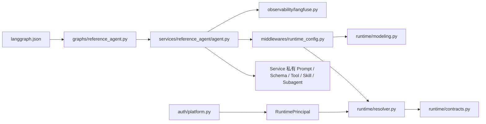

# Runtime Service 目标物理目录与 Legacy 处置设计（Draft）

> 文档类型：Draft
>
> 状态：目标目录已按 R0 落地，暂不替代 `docs/standards/` 下的新规范
>
> 关联文档：`11-agent-service-directory-architecture.md`、
> `12-runtime-context-and-local-debug-architecture.md`、
> `14-runtime-contracts-and-resolution-design.md`、
> `15-runtime-middleware-lifecycle-and-failure-semantics.md`、
> `16-runtime-observability-and-langfuse-design.md`、
> `17-platform-observability-query-and-admin-console-design.md`、
> `18-open-swe-to-runtime-event-and-run-explorer-design.md`、
> `19-runtime-tool-capability-mcp-and-side-effect-design.md`、
> `20-runtime-backend-workspace-skills-and-subagents-design.md`、
> `22-platform-runtime-contract-design.md`、
> `23-graph-thread-backend-checkpoint-lifecycle-design.md`、
> `24-package-langgraph-startup-shutdown-design.md`、
> `25-runtime-testing-and-cross-service-contract-design.md`、
> `26-runtime-custom-routes-and-model-config-design.md`
>
> 冻结范围：新 Runtime Service 的物理目录、代码归属、依赖方向和 Legacy 处置
>
> 公共 Runtime API、中间件、可观测和测试契约以关联文档为准；本文只定义物理归属、依赖方向
> 和 Legacy 处置；本文不定义删除命令，实际隔离结果以工作树与 R0 验收记录为准

## 1. 本轮结论

新架构采用标准 Python `src layout`，唯一正式包位于
`apps/runtime-service/src/runtime_service/`。应用根承载 `langgraph.json`、文档、测试和
开发脚本；生产 Python 代码只进入 `src/runtime_service/`。

这取代此前“在现有 Python 包内原地重建”的结论。目标仍不创建 `runtime_service_v2/`，
不保留 Legacy 兼容层，也不把旧代码继续留在可导入路径中。

目标结构遵循五条规则：

1. `langgraph.json -> graphs/<graph_id>.py -> services/<service>/agent.py | services/demo/<demo>/agent.py`
   是唯一部署链路。
2. `runtime/` 只放所有 Agent Service 共用的运行时契约和纯决议逻辑。
3. `middlewares/` 只放真正跨 Service 的运行时横切能力。
4. Tool、Skill、Subagent、MCP、Backend 和业务 Integration 默认归所属 Service。
5. 首期只建设一个全新的 `reference_agent` 验证架构；旧 Agent 不迁移、不兼容、不维护。

旧代码已移出活动导入路径并归档到 `archive/apps/runtime-service/`，不再维护或作为新代码输入；
只有仍有解释价值的历史文档进入应用 `docs/archive/`。

## 2. 目标物理目录

首期目标树如下：

```text
apps/runtime-service/
├── pyproject.toml
├── langgraph.json                      # 生产配置，只注册新入口
├── langgraph.demo.json                 # 本地学习配置，注册全部 Demo
├── .env.example                        # 只列变量名和非敏感示例
├── deploy/                             # 镜像、Compose 和部署说明
│   ├── Dockerfile
│   ├── docker-compose.runtime-service.yml
│   └── README.md
├── docs/
│   ├── standards/
│   ├── knowledge/
│   ├── runbooks/
│   └── archive/
├── scripts/                            # 开发辅助、可复现验收和受控运维入口
│   └── issue_local_delegation.py       # 本地短期 JWT 签发器，仅开发使用
├── tests/
│   ├── conftest.py
│   ├── fixtures/
│   │   ├── runtime.py
│   │   ├── graphs.py
│   │   └── auth.py
│   ├── runtime/
│   │   ├── test_contracts.py
│   │   ├── test_resolver.py
│   │   ├── test_modeling.py
│   │   └── test_errors.py
│   ├── middleware/
│   ├── graphs/
│   ├── integration/
│   ├── durable/
│   ├── contracts/
│   └── services/
│       ├── reference_agent/
│       │   └── test_agent.py
│       ├── workflow_services/demo/
│       │   └── test_agent.py
│       ├── deep_agent_services/demo/
│       │   └── test_agent.py
│       ├── mcp_services/demo/
│       │   └── test_agent.py
│       └── backend_services/demo/
│           └── test_agent.py
└── src/
    └── runtime_service/
        ├── __init__.py
        ├── graphs/                     # LangGraph 稳定部署契约层
        │   ├── __init__.py
        │   ├── reference_agent.py     # 只重导出 get_agent
        │   ├── workflow_demo.py       # 只重导出 get_agent
        │   ├── deep_agent_demo.py     # 只重导出 get_agent
        │   ├── mcp_demo.py            # 只重导出 get_agent
        │   └── backend_demo.py        # 只重导出 get_agent
        ├── auth/                       # Agent Server 认证与资源授权
        │   ├── __init__.py
        │   └── platform.py            # Delegation JWT 验证、AuthN、Thread AuthZ
        ├── runtime/                    # 最小公共 Runtime 内核
        │   ├── __init__.py            # 只导出稳定公共符号
        │   ├── contracts.py           # Principal、Context、Policy、Defaults、ResolvedConfig
        │   ├── resolver.py            # 严格校验、配置合并、权限裁剪
        │   └── modeling.py            # model_id -> ChatModel
        ├── middlewares/                # 跨 Service 的共享中间件
        │   ├── __init__.py
        │   └── runtime_config.py      # Model、Prompt、Tools 与执行配置的每次请求绑定
        ├── observability/              # Agent 工程 Trace 接入
        │   ├── __init__.py
        │   └── langfuse.py            # Callback、metadata、脱敏和生命周期
        └── services/
            ├── __init__.py
            ├── reference_agent/       # 唯一生产/参考 Agent
            │   ├── __init__.py
            │   ├── agent.py    # 唯一组合根，导出 get_agent
            │   ├── prompts.py
            │   ├── schemas.py
            │   ├── tools.py
            │   └── README.md
            └── services/demo/                  # 学习和受控验收 Demo
                ├── __init__.py
                ├── workflow_services/demo/     # StateGraph 示例
                │   ├── __init__.py
                │   ├── agent.py
                │   ├── workflow.py
                │   ├── schemas.py
                │   └── README.md
                ├── deep_agent_services/demo/   # create_deep_agent 示例
                ├── mcp_services/demo/          # MCP 和副作用隔离示例
                └── backend_services/demo/      # Backend/Workspace 生命周期示例
```

这是一棵职责地图，不是空目录生成清单。Git 不跟踪空目录，不为占位创建 `.gitkeep`；目录
只在首个真实文件出现时创建。比如本地 Token Signer 尚未实现时，`scripts/` 可以不存在；
但一旦实现，它只能放在应用包外的 `apps/runtime-service/scripts/`，不能进入生产导入链。

## 3. 顶层目录职责

| 路径 | 职责 | 禁止事项 |
| --- | --- | --- |
| `langgraph.json` | 注册 graph、Auth 和必要部署配置 | 直接指向 `services/`；注册 Legacy graph |
| `src/runtime_service/graphs/` | 给 LangGraph 提供稳定、明确的导入地址 | 业务装配、模型创建、网络 I/O、批量导入所有 graph |
| `src/runtime_service/auth/` | 验证可信凭证并约束 Agent Server 资源访问 | 解析模型、Prompt、Tool；从 `RuntimeContext` 推断身份 |
| `src/runtime_service/runtime/` | 定义公共运行时契约并生成有效配置 | 业务流程、Service 私有参数、外部 API client |
| `src/runtime_service/middlewares/` | 在执行期把有效配置绑定到模型、Prompt 和工具 | 存放仅一个 Service 使用的业务逻辑 |
| `src/runtime_service/observability/` | 接入 Langfuse Agent Trace，并执行采集和脱敏策略 | Run 状态、SSE、Audit、通用 Provider 框架 |
| `src/runtime_service/services/` | 生产/参考 Agent 及其受控 Demo 的唯一所有权边界 | Service 之间互相导入私有实现；Demo 不得成为生产业务能力 |
| `src/runtime_service/services/demo/` | 学习和受控验收 Demo 的隔离边界 | 进入生产 `langgraph.json`；被其他 Demo 作为公共库 |
| `tests/` | 公共 Runtime、Middleware、Graph、集成、Durable、Contract 和 Service 测试 | 混合旧目录、复制生产实现、为不存在的能力预建测试 |
| `scripts/` | 人工开发辅助、可复现验收和受控运维入口 | 被生产包导入；持有生产 secret；用它替代生产 API/Worker |

目标树首期不创建这些顶层目录：

- `agents/`
- `tools/`
- `skills/`
- `mcp/`
- `integrations/`
- `custom_routes/`
- `conf/`
- `devtools/`
- `test_data/`

它们不是永远禁止，而是当前没有公共职责证明其必须存在。后续只有出现真实的跨 Service
复用或非 LangGraph HTTP 能力时，才通过单独架构讨论重新引入。

### 3.1 目录准入与实验退出

目标树是 R0 的最小实现图，不是对后续 R6 验收脚本和已批准 Service 的禁止清单。目录是否
保留必须以职责、导入边界和可复现证据判断：

| 路径 | 准入规则 | 当前判定 |
| --- | --- | --- |
| `src/runtime_service/services/` | 唯一的生产 Service 所有权边界；每个目录由 Graph 稳定入口和 Service 测试证明 | 保留 |
| `src/runtime_service/services/demo/` | 学习或受控验收图的实现边界；仍经 `graphs/` 稳定导出，但不进入生产 `langgraph.json` | 保留 |
| 应用根 `services/` | 不得存放生产实现或说明副本；避免与 `src/runtime_service/services/` 形成双真源 | 禁止 |
| `scripts/` | 只能是人工调用的开发、验收或受控运维入口；不得被生产包导入，必须从环境读取 secret | 允许 |
| `spikes/<name>/` | 必须与生产 package/import/deploy 隔离，并有 owner、OpenSpec 结论和退出日期 | 仅限有活跃评估的短期实验；结论为不采用时先归档证据再删除 |

本轮已选定 GraphHarbor，Aegra 实验的 OpenSpec 以 `Abandoned` 归档，
`spikes/aegra/` 不再保留在活动工作树。正式 GraphHarbor 包已由 `pyproject.toml` 和
`uv.lock` 固定；本地 wheel 构建/安装脚本不再是受支持路径。

测试目录以 25 号文档为准：公共 Runtime、Middleware、Graph、Integration、Durable 和
Contract 测试按领域放置；每个 Service 的装配、工具和 Subagent 测试放在
`tests/services/<service_name>/`，不再使用顶层 `tests/agents/`。

跨服务契约 fixtures 位于仓库级 `contracts/runtime-v1/`，不进入 `src/runtime_service/`，
也不属于任何单一 Service；Platform API 和 Runtime Service 两端独立读取并验证。

## 4. 最小公共 Runtime 内核

`runtime/` 首期只保留三个实现文件，不能提前铺设 `engine/`、`builder/`、`factory/`、
`registry/`、`plugin/`、`orchestrator/`、`coordinator/`、`policies/` 或 `providers/` 等目录。

### 4.1 `runtime/contracts.py`

集中定义首期少量不可变契约：

```text
RuntimePrincipal
RuntimeContext
RuntimePolicy
AgentDefaults
ResolvedRuntimeConfig
```

规则：

- `RuntimePrincipal` 只表示 Auth 产生的可信身份与权限事实；
- `RuntimeContext` 只表示 Assistant/Run 可配置依赖；
- `RuntimePolicy` 只表示从已验证 Delegation claims 得到的可信模型、工具和策略版本事实；
- `AgentDefaults` 表示 Service 随代码发布的默认值；
- `ResolvedRuntimeConfig` 只保存可序列化决议，不保存 Model、Tool、Client 或 secret；
- 严格拒绝未知字段，不提供 `extra`、`extensions`、`metadata: dict[str, Any]` 逃生口。

这些类型首期放在同一个文件，是因为规模很小且共同描述一份运行时契约。只有文件出现多个
独立变化原因后，才拆成 `principal.py`、`context.py` 和 `config.py`。

### 4.2 `runtime/resolver.py`

负责纯决议：

```text
RuntimePrincipal
+ RuntimeContext
+ AgentDefaults
+ Platform / Project / Agent Policy Facts
-> ResolvedRuntimeConfig
```

允许：

- 校验身份必要字段；
- 校验模型和生成参数；
- 解析 `tools=None` 与 `tools=[]`；
- 计算 Required / Optional Tool 名称；
- 应用可信 `RuntimePolicy`；
- 生成 `config_hash`、`prompt_hash` 和审计字段。

禁止：

- 创建 ChatModel；
- 实例化 Tool；
- 调用网络、数据库或 MCP；
- 修改传入的 `RunnableConfig`；
- 从 `configurable.platform_runtime` 读取旧契约。

### 4.3 `runtime/modeling.py`

只负责把已经授权的 `model_id + generation params` 变成 ChatModel。模型 catalog 和项目级
选择策略属于 Platform API；这里保留执行侧支持范围和最终 fail-closed 校验。

### 4.4 `middlewares/runtime_config.py`

共享 Middleware 读取 `Runtime`，调用 resolver，随后绑定真实 Model、Prompt，并从 Service 已经
显式装配的工具列表中筛选本次可见 Tool。它不是第二个 resolver，也不保存业务默认值。

首期不单独创建 `snapshot.py`、`tool_selector.py`、`prompt_registry.py` 或 Tool Registry。
对应逻辑先保持在 `resolver.py` 和 Middleware 内；Tool 由各 Service 在
`agent.py/get_agent()` 中直接装配。

### 4.5 `observability/langfuse.py`

只负责 Langfuse Client 生命周期、每次 Run 的 Callback 注入、metadata 合并和导出前脱敏。
它不创建 graph，不解析 Model/Prompt/Tool，不参与鉴权、Run 状态、SSE 或 Audit。

首期只有 Langfuse 一个后端，因此不创建 `provider.py`、`registry.py`、`builder.py` 或
`ObservabilityMiddleware`。详细契约见 `16-runtime-observability-and-langfuse-design.md`。

## 5. Agent Service 与 Demo 目录

生产 Service 按 11 号文档执行：

```text
src/runtime_service/services/<service_name>/
├── __init__.py
├── agent.py
├── prompts.py
├── schemas.py
└── README.md

tests/services/<service_name>/
    └── test_agent.py
```

Demo 使用等价的私有文件形状，但根目录为 `src/runtime_service/services/demo/<demo_name>/`；测试仍可按
现有 `tests/services/` 分类，避免测试目录移动本身成为一次语义变更。

只有存在真实能力时才增加：

```text
tools.py | tools/
workflow.py
middleware.py | middleware/
mcp.py
backend.py
subagents.py | subagents/
skills/
integrations.py | integrations/
evals/
```

归属判断只有一条：如果删除这个 Service 后代码也没有消费者，它就属于 Service 私有实现，
不能放到顶层公共目录。

### 5.1 `agent.py` 的组合方式

`agent.py` 是 Service 的唯一组合根，直接使用 LangChain/LangGraph/Deep Agents 的官方
构造函数，不经过公共 `build_graph()`、`BaseAgentFactory` 或万能 Builder：

```python
async def get_agent(config: RunnableConfig) -> Pregel:
    agent = create_agent(...)
    # 或直接使用 create_deep_agent(...)
    # 显式 StateGraph 则在本 Service 内声明节点/边并调用 compile()
    return agent.with_config(execution_config(config))
```

`tools.py`、`subagents.py`、`backend.py` 等模块只提供当前 Service 的显式依赖；组合根决定
传给官方构造函数的具体参数和顺序。Service 私有的 `_build_workflow()` 可以封装本 Service
自己的 StateGraph 拓扑，但不得被提取为跨 Service 的统一构图协议。

`.with_config(...)` 只绑定当前 Run 的执行控制、追踪字段和受控执行标识，不负责解析
`RuntimeContext`、选择模型/工具或改变 Graph 拓扑；传入的 `RunnableConfig` 必须按只读方式处理。

首个 `reference_agent` 的职责不是承载真实产品业务，而是证明：

- 最简单的 `create_agent` 可以通过统一 `get_agent` 暴露为稳定 graph；
- 公共入口只要求返回 `Pregel`，不把 `create_agent` 的参数固化成平台协议；
- Auth、RuntimeContext、resolver 和 Middleware 使用同一条链；
- Assistant Context 与 Run Context 行为符合契约；
- 本地调试不需要启动 Platform API；
- 基础 stream 和 checkpoint 行为可以被验证。

`create_deep_agent`、显式 `StateGraph`、Interrupt 和 Subagent event 由独立 Demo 验证，不塞
进首个 `reference_agent` 制造全家桶 Demo。五个 Demo 的职责和阶段统一见 28 号开发计划的
“可运行 Demo 计划”章节。

## 6. Platform API 代码归属

Platform API 不复制 Runtime Service 的 Python 类型。双方通过版本化 JSON/HTTP/Auth 契约
对齐，并用跨服务契约测试防止漂移。

```text
apps/platform-api/app/
├── modules/
│   ├── assistants/                   # Assistant Context、版本和发布配置
│   ├── runtime_policies/             # 项目模型/工具策略主数据
│   ├── runtime_catalog/              # Graph、Model、Tool catalog snapshot
│   └── runtime_gateway/
│       ├── application/
│       │   ├── contracts.py          # Run Context 外部契约和严格校验
│       │   ├── ports.py
│       │   └── service.py            # 授权、策略决议、调用编排
│       └── presentation/
│           └── http.py
├── adapters/
│   └── langgraph/                    # LangGraph SDK / HTTP 适配
└── core/
    └── security/                     # 通用签名与安全原语
```

当前 `app/core/runtime_contract.py` 属于 Runtime Gateway 业务契约，目标应收敛到
`modules/runtime_gateway/application/contracts.py`。`core/security/` 可以保留通用 JWT 原语，
但 Runtime Delegation claims 的构造和授权语义属于 `runtime_gateway`。

项目 Policy 如何作为可信事实进入 Runtime resolver，仍是下一轮公共 Runtime API 讨论的
必答问题。物理目录不能掩盖这个契约缺口。

## 7. 目标依赖方向



依赖约束：

1. `graphs/` 只能依赖对应 Service 的公开 `get_agent`。
2. `services/` 可以依赖公共 Runtime、Middleware 和 Auth 产生的可信事实。
3. 公共 Runtime 禁止反向依赖任何 Service。
4. 一个 Service 禁止导入另一个 Service。
5. Platform API 禁止导入 Runtime Service 的 Python 包。
6. `scripts/` 和 tests 可以依赖公共契约，生产代码禁止依赖它们。
7. `observability/` 只能读取安全关联字段，禁止成为 Runtime 授权和业务决议的输入。

禁止出现：

```text
graphs/ -> runtime resolver -> services/
services/a -> services/b
runtime/ -> middlewares/ -> runtime/     # 循环依赖
platform-api -> import runtime_service
```

## 8. Legacy 目录处置表

以下是目标处置，不是本轮执行删除。表中 `runtime_service/` 均指当前 Legacy 包；新代码只写入
`src/runtime_service/`：

| 当前路径 | 目标处置 | 说明 |
| --- | --- | --- |
| `runtime_service/agents/` | 删除 | Demo/旧范式不进入目标架构 |
| `services/sql_agent/` | 删除 | 不迁移、不维护 |
| `services/test_case_service/` | 删除 | 不迁移、不维护 |
| `services/test_case_service_v2/` | 删除 | 不保留 V2 双轨 |
| `services/` | 删除 | 新 `src/runtime_service/services/` 首期只加入 `reference_agent/` |
| `auth/platform.py` | 删除并在新包重写 | 只保留目标 Delegation AuthN/AuthZ |
| `auth/provider.py` | 删除 | 不保留多套认证 provider 心智 |
| `runtime/context.py` | 删除并由 `contracts.py` 取代 | 不保留旧字段和旧 coercion 行为 |
| `runtime/config_utils.py` | 删除 | 不再围绕旧 `configurable` 契约提供 helper |
| `runtime/runtime_request_resolver.py` | 删除并由 `resolver.py` 取代 | 不保留旧 API 或兼容导出 |
| `runtime/modeling.py` | 删除并在新包重写 | 只接受已授权的有效配置 |
| `runtime/filesystem_backend.py` | 删除 | Backend 默认归具体 Service |
| `middlewares/runtime_request.py` | 删除并由 `runtime_config.py` 取代 | 新 Middleware 使用新契约 |
| `middlewares/multimodal/` | 删除 | 未来有真实跨 Service 需求再重新设计 |
| `tools/` | 删除 | 不保留全局 Tool Registry；Tool 默认归 Service |
| `skills/` | 删除 | Skill 默认归 Service |
| `mcp/` | 删除 | MCP server 配置和加载默认归 Service |
| `integrations/interaction_data.py` | 删除 | 只服务 Legacy testcase 链路 |
| `integrations/` | 首期删除 | 两个以上 Service 确认复用后再建立 |
| `custom_routes/` | 删除 | 首期不需要非 LangGraph HTTP 入口 |
| `conf/` | 删除 | 部署默认值使用 env 和 `.env.example`；业务配置不放 YAML |
| `devtools/` | 删除 | 新本地调试器放应用包外 `scripts/` |
| `test_data/` | 删除 | Legacy fixture 不进入新验收链 |
| `tests/` 下 Legacy 测试 | 删除 | 在应用根 `tests/` 按公共契约和 Service 镜像路径重建 |
| `tests/harness/` | 按目标契约重写 | 不能继续为旧架构提供硬门禁 |
| `runtime_service/langgraph.json` | 删除 | 应用根新建唯一 `langgraph.json` |
| `langgraph_auth.json` | 删除 | 不保留两份部署配置 |
| `.env` | 不进入版本库 | secret 只由本地/部署环境提供 |
| `runtime_service/.env.example` | 删除 | 应用根重写，只包含目标架构所需变量 |
| `__pycache__/` | 删除生成物 | 不属于源码或存档 |
| `runtime_service/docs/` | 原子迁移到应用根 | 更新权威引用；失效标准和说明进入 `docs/archive/` |

Legacy 代码不能通过以下方式继续存活：

- `legacy/`、`compat/`、`v1/`、`v2/` 包；
- 从新 `__init__.py` 重导出旧函数；
- 新 resolver 同时接受 `RuntimeContext` 和 `platform_runtime`；
- `langgraph.json` 同时注册新旧 graph；
- 保留旧测试并把失败标记为 skip；
- 把归档代码重新加入可导入路径或继续维护。

## 9. 落地方式

这不是 Service 迁移，而是目标架构替换。禁止让
`apps/runtime-service/runtime_service/` 与 `apps/runtime-service/src/runtime_service/` 两个
同名可导入包长期并存；从应用根运行时，旧包可能优先命中并污染新测试。设计阶段继续在当前
位置维护 Draft，实施阶段必须在一个受控 change 中原子切换。

建议一个 B3 OpenSpec change 内按以下顺序实施：

1. 用契约测试确认 LangGraph 当前版本的 Assistant/Run Context、factory 和 Auth 行为。
2. 将 `runtime_service/docs/` 原子迁移到应用根 `docs/`，同步更新 `AGENTS.md`、仓库标准和
   仍有效文档中的权威路径；历史 OpenSpec 记录保持历史原文。
3. 明确处理未入库的本地 `.env`，重写应用根 `.env.example`，禁止删除操作误伤开发凭据。
4. 经危险操作确认后删除 Legacy 可导入包、旧 graph、Service、Registry、脚本和测试。
5. 直接创建首批真实 `src/runtime_service` 文件及根 `tests/`；不预建空目录。
6. 配置 `pyproject.toml` 只打包 `src/runtime_service`，在应用根创建唯一 `langgraph.json`。
7. 实现最小 Runtime、Auth、Middleware、`reference_agent` 和稳定 Graph 入口。
8. 同步修改 Platform API 的 Runtime Gateway 契约和 Delegation claims。
9. 验证只有 `src/runtime_service` 可导入，并覆盖本地直调、GraphHarbor Durable、Platform
   Gateway 和基础可观测链路。
10. 更新 Current Standards，把 11、12、13 号 Draft 的批准结论转成正式标准。

由于该变更涉及跨应用公共契约、认证、权限和删除，必须经过 owner pre-apply review。正式删除
前还需要按仓库危险操作规则再次确认精确目标。

## 10. 验收标准

目标目录完成至少满足：

- 应用根 `langgraph.json` 的所有 graph 都指向 `runtime_service.graphs.*:get_agent`；
- 每个 graph 文件只重导出一个 Service 的 `get_agent`；
- `apps/runtime-service/runtime_service/` Legacy 包不再存在；
- Python 只从 `apps/runtime-service/src/runtime_service/` 导入；
- Legacy `services/*`、顶层 `tools/skills/mcp` 不存在；
- 新代码不出现 `platform_runtime`、`platform_local_debug` 或旧 Runtime API；
- Runtime Service 与 Platform API 对未知字段、身份字段和 Tool 权限的判断一致；
- `reference_agent` 可通过 fixture 直接测试，也可通过本地 JWT + GraphHarbor Durable 运行；
- schema/introspection 不创建 Sandbox 或建立外部连接；
- 公共契约测试、Service 测试和最短跨服务契约测试通过；
- 文档中不再把 Legacy 文件当作推荐入口。

## 11. 实施前冻结检查

下列问题已在关联文档中形成结论，实施前仍需通过锁定版本的代码和契约测试确认：

1. `contracts.py` 中五个类型的准确字段、可选性和严格校验方式；
2. `resolve_runtime_config(...)` 的输入、输出和同步/异步边界；
3. Platform/Project Policy 通过什么可信契约进入 Runtime；
4. `runtime_config` Middleware 如何取得各 Service 的 `AgentDefaults`、Prompt，并过滤
   `get_agent()` 已显式装配的 Tool；
5. Required / Optional Tools 在模型调用和实际 Tool 调用阶段如何二次校验；
6. `modeling.py` 返回 Model 对象还是只提供一个最小绑定函数；
7. `runtime/__init__.py` 最终公开哪些稳定符号。
8. `tests/services/<service_name>/` 与公共测试目录的边界是否保持一致。
9. `contracts/runtime-v1/` fixtures 是否被 Platform API 和 Runtime Service 两端独立消费。

继续遵循一个原则：不设计万能 Runtime Facade，只暴露 Agent Service 真正共同使用的最小函数
和类型。实施前不新增 `engine/`、`builder/`、`factory/`、`registry/`、`plugin/`、
`orchestrator/` 或 `coordinator/` 公共目录。

## 12. 实现对齐目录

> 本目录只核对本文的 R0 相关要求，不替代 Current Standard。跨文档汇总见
> [31 号审计](./31-runtime-refactor-alignment-audit.md)。

| ID | 要求 | 阶段 | 实现位置 | 测试位置 | 验证记录 | 状态 | 是否实现 | 缺口/后续 |
| --- | --- | --- | --- | --- | --- | --- | --- | --- |
| `13-R0-PKG-001` | 新代码唯一位于 `src/runtime_service/` | R0 | `src/runtime_service/`；应用根不存在 `runtime_service/` | `tests/test_r0_baseline.py:test_new_package_is_loaded_from_src`；`test_installed_package_imports_without_test_path` | `uv run --frozen python` 直接 import 和临时 wheel 安装后的独立 venv import 均输出新包路径 | `implemented-local` | ✅ | 已有独立子进程证据，不依赖 `tests/conftest.py` |
| `13-R0-PKG-002` | 使用标准 src layout，可安装并锁定依赖 | R0 | `pyproject.toml:[tool.setuptools.packages.find]`；`uv.lock` | R0 基线测试；`uv lock --check`；wheel build/install smoke | `uv lock --check` 通过；wheel build 成功；临时 venv 使用 `--no-deps` 安装 wheel 后 import 通过 | `implemented-local` | ✅ | 依赖完整性仍由 lock 和 CI 安装门禁负责 |
| `13-R0-PKG-003` | 目标目录包含 Graph、Service、测试和部署边界 | R0 | `src/runtime_service/graphs/`、`services/`、`tests/`、`deploy/` | `tests/test_r0_baseline.py`；各 Service 测试 | 目录和入口加载检查通过 | `implemented-local` | ✅ | `auth/platform.py` 属于 R1，不能作为 R0 失败；目标目录整体仍未完全对齐 |
| `13-R0-PKG-004` | Legacy 包不进入新的导入链 | R0 | 应用根无 `runtime_service/`；旧代码仅在仓库归档位置 | `test_installed_package_imports_without_test_path`；`test_new_package_is_loaded_from_src`；静态 `rg` | 独立安装 import 和静态检查均未命中 Legacy；测试兜底不再是唯一证据 | `implemented-local` | ✅ | `conftest.py` 仍保留用于测试环境兼容，但不能替代安装检查 |
| `13-R0-PKG-005` | Graph 配置只指向 `runtime_service.graphs.*` 稳定入口 | R0 | `langgraph.json:5-10`；`langgraph.demo.json:5-25` | `tests/test_r0_baseline.py:test_production_config_registers_only_reference_agent`；`tests/services/test_r4_capability_demos.py:test_demo_config_registers_all_r4_capability_graphs` | R0 `14 passed`；R4 `10 passed` | `implemented-local` | ✅ | Demo 配置按设计包含 R4 Graph；Dockerfile 注册表由生产配置生成并有同步门禁 |
| `13-R0-PKG-006` | 旧 Graph、旧 Auth、旧 HTTP 路由不作为新部署入口 | R0 | 两个根配置无 Legacy graph/Auth/http app | `tests/test_r0_baseline.py:37-49` | 未发现旧 graph 路径 | `implemented-local` | ✅ | R1 Auth 已由 `auth/platform.py` 接入；R0 只验证 Legacy Auth/HTTP 不成为新部署入口 |
