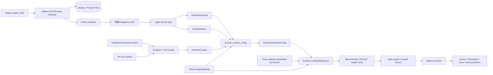

# Runtime Contracts 与配置决议架构设计（Draft）

> 文档类型：Draft
>
> 状态：讨论结论，暂不替代 `docs/standards/` 下的现行规范
>
> 关联文档：`11-agent-service-directory-architecture.md`、
> `12-runtime-context-and-local-debug-architecture.md`、
> `13-runtime-service-target-code-layout.md`
>
> 冻结范围：五类 Runtime 类型、Assistant/Run Context 合并、Policy snapshot、纯函数
> Resolver、Prompt/Tool 决议、运行快照与错误语义
>
> 暂不展开：具体 JWT 库实现、模型 Provider 适配、Middleware 生命周期实现、
> 可观测后端和 Legacy 删除操作
>
> Middleware 后续设计：`15-runtime-middleware-lifecycle-and-failure-semantics.md`
>
> 可观测后续设计：`16-runtime-observability-and-langfuse-design.md`、
> `17-platform-observability-query-and-admin-console-design.md`
>
> Tool、MCP 与副作用设计：`19-runtime-tool-capability-mcp-and-side-effect-design.md`

## 1. 本轮结论

Runtime 内核不做万能 Builder、Facade 或 Provider。它只完成一件事：把已验证的身份事实、
不可信的运行时候选值、Service 默认值和已签名策略快照，决议成一次 Run 的有效配置。

目标链路：

```text
Verified Delegation JWT
  -> RuntimePrincipal + RuntimePolicy
Assistant/Run Context
  -> RuntimeContext
Service code
  -> AgentDefaults
全部进入同步纯函数 resolver
  -> ResolvedRuntimeConfig
Middleware 再绑定 Model / Prompt / Tool 实例
```

必须遵守：

1. `RuntimePrincipal` 只由 Agent Server Auth 从 verified credential 产生，不能由
   `RuntimeContext` 或消息内容覆盖。
2. `RuntimePolicy` 是 Platform API 在签发 Delegation JWT 时物化的紧凑 snapshot；Runtime
   不在 Resolver 中访问 Platform API、数据库或 MCP。
3. `RuntimeContext` 只表示 Assistant/Run 的配置候选值，严格拒绝未知字段、错误类型和
   未声明的身份字段。
4. `AgentDefaults` 随 Service 代码发布，属于 Service 的组合根，不进入公共配置中心。
5. `ResolvedRuntimeConfig` 只保存可序列化的决议结果，不保存 Model、Tool、Client、Backend
   或 secret 对象。
6. Resolver 是同步、无副作用、输入不可变的纯函数；任何 I/O 和对象实例化都在边界外完成。
7. 发生授权、类型或策略冲突时 fail-closed，禁止静默裁剪、静默回退或从旧
   `configurable.platform_runtime` 读取值。

本设计与 Open SWE 的关系是“借鉴顺序和快照，不复制控制面”。Open SWE 的线程设置、
Profile 覆盖、每次 Run override 和 `PrepareRunMiddleware` 提供了有价值的可恢复性经验；
本项目不把 GitHub/Slack 身份、Thread Settings 或大型 `server.py` 搬进公共 Runtime。

## 2. 设计目标与非目标

### 2.1 目标

- 同时承接 `create_agent`、`create_deep_agent` 和显式 `StateGraph`，不固化某一种 graph
  构造函数。
- 让不同 Service 共享一份字段语义和错误分类。
- 让 Platform API 可以在调用 Runtime 前给出快速的模型/工具拒绝反馈。
- 让 Runtime 在恢复 Run、绕过 Gateway 或策略变更后仍能重新校验执行边界。
- 生成稳定的 `config_hash`，支持审计、去重和问题复现。
- 让 `stream_event`、checkpoint、trace 和 audit 只暴露必要的决议摘要，不泄漏 secret 或
  完整 Prompt。
- 让本地 `langgraph dev` 和生产 Agent Server 使用同一个 Resolver 和 Auth 语义。

### 2.2 非目标

- 不建立公共 Thread Settings 层。只有某个 Service 出现真实的线程冻结需求时，才在该
  Service 私有实现。
- 不让请求上传 Python Tool、Middleware、Backend、Prompt 模板或 Subagent 实现。
- 不用 `dict[str, Any]`、`extra`、`extensions` 为未知未来字段预留逃生口。
- 不让 Resolver 负责创建模型、连接 MCP、启动 Sandbox 或决定 graph 拓扑。
- 不把所有 Service 私有字段塞进公共 `RuntimeContext`。
- 不保留 `platform_runtime`、`platform_local_debug` 或旧 Runtime API 的兼容分支。

## 3. 可信输入与决议链路



输入的信任边界：

| 输入 | 来源 | 信任级别 | 允许承载 | 不允许承载 |
| --- | --- | --- | --- | --- |
| `RuntimePrincipal` | verified Agent Server Auth | 可信 | 用户、租户、项目、角色、权限 | Run 参数、Prompt、Tool 实现 |
| `RuntimePolicy` | 签名 Delegation claims | 可信 snapshot | policy version、allowed model/tool | 未签名的数据库查询结果 |
| `RuntimeContext` | Assistant + Run payload | 不可信候选值 | model、生成参数、Optional Tools | 身份、权限、secret、任意字段 |
| `AgentDefaults` | Service 代码 | 可信发布值 | 默认模型、Prompt、Required/Optional Tool | 当前用户身份、请求状态 |
| `RunnableConfig` | Agent Server / SDK | 按字段判断 | thread、assistant、run、trace 控制 | 公共业务配置的第二真源 |

LangChain 官方运行时把 `context_schema` 传入的值暴露在 `runtime.context`，Middleware 通过
`request.runtime.context` 读取，Tools 通过 `ToolRuntime.context` 读取；Deep Agents 会把
Runtime Context 传播到 Subagents。这个传播能力只解决“如何传递”，不解决“谁有权传什么”，
因此授权和合并仍由本项目 Resolver 负责。

## 4. 五类核心类型

首期使用标准库：

```python
from dataclasses import dataclass


@dataclass(frozen=True, slots=True)
class RuntimePrincipal:
    user_id: str
    tenant_id: str
    project_id: str
    role: str
    permissions: tuple[str, ...]


@dataclass(frozen=True, slots=True)
class RuntimeContext:
    model_id: str | None = None
    temperature: float | None = None
    max_tokens: int | None = None
    top_p: float | None = None
    tools: tuple[str, ...] | None = None


@dataclass(frozen=True, slots=True)
class RuntimePolicy:
    version: str
    allowed_model_ids: tuple[str, ...]
    allowed_tool_names: tuple[str, ...]


@dataclass(frozen=True, slots=True)
class AgentDefaults:
    model_id: str
    system_prompt: str
    prompt_version: str
    temperature: float | None = None
    max_tokens: int | None = None
    top_p: float | None = None
    required_tool_names: tuple[str, ...] = ()
    optional_tool_names: tuple[str, ...] = ()


@dataclass(frozen=True, slots=True)
class ResolvedRuntimeConfig:
    principal: RuntimePrincipal
    model_id: str
    temperature: float | None
    max_tokens: int | None
    top_p: float | None
    required_tool_names: tuple[str, ...]
    optional_tool_names: tuple[str, ...]
    prompt_version: str
    prompt_hash: str
    policy_version: str
    config_hash: str
```

### 4.1 类型规则

- 所有类型不可变；Resolver 不修改输入对象。
- `tuple[str, ...]` 是公开契约中的集合表示。边界解析拒绝空白和重复值，再按字典序规范化；
  不使用 `frozenset` 作为 JSON 边界类型。
- `RuntimePrincipal.permissions` 同样使用规范化 tuple；权限的授权含义由 Platform Gateway
  和执行侧 Tool 检查共同约束。
- `required_tool_names` 与 `optional_tool_names` 不能重名；Tool 名称冲突在 Service 组合时
  直接拒绝，不能等到首次调用才发现。
- 字符串字段不得为空白；ID 使用 ASCII 可打印字符和明确长度上限，具体上限由契约测试
  固定，不能依赖 Provider 的异常。
- `temperature` 范围为 `0 <= value <= 2`；`top_p` 范围为 `0 < value <= 1`；
  `max_tokens` 为正整数。`NaN`、无穷值和布尔值都拒绝。
- `None` 表示“调用方没有覆盖”；数值 `0`、空 tuple 等有效值不能被真假判断吞掉。
- `ResolvedRuntimeConfig` 不保存完整 Prompt。Middleware 使用同一个 `AgentDefaults` 实例
  绑定 Prompt，并先核对 `prompt_hash`；持久化审计只写 version/hash。

本 14 号文档是新 Runtime 契约的准则。旧知识文档中出现的 `enable_tools` 不再进入新
`RuntimeContext`：`tools=None` 表示继承 Optional Tools，`tools=()` 表示本次禁用全部
Optional Tools，避免两个开关表达同一语义。旧文档只作为历史讨论材料，不作为实现依据。

### 4.2 为什么 Policy 不放进 RuntimeContext

`RuntimeContext` 来自 Assistant/Run payload，天然是不可信输入。若把 `allowed_model_ids`
或 `allowed_tool_names` 放在里面，调用方就能把“请求什么”和“允许什么”写成同一份数据。
`RuntimePolicy` 必须来自已验证签名凭证；其变更通过 `version` 体现，Runtime 不自行查询控制面。

### 4.3 Project 默认模型与 temperature 的唯一归属

Platform API 当前有 `is_default_for_project` 和 `temperature_default`。目标架构不允许同一
默认值同时存在于 Platform、RuntimePolicy、RuntimeContext 和 Service Defaults 四处。

首期规则：

- Project 默认模型由 Platform Gateway 在创建 Assistant 或发送 Run 前物化到 Assistant
  Context 的 `model_id`；如果调用方明确指定 Run model，则由 Gateway 先按 Policy 校验。
- `temperature_default` 若要成为项目级公共能力，必须在同一 Gateway 物化到 Assistant Context；
  不能只把它藏在数据库而要求 Runtime Resolver 查库。
- `RuntimePolicy` 只承载 allowlist 和 `version`，不承载可变的默认值。
- Service 的 `AgentDefaults` 是没有 Assistant 覆盖时的部署默认值；它不是项目配置真源。

如果后续需要“项目策略强制最大 temperature”等约束，新增明确的 Policy 字段并同步版本化；
不能偷偷复用 `temperature_default` 表达上限。

## 5. 严格输入校验

### 5.1 `RuntimePrincipal`

Auth 验证完成后，只从 `runtime.server_info.user` 读取：

```text
sub                 -> user_id
tenant_id           -> tenant_id
project_id          -> project_id
role                -> role
permissions         -> permissions
```

缺少必填 claim、claim 类型不正确、scope 与当前 thread/assistant 不匹配，直接返回
`runtime.auth.invalid_principal`。不允许从以下位置补身份：

- `runtime.context`
- `state`
- `config.metadata`
- `config.configurable`
- system prompt 或用户消息

### 5.2 `RuntimeContext`

`context_schema` 负责结构形状，Runtime 自己负责业务边界。解析入口必须：

1. 确认输入是 object/mapping；`None` 只在入口被转换为全默认 Context。
2. 检查字段集合与白名单完全相等；出现未知字段直接拒绝。
3. 对每个字段做精确类型校验；`bool` 不得当作 `int` 或 `float` 接受。
4. 将 tools 列表规范化为 tuple；列表元素必须是非空字符串。
5. 拒绝 `user_id`、`tenant_id`、`project_id`、`role`、`permissions`、`secret`、`token`、
   `api_key` 等身份或凭证字段，即使调用方试图通过额外字段传入。

错误码统一为：

```text
runtime.context.invalid_shape
runtime.context.unknown_field
runtime.context.invalid_field_type
runtime.context.invalid_value
runtime.context.identity_field_forbidden
```

### 5.3 `RuntimePolicy`

Policy 在 Auth 层验证签名、issuer、audience、时间窗口和 `type=runtime_delegation` 后构造。
Resolver 仍要防御性检查：

- `version` 非空；allowlist 不含空值和重复值；
- `version` 是 Runtime 不解释格式的 opaque string，但只要相关 allowlist 变化就必须变化；
- 当前选择的 model/tool 必须能在 allowlist 中找到；
- JWT 不允许出现 Runtime 代码不认识的 policy claim 变体；
- claims 中的 scope ID 必须与 `RuntimePrincipal` 的 tenant/project 一致。

首期 Delegation claims 最小增加：

```json
{
  "type": "runtime_delegation",
  "policy_version": "project-policy-2026-08-29T01",
  "allowed_model_ids": ["openai:gpt-5.5"],
  "allowed_tool_names": ["search", "read_project"]
}
```

这些 allowlist 是签发时由 Platform Gateway 计算的最终结果，已包含 Project Policy、
Actor permissions 和发布配置约束。Runtime 不需要再引入 `CapabilityProfile`、
`ToolCapability` 或公共 Tool Registry。RuntimePrincipal.permissions 仍保留用于工具执行期
的防御性检查和审计，但不能让 JWT 自相矛盾地同时声明“权限没有”和“tool 已允许”。

首期继续使用紧凑 JWT，不增加 Policy 查询服务。跨服务测试必须验证 claims 在部署网关的
Header 大小限制内；只有真实 allowlist 超出限制时，才讨论签名 snapshot reference，且不能
让 Resolver 自己发起网络查询。

### 5.4 `context_schema` 的版本门禁

官方文档明确 `context_schema` 可以使用 dataclass 或 `TypedDict`，但没有保证当前锁定的
Agent Server 会如何处理 JSON 未知字段。实施前必须用真实 SDK/HTTP 请求证明下列任一条件：

1. Agent Server 在进入 graph 前拒绝未知字段；或
2. Middleware 能拿到未丢字段的原始 mapping，并由严格 parser 拒绝。

如果 dataclass 在进入 Middleware 前静默丢弃未知字段，就不能只靠 dataclass 构造器宣称
“严格校验”。此时应选择锁定版本正式支持、且能生成 `additionalProperties: false` 的 schema
表示；未经契约测试，不预设 Pydantic 一定可作为 `context_schema`。

## 6. Assistant Context 与 Run Context

LangGraph Assistant 保存 graph 的 context 配置；每次 Run 还可以提供 context。目标服务对外
采用字段级覆盖，但合并必须在唯一的 Platform Gateway 入口物化，不让每个 Service 自己猜
上游行为：

```text
Service Defaults
  <- Published Assistant Context
  <- Per-run Context Override
  = RuntimeContext candidate
```

字段语义：

| 字段 | 缺省 | 明确值 | 说明 |
| --- | --- | --- | --- |
| `model_id` | 继承上一层 | 覆盖模型 | 最终必须在 Policy allowlist |
| `temperature` | 继承上一层 | 覆盖生成参数 | `0` 是有效覆盖 |
| `max_tokens` | 继承上一层 | 覆盖生成参数 | 必须为正整数 |
| `top_p` | 继承上一层 | 覆盖生成参数 | 必须在范围内 |
| `tools` | `None` | tuple（含空 tuple） | 整体替换 Optional Tools |

特别规则：

- `tools=None`：继承 Assistant/Service 的 Optional Tools。
- `tools=()`：本次禁用全部 Optional Tools。
- Required Tools 不受 `tools` 控制；若 Policy 禁用 Required Tool，Run 直接失败。
- Tool 列表整体替换，不隐式追加 Assistant 列表，也不按用户顺序改变 Service 的稳定
  catalog 顺序。
- Run Context 不得覆盖 `system_prompt`；用户任务应进入 messages/state。
- 上游如果未能保证字段级合并，Gateway 必须先生成完整、严格校验的 context，再调用
  Runtime。

### 6.1 Open SWE 线程设置的取舍

Open SWE 将主模型、Subagent 模型和仓库说明冻结到 Thread Settings Snapshot，因为它的
Thread 是长期、多参与者的工作单元。本平台 v1 不把该层提升为公共契约：

- Assistant Context 管发布配置和版本；
- Run Context 管单次覆盖；
- `ResolvedRuntimeConfig` 管本次实际结果；
- 只有出现明确的 Service 需求时，才在该 Service 内增加线程快照。

这样可以借鉴其“显式优先级”和“恢复稳定性”，又避免公共 Runtime 被某一种 coding agent
的线程语义绑死。

## 7. 配置决议规则

### 7.1 精确入口

```python
def resolve_runtime_config(
    *,
    principal: RuntimePrincipal,
    context: RuntimeContext,
    policy: RuntimePolicy,
    defaults: AgentDefaults,
) -> ResolvedRuntimeConfig:
    """Pure, synchronous, fail-closed runtime resolution."""
```

实现边界：

- 不接收 `Runtime`、`RunnableConfig`、HTTP request 或 database session；
- 不读取 env；
- 不调用网络、数据库、MCP、Provider 或 Tool factory；
- 不修改四个输入；
- 相同的规范化输入必须产生相同结果和 `config_hash`；
- 允许使用标准库 `hashlib`、`json`、`math`，不引入 Resolver 框架。

公共错误只需要一个轻量类型，不建立异常继承树：

```python
class RuntimeResolutionError(ValueError):
    code: str
    field: str | None
```

`runtime/__init__.py` 只公开五类契约、`RuntimeResolutionError` 和
`resolve_runtime_config`；parser、hash helper 和绑定实现保持包内私有。

### 7.2 决议伪代码

```python
def resolve_runtime_config(*, principal, context, policy, defaults):
    validate_principal(principal)
    validate_context(context)
    validate_policy(policy)
    validate_defaults(defaults)

    model_id = context.model_id if context.model_id is not None else defaults.model_id
    if model_id not in policy.allowed_model_ids:
        raise RuntimeResolutionError("runtime.model.not_allowed", model_id)

    temperature = (
        context.temperature
        if context.temperature is not None
        else defaults.temperature
    )
    max_tokens = (
        context.max_tokens
        if context.max_tokens is not None
        else defaults.max_tokens
    )
    top_p = context.top_p if context.top_p is not None else defaults.top_p
    validate_generation_params(temperature, max_tokens, top_p)

    required = require_canonical_names(defaults.required_tool_names)
    optional_candidate = (
        context.tools
        if context.tools is not None
        else defaults.optional_tool_names
    )
    optional = require_canonical_names(optional_candidate)

    if any(name not in policy.allowed_tool_names for name in required):
        raise RuntimeResolutionError("runtime.required_tool.not_allowed")
    if any(name not in defaults.optional_tool_names for name in optional):
        raise RuntimeResolutionError("runtime.optional_tool.not_declared")
    if any(name not in policy.allowed_tool_names for name in optional):
        raise RuntimeResolutionError("runtime.optional_tool.not_allowed")

    prompt_hash = sha256_utf8(defaults.system_prompt)
    resolved = ResolvedRuntimeConfig(
        principal=principal,
        model_id=model_id,
        temperature=temperature,
        max_tokens=max_tokens,
        top_p=top_p,
        required_tool_names=required,
        optional_tool_names=optional,
        prompt_version=defaults.prompt_version,
        prompt_hash=prompt_hash,
        policy_version=policy.version,
        config_hash="",  # computed from canonical execution fields below
    )
    return replace(resolved, config_hash=hash_resolved(resolved))
```

首期实现保持为一个公开函数和少量私有校验函数，不建立 `ConfigMerger`、
`PolicyResolver` 或其他对象层次。校验、合并、规范化和 hash 是 Resolver 的全部职责；
任何外部 I/O 都不属于 Resolver。

这里没有把无权限 Optional Tool 静默裁剪掉。静默裁剪会造成“模型以为能力存在”和“实际
能力不存在”的隐性分叉，也会让调用方误以为策略生效。拒绝请求更容易观测、重试和审计。

### 7.3 Tool 权限的来源

首期不在 Runtime 中增加第六个公共类型。Platform Gateway 在签发 Policy snapshot 时计算
Actor 和 Project 允许请求的最大 Tool 集合；Service 代码再通过显式工具列表定义当前 Agent
真正具备的能力：

```text
allowed_tool_names
  = Project Tool Policy
  ∩ Actor Permissions
  ∩ Published Assistant Policy
```

审批不进入这个 allowlist。`allowed_tool_names` 表示调用方有权请求某个 Tool；针对具体参数的
审批发生在模型产生 Tool Call 之后，由 HITL 在执行前判断。

Runtime 的有效 Tool 集合来自：

```text
get_agent() 已显式装配的 Tool
  ∩ AgentDefaults 声明的 Required / Optional Tool
  ∩ RuntimePolicy.allowed_tool_names
  ∩ RuntimeContext 本次选择
```

Runtime 仍在以下两个时点做精确匹配：

1. Middleware 将 Optional Tools 暴露给 Model 前；
2. 实际 Tool 调用和恢复 Run 前。

Service 组合时必须拒绝重名 Tool。名字失效、allowlist 过期或 JWT claims 自相矛盾时
fail-closed。

Deep Agents 自动加入的 `task`、filesystem 和 `execute` 等内置 Tool 也必须显式分类：

- Agent 正常语义离不开的能力写入 `required_tool_names`；
- 可按 Run 关闭的能力写入 `optional_tool_names`，并通过 Deep Agents 官方 harness/profile
  或 Middleware 真正从模型可见列表和执行通道同时移除；
- 未声明的内置 Tool 不得因为由框架自动创建就绕过 Runtime Policy。

## 8. Prompt、Model 和 Tool 绑定

Resolver 只生成标识和参数，Middleware 只从 Service 已经装配到 Agent 的工具中筛选：

```python
async def bind_runtime_resources(
    resolved: ResolvedRuntimeConfig,
    *,
    defaults: AgentDefaults,
    request_tools,
) -> BoundRequest:
    require_hash_match(defaults.system_prompt, resolved.prompt_hash)
    model = resolve_model_by_id(resolved.model_id).bind(
        temperature=resolved.temperature,
        max_tokens=resolved.max_tokens,
        top_p=resolved.top_p,
    )
    names = (*resolved.required_tool_names, *resolved.optional_tool_names)
    tools = [tool for tool in request_tools if tool.name in names]
    require_all_names_present(names, tools)
    return BoundRequest(
        model=model,
        system_prompt=defaults.system_prompt,
        tools=dedupe_by_name(tools),
    )
```

这里的 `request_tools` 来自 `create_agent(..., tools=...)` 或
`create_deep_agent(..., tools=...)`，不是 Registry。`BoundRequest` 是执行期内存对象，不属于
公共 Runtime contract；它不进入 checkpoint、trace metadata 或 JSON response。

### 8.1 Prompt 版本与 hash

- `system_prompt` 随 Service 发布，`prompt_version` 必须是显式稳定字符串。
- `prompt_hash = SHA-256(system_prompt.encode("utf-8"))`，按最终 UTF-8 文本计算。
- Assistant/Run v1 不接受任意完整 Prompt 覆盖。
- 未来若需要业务化配置，只新增有限的 `prompt_profile_id`，由 Service 映射到审核过的
  模板；不能把任意文本放进公共 Context。
- `prompt_hash` 不等同于模型 Prompt 全量 trace；日志只记录 version/hash。

### 8.2 生成参数

参数覆盖遵循 `context value ?? defaults value`，不使用 `or`：

```text
temperature=0    -> 保留 0
max_tokens=None  -> 继承默认值
top_p=1          -> 保留 1
```

所有 Provider 特有参数留在 Service 私有 schema 或 `modeling.py` 的明确适配中，不进入
公共 RuntimeContext。

### 8.3 `modeling.py` 的最小实现

`modeling.py` 只接收已经通过 Resolver 的 `ResolvedRuntimeConfig`，把 `model_id` 和已决议的
生成参数转换为 ChatModel。首期优先使用 LangChain 的标准初始化入口，不复制 Open SWE
针对多 Provider、Gateway、OAuth、Responses API 和复杂 reasoning 参数的完整适配：

```python
from langchain.chat_models import init_chat_model


def build_model(config: ResolvedRuntimeConfig) -> BaseChatModel:
    kwargs = {
        key: value
        for key, value in {
            "temperature": config.temperature,
            "max_tokens": config.max_tokens,
            "top_p": config.top_p,
        }.items()
        if value is not None
    }

    try:
        return init_chat_model(config.model_id, **kwargs)
    except Exception as exc:
        raise RuntimeResolutionError(
            "runtime.model.initialization_failed",
            "model_id",
        ) from exc
```

当真实 Provider 需要特殊参数时，只在 `modeling.py` 增加针对该 Provider 的明确分支；不引入
Provider Registry、动态插件或通用适配器。模型 allowlist 仍由 `RuntimePolicy` 在 Resolver
阶段校验，`modeling.py` 不接受未经决议的 `RuntimeContext` 或原始 `RunnableConfig`。

三个公共文件的最小边界固定为：

```text
contracts.py  -> 不可变 Runtime 类型
resolver.py   -> 纯校验、合并、规范化、hash
modeling.py   -> ResolvedRuntimeConfig -> ChatModel
```

这三个文件不会演变为 Graph Builder、Agent Factory、Tool Registry 或 Provider Registry。
只有出现真实且稳定的重复实现，才提取更小的公共函数。

## 9. `config_hash` 规范化

使用：

```text
SHA-256(canonical JSON)
```

canonical JSON 规则：

- UTF-8 编码；
- payload 固定包含 schema marker `runtime-config/v1`；
- `sort_keys=True`；
- 紧凑 separators `(',', ':')`；
- `ensure_ascii=False`、`allow_nan=False`；
- set-like tuple 已在边界拒绝重复并按字典序固定；
- `None` 字段保留，区分“未设置”和未来新增默认值；
- 包含 tenant/project/user scope、role/permissions、policy version、最终模型和生成参数、
  prompt hash、Required/Optional Tool names；
- 不包含 `jti`、`iat`、`nbf`、`exp`、request ID 等只影响凭证生命周期而不影响执行语义的值；
- 不包含完整 Prompt、JWT、secret 或进程对象。

建议 canonical payload：

```json
{
  "schema": "runtime-config/v1",
  "principal": {
    "tenant_id": "tenant-a",
    "project_id": "project-a",
    "user_id": "user-a",
    "role": "developer",
    "permissions": ["project.runtime.write"]
  },
  "model_id": "openai:gpt-5.5",
  "temperature": 0.0,
  "max_tokens": null,
  "top_p": 1.0,
  "required_tool_names": ["read_project"],
  "optional_tool_names": ["search"],
  "prompt_version": "reference-agent-1",
  "prompt_hash": "sha256:...",
  "policy_version": "project-policy-2026-08-29T01"
}
```

同一 scope 下只要策略版本、Prompt 版本或有效 Tool 发生变化，hash 必须变化；凭证刷新但
执行语义不变时，hash 不应变化。

`prompt_hash` 和 `config_hash` 均使用小写十六进制并带 `sha256:` 前缀。浮点参数在进入
canonical payload 前统一转换为 `float`，避免 `0` 与 `0.0` 产生两个 hash；`config_hash`
字段本身不参与其自身计算。

## 10. Factory 与 Middleware 的职责边界

官方 Agent Server 推荐优先导出已经编译的 graph；只有需要每次 Run 的 graph 定制或必须按
thread/assistant 创建 Sandbox 时，才使用轻量 factory。官方也说明 factory 会在 schema、
state read/update 等 introspection 场景被调用，不能把昂贵 I/O 无条件放进去。

### 10.1 静态 graph

```python
_AGENT = create_agent(
    model=DEFAULT_MODEL,
    tools=SERVICE_TOOLS,
    middleware=[runtime_config_middleware],
    context_schema=RuntimeContext,
)


async def get_agent(config: RunnableConfig) -> Pregel:
    return _AGENT.with_config(execution_config(config))
```

`_AGENT` 在模块加载时只编译一次；`.with_config(...)` 只是创建带执行配置的 Runnable 绑定，
不会改变 Graph 拓扑，也不会重新创建 Model、Tool 或 Backend。若调用方已经在
`invoke/stream` 时传入同一执行配置，Service 可以直接返回 `_AGENT`，但必须通过锁定版本的
Agent Server 集成测试确认，不能在两处重复注入互相冲突的配置。

### 10.2 动态 factory

```python
async def get_agent(config: RunnableConfig) -> Pregel:
    thread_id = require_execution_id(config, "thread_id")
    backend = await get_or_create_thread_backend(thread_id)
    agent = create_deep_agent(
        model=DEFAULT_MODEL,
        tools=SERVICE_TOOLS,
        subagents=SERVICE_SUBAGENTS,
        backend=backend,
        middleware=[runtime_config_middleware],
        context_schema=RuntimeContext,
    )
    return agent.with_config(execution_config(config))
```

Factory 可以读取 `thread_id` / `assistant_id` 做资源作用域，但不能从 `configurable` 解析
身份、模型、Prompt 或工具权限。schema/introspection 调用不得创建 Sandbox、连接 MCP 或
执行不可逆副作用；需要资源 setup/teardown 时使用官方 `ServerRuntime.execution_runtime`
语义并保持 graph topology 稳定。

### 10.3 Middleware

Runtime Config Middleware 负责：

1. 从 `Runtime` 读取已构造的 Context 和 Auth 事实；
2. 调用纯 Resolver；
3. 用 `request.override(...)` 绑定 Model、system message 和 Model 可见 Optional Tools；
4. 在 `wrap_tool_call` / `awrap_tool_call` 再次按名称检查 allowlist；
5. 把 `ResolvedRuntimeConfig` 的审计摘要放入 trace metadata；
6. 不把 Runtime 解析结果跨 Run 缓存在 Middleware 实例、state 或全局变量。

Middleware 不负责业务工作流、Deep Agents Subagent 编排或 Service 私有参数拼装。

### 10.4 官方构造函数与 `.with_config(...)`

每个 Service 的 `agent.py` 必须直接调用适合自身的官方构造函数：

```python
async def get_agent(config: RunnableConfig) -> Pregel:
    agent = create_agent(...)
    # 或：agent = create_deep_agent(...)
    # 显式 StateGraph 则由本 Service 声明节点/边后调用 workflow.compile()
    return agent.with_config(execution_config(config))
```

这保留了 Open SWE `agent/server.py` 中“直接构造 `create_deep_agent(...).with_config(config)`”的
清晰入口形式；本项目只额外收紧 `execution_config` 的字段过滤和只读约束，不复制 Open SWE
面向具体 Coding Agent 的业务配置大字典。

这里不引入公共 `build_graph()`、`BaseAgentFactory` 或接收各种可选参数的万能 Builder。Service
可以有只服务于自身的 `_build_workflow()` 等小 helper，但它只能封装本 Service 的节点和边，
不能成为 Runtime 的第二套构图协议。

`execution_config(config)` 必须复制并过滤输入，只保留执行控制、追踪字段和受控的线程/运行
标识；不得把未经校验的业务配置、身份字段或 secret 放入绑定结果，也不得原地修改传入的
`RunnableConfig`。

## 11. 运行快照、事件与审计投影

每个 Run 至少可查询以下非敏感字段：

```text
graph_id + deployment/version
assistant_id + assistant_version
tenant_id + project_id + user_id
model_id + temperature + max_tokens + top_p
required_tool_names + optional_tool_names
prompt_version + prompt_hash
policy_version
config_hash
```

以下内容禁止进入 checkpoint、metadata、trace input/output 或 stream event：

- Delegation JWT、API Key、OAuth Token、Provider secret；
- 完整 `system_prompt`；
- Model、Tool、Backend、Client 等 Python 对象；
- 未经必要性评估的原始权限对象和个人信息。

事件可以显示：

- `runtime.config.resolved`：model、参数、tool names、prompt/policy/config hash；
- `runtime.config.rejected`：稳定错误码、字段名摘要和 request/run ID；
- `subagent.*`：官方 stream namespace、subagent name、状态和调用耗时。

事件不能显示：

- 未脱敏 JWT/headers；
- 完整 Prompt；
- Tool 参数中未经审计的 secret；
- 把“被策略隐藏”误报成“工具不存在”的模糊成功事件。

快照用于解释“当时为何如此运行”，不保证第三方模型、网络 API 或外部数据可以位级重放。

## 12. 错误分类与失败语义

错误必须是稳定 code + 可观测 detail + 面向用户的短 message：

| 分类 | 示例 code | HTTP/运行语义 | 是否重试 |
| --- | --- | --- | --- |
| Auth | `runtime.auth.invalid_principal` | 401/403，立即终止 | 否 |
| Context | `runtime.context.unknown_field` | 400，立即终止 | 否 |
| Policy | `runtime.model.not_allowed` | 403，立即终止 | 否，除非刷新 Policy |
| Tool | `runtime.required_tool.not_allowed` | 403，立即终止 | 否，需改策略 |
| Model | `runtime.model.unsupported` | 400/503，按原因区分 | 仅 Provider 暂时不可用时 |
| Prompt | `runtime.prompt.hash_mismatch` | 500，部署配置错误 | 否，先修部署 |
| Binding | `runtime.tool.binding_failed` | 500，执行装配失败 | 由 Service runbook 决定 |

规则：

- Resolver 决议失败不静默回退默认模型；调用方明确未传 model 时才使用 Service Defaults。
- 未知 Tool、未声明 Tool、Policy 禁用 Tool、Required Tool 缺失都拒绝；不静默裁剪。
- Prompt hash 不匹配说明 Defaults 和快照来自不同部署版本，必须拒绝绑定。
- Middleware 外部增强是否 fail-soft 必须由该 Middleware 单独定义；公共 Runtime contract
  校验永远 fail-closed。
- 对 Model 可见的错误只给必要摘要，详细字段写入受控 trace/audit。

## 13. Platform API 与 Runtime Service 契约变化

### 13.1 Platform API

Platform API 负责：

1. 根据 Actor、Project、Graph/Tool/Model catalog 和 policy 计算最终 allowlist；
2. 将 Assistant Context 和 Run Context 合并、严格校验并物化；
3. 签发短期 Delegation JWT，增加 `policy_version`、`allowed_model_ids`、
   `allowed_tool_names`；
4. 在 Gateway 层尽早拒绝明显的 model/tool 请求，但不替代 Runtime 的最终校验；
5. 不把 Runtime Service Python 类型作为 import 依赖，双方通过版本化 JSON/claims 和跨服务
   契约测试对齐。

当前 Platform Policy 数据中的 `temperature_default` 只能在 Gateway 物化到 Context；
若未来变成约束而非默认值，必须新增明确的 policy claim 和版本。

### 13.2 Runtime Service

Runtime Service 负责：

1. Auth 验证签名、scope、时间窗口和 policy claims；
2. 从 `runtime.server_info.user` 构造 Principal；
3. 严格解析 Context；
4. 运行纯 Resolver 并在 Model/Tool 绑定前后再次校验；
5. 记录非敏感决议摘要；
6. 对恢复 Run、绕过 Gateway 的本地调用保持同样的 fail-closed 语义。

Runtime Service 不查询 Platform API 以“补齐”缺失 Policy。缺 Policy 就失败，避免每次 Run
引入网络依赖、延迟和控制面耦合。

## 14. 本地调试契约

开发者可以不启动 Platform API，但不能跳过 Runtime Auth/Resolver：

```text
local Token Signer
  -> local short-lived Delegation JWT with policy snapshot
  -> langgraph dev Auth
  -> same RuntimePrincipal / RuntimePolicy / RuntimeContext / Resolver
```

本地 Token 约束：

- 专用本地 secret，不复用生产 secret；
- 固定 issuer `local-runtime-debug`；
- TTL 10~15 分钟；
- 仅允许显式 debug project/tenant；
- 签发器位于应用根 `scripts/`，不进入生产包；
- 不能通过请求字段打开 `platform_local_debug=true` 信任旁路。

Resolver 单元测试直接构造五类不可变对象；Agent Server 集成测试使用本地 JWT，覆盖 Auth、
Context、Middleware、stream、checkpoint、interrupt 和 Subagent event。两者共享同一组 fixture
语义，但 fixture 不进入生产 Resolver fallback。

## 15. 验收测试

### 15.1 contracts

- dataclass 字段、默认值和不可变性固定；
- 未知 Context 字段、身份字段、错误类型和非法范围均拒绝；
- tuple 规范化稳定、空 tuple 与 None 语义不同；
- JWT Policy snapshot 缺失、签名错误、scope 不匹配均拒绝；
- `prompt_hash` 和 `config_hash` 对等价输入稳定，对语义变化敏感。

### 15.2 resolver

- Context model 覆盖优先于 Defaults；缺省时继承 Defaults；
- `temperature=0`、`top_p=1` 等边界值不丢失；
- `tools=None` 继承 Optional Tools；`tools=()` 禁用 Optional Tools；
- Required Tool 不受 Optional 覆盖影响；Required 被 Policy 禁用时 fail-closed；
- 未声明、未 allowlist 或未授权 Tool 均返回稳定错误码；
- Resolver 无网络、数据库、模型实例化和输入变更。

### 15.3 integration

- `create_agent`、`create_deep_agent`、`StateGraph` 都能通过 `get_agent(config)` 暴露；
- 静态 graph 在 introspection 和多次 Run 间保持 topology；
- 动态 factory 只在实际执行上下文初始化 Sandbox/MCP；
- Runtime Context 传播到 Deep Agents Subagent，子调用仍执行 Tool allowlist 检查；
- 重放/恢复 Run 在 Policy 变化后不会绕过二次校验；
- stream/checkpoint/trace 只输出审计投影，不输出 secret 或完整 Prompt；
- 本地 JWT + `langgraph dev` 不依赖 Platform API 即可完成真实调试。

## 16. 明确禁止事项

- `resolve_runtime_config()` 读取 env、数据库、HTTP、MCP 或 `RunnableConfig`；
- 同时接受新 `RuntimeContext` 和旧 `configurable.platform_runtime`；新实现只接受前者，旧字段直接拒绝；
- 以 `dict[str, Any]`、`extra`、`extensions` 规避严格 schema；
- 用 `frozenset` 直接穿过 JSON/trace 边界；
- 用 `context.model_id or defaults.model_id` 让空值/边界值产生错误继承；
- 发现无权限 Tool 后静默裁剪并继续执行；
- 把完整 Prompt、JWT 或 Provider secret 放进 `ResolvedRuntimeConfig` 的持久化投影；
- 在 Factory 中因 schema/introspection 创建 Sandbox、连接 MCP 或修改外部状态；
- 在 Middleware、state 或全局变量缓存跨 Run 的动态 Tool 对象；
- 为每个 Service 复制一套 JWT、Resolver、Debug Auth 或 Policy 类型；
- 为尚无第二个实现的能力提前创建 Builder、Registry、Provider、Strategy 层。

## 17. 实施前置与文档收口

本设计一旦进入实现，会改变 `platform-api` 与 `runtime-service` 的认证、权限和公共调用
契约，属于 B3 Governed Change。实施前必须创建独立 OpenSpec change，并完成 owner 的
pre-apply review。

实施顺序：

1. 用锁定版本做 `context_schema`、Assistant/Run Context、factory 和 Subagent propagation
   契约测试；不要把文档示例当成版本行为保证。
2. 实现五类类型、严格解析和同步 Resolver，先不接真实 Model/Tool。
3. 实现 Platform Gateway 的 Context 物化和 Delegation Policy claims。
4. 实现 Runtime Auth 与 Runtime Config Middleware，接入第一个全新的 reference Agent。
5. 覆盖静态 graph、动态 deep agent、本地 JWT、stream、checkpoint、interrupt 和 audit。
6. 验收后再把 11、12、13、14 号 Draft 的批准结论转成 `docs/standards/` 当前标准；旧标准
   中互相冲突的 `platform_runtime` 描述直接废弃。

上述内容记录的是设计冻结时的初始状态；`runtime-service-r1-contract-closure` 已按 B3
变更完成当前 Runtime 合同、Auth 适配和 Resolver 接线。后续修改仍必须沿用本目录和
Harness 验证规则，不迁移或兼容 Legacy。

## 18. 参考依据

- LangChain 官方 Runtime：`/oss/python/langchain/runtime`
- LangChain 官方 Context Engineering：`/oss/python/langchain/context-engineering`
- Deep Agents Context Engineering：`/oss/python/deepagents/context-engineering`
- Deep Agents Subagents Context：`/oss/python/deepagents/subagents`
- LangChain `create_agent` API reference：
  `https://reference.langchain.com/python/langchain/agents/factory/create_agent`
- Deep Agents `create_deep_agent` API reference：
  `https://reference.langchain.com/python/deepagents/graph/create_deep_agent`
- LangGraph Agent Server：`/langsmith/agent-server`
- LangGraph Graph Rebuild：`/langsmith/graph-rebuild`
- LangGraph Assistant Configuration：`/langsmith/configuration-cloud`
- Open SWE：`agent/server.py`
- Open SWE：`agent/utils/thread_settings.py`
- Open SWE：`agent/middleware/prepare_run.py`
- Open SWE：`agent/dashboard/agent_overrides.py`

## 19. 实现对齐目录

> 本目录是 R1 主文档的验收记录。代码存在、单元测试通过或 OpenSpec task 勾选，均不能单独
> 证明真实 Agent Server 链路完成。`是否实现` 只有 Requirement 整体满足时才填 `✅`；其余状态统一填 `❌`。
> 状态使用 `.harness/templates/design-implementation-alignment.md`。

| ID | 要求 | 实现位置 | 测试/检查 | 验证记录 | 状态 | 是否实现 | 缺口/后续 |
| --- | --- | --- | --- | --- | --- | --- | --- |
| `14-R1-CON-001` | 五类 Runtime 类型不可变并公开导出 | `src/runtime_service/runtime/contracts.py:6-55`；`runtime/__init__.py:3-38` | `tests/runtime/test_contracts_and_resolver.py:test_contracts_are_frozen` | 快速全套：`77 passed`；五类实例均尝试字段修改并失败 | `implemented-local` | ✅ | 只证明本地类型边界，不证明跨进程序列化后的不可变性 |
| `14-R1-CON-002` | Context 严格拒绝未知字段、身份字段、旧字段，保留 None/空 tuple 语义 | `runtime/resolver.py:75-104,147-157`；`runtime/runtime_config.py:12-21` | `tests/runtime/test_contracts_and_resolver.py:43-70` | R1 单测通过；未知字段、身份字段、legacy 字段和空 Tools 有证据 | `implemented-local` | ✅ | 真实 Agent Server 是否在 Middleware 前丢弃未知字段仍由 R2 集成验证 |
| `14-R1-CON-003` | 类型、范围、bool、NaN、无穷和边界值严格校验 | `runtime/resolver.py:54-72,150-156` | `tests/runtime/test_contracts_and_resolver.py:test_context_parser_rejects_invalid_generation_values` | 快速全套：`77 passed`；bool、NaN、inf、负值、零值和超范围输入均失败 | `implemented-local` | ✅ | 合法边界的语义由当前 dataclass/Provider 组合继续覆盖 |
| `14-R1-RES-001` | Resolver 是无 I/O、输入不变的纯函数，完成默认值合并和稳定 hash | `runtime/resolver.py:204-279` | `tests/runtime/test_contracts_and_resolver.py:test_resolver_does_not_mutate_inputs_or_perform_io`；hash/merge tests | 快速全套：`77 passed`；输入保持不变，`open` 被替换为失败门禁，等价输入 hash 稳定 | `implemented-local` | ✅ | 只证明本地调用无 I/O，不替代真实服务链路检查 |
| `14-R1-RES-002` | Required/Optional Tool 按 Agent、Project、Actor Policy 交集 fail-closed | `runtime/resolver.py:253-263`；`services/reference_agent/agent.py:_TOOL_PERMISSIONS` | `tests/runtime/test_contracts_and_resolver.py:test_resolver_enforces_actor_tool_permissions`；`tests/services/reference_agent/test_agent.py` | 快速全套：`77 passed`；Required/Optional 缺 Actor permission 均失败，reference tool 使用私有映射 | `implemented-local` | ✅ | 只覆盖当前 Service 的显式映射，不创建公共 Capability Registry |
| `14-R1-AUTH-001` | JWT 签名、issuer、audience、时间、type 和已知 claim 校验 | `runtime/auth.py:14-104` | `tests/runtime/test_auth.py:44-80` | 合法 token、签名、过期、type、tenant/project 一致性和未知 claim 通过 | `implemented-local` | ✅ | 仅是本地 HS256 函数验证，不是 Agent Server Auth 接线证据 |
| `14-R1-AUTH-002` | Delegation claims 包含并验证 scope 与 Context hash | `runtime/auth.py:18-223`；`runtime/resolver.py:230-255` | `tests/runtime/test_auth.py:test_scope_and_context_hash_claims_fail_closed`；`test_scope_and_context_are_checked_against_execution_inputs` | 快速全套：`77 passed`；缺失/篡改 hash、scope 结构、tenant/project/assistant/thread 不一致均失败 | `implemented-local` | ✅ | Platform 签发链和真实 Gateway payload 不在本 change |
| `14-R1-POL-001` | RuntimePolicy 来自已验证 snapshot，且与 Principal scope/权限一致 | `runtime/auth.py:130-169`；`runtime/resolver.py:253-263` | `tests/runtime/test_auth.py`；`tests/runtime/test_contracts_and_resolver.py:test_resolver_enforces_actor_tool_permissions` | 快速全套：`77 passed`；policy allowlist、Principal scope 和 Actor permission 均参与决议 | `implemented-local` | ✅ | policy snapshot 的上游 Platform 产生与轮换属于后续整合 |
| `14-R1-MOD-001` | 只接受 ResolvedRuntimeConfig，显式构造 DeepSeek/GPT/标准 Provider Model | `runtime/modeling.py:36-72` | `tests/runtime/test_modeling.py:31-90` | `uv run pytest tests/runtime -q`：Provider 参数和缺凭据失败映射通过 | `implemented-local` | ✅ | 真实 Provider 不属于 R1 本地单测门槛；生产凭据和模型目录属于后续链路 |
| `14-R1-ERR-001` | 错误码稳定，字符串摘要不泄漏 token/secret/claims | `runtime/errors.py:4-18`；`runtime/auth.py:40-41` | `tests/runtime/test_auth.py:66-75`；`test_modeling.py:69-72` | 错误只暴露 code/field，错误测试通过 | `implemented-local` | ✅ | 需要在真实 HTTP 错误映射中继续验证 401/403/400/500 语义 |
| `14-R1-SNAP-001` | ResolvedRuntimeConfig 只包含可序列化执行事实并形成 config_hash | `runtime/contracts.py:43-55`；`runtime/resolver.py:308-382` | `tests/runtime/test_contracts_and_resolver.py:test_runtime_context_hash_and_snapshot_are_safe_and_stable` | 快速全套：`77 passed`；JSON round-trip、hash 篡改失败，snapshot 不含完整 Prompt/JWT/secret/model/callback | `implemented-local` | ✅ | snapshot 不是 Durable checkpoint；跨 Worker 持久化仍由 R6 验证 |
| `14-R1-BOUND-001` | model_id 位于 Context，不从 configurable 读取业务模型/身份/权限 | `runtime/resolver.py:21-24,75-104`；`services/reference_agent/agent.py:53-70` | `tests/runtime/test_contracts_and_resolver.py`；`tests/services/reference_agent/test_agent.py:test_context_override_is_resolved_before_model_creation` | 快速全套：`77 passed`；旧字段和身份字段拒绝，`_runtime_model` 仅作为显式测试注入并从生产 bound config 移除 | `implemented-local` | ✅ | `_runtime_model` 仍是测试边界；真实 Server execution info 的最终字段形状需链路测试确认 |
| `14-R1-CHAIN-001` | Agent Server Auth 构造 Principal/Policy，RuntimeContext 进入同一 Resolver 链 | `auth/platform.py`；`langgraph.json`；`middlewares/runtime_config.py`；`reference_agent/agent.py` | `tests/integration/test_agent_server_auth.py`；`tests/e2e/test_reference_agent_real_model.py`；Middleware tests | `RUNTIME_E2E=1` 集成测试：`2 passed`；匿名 `401`、无效 JWT `401`、合法 JWT `200`，并以 `temperature=0` 真实调用 DeepSeek 返回 `e2e-ok` | `implemented-chain` | ✅ | 证明 local Agent Server shortest chain；Platform 正式签发链和 R6 Durable 不在本 change |

### R1 结论

```text
R1 capability-chain-complete-local-agent-server / platform-durable-deferred
```

可以确认：五类类型、严格解析、纯 Resolver、JWT scope/context_hash、Actor Tool 权限交集、
安全 snapshot、Modeling 和稳定错误类型已经存在并有本地测试；Auth path 到 RuntimeContext、
Resolver、真实 DeepSeek Model 的 local Agent Server shortest chain 也已通过。未覆盖的是
Platform 正式签发链、生产部署和 Durable 恢复，因此 R1 结论是
`capability-chain-complete-local-agent-server / platform-durable-deferred`。
