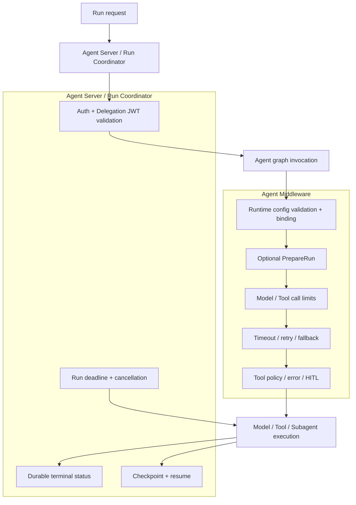

# Runtime Middleware 生命周期、顺序与失败语义（Draft）

> 文档类型：Draft
>
> 状态：讨论结论，暂不替代 `docs/standards/` 下的现行规范
>
> 关联文档：`11-agent-service-directory-architecture.md`、
> `12-runtime-context-and-local-debug-architecture.md`、
> `13-runtime-service-target-code-layout.md`、
> `14-runtime-contracts-and-resolution-design.md`、
> `16-runtime-observability-and-langfuse-design.md`、
> `17-platform-observability-query-and-admin-console-design.md`、
> `19-runtime-tool-capability-mcp-and-side-effect-design.md`
>
> 冻结范围：Middleware 责任边界、生命周期、显式顺序、失败语义、首期清单、
> Open SWE 取舍、`RuntimeConfigMiddleware` 职责和 Subagent 规则
>
> 暂不展开：具体异常类、timeout 数值、模型 fallback 列表、Tool 重试名单、
> HITL 产品交互、可观测后端和源码实现

## 1. 本轮结论

公共 Middleware 不是所有 Agent 自动套用的“全家桶”，也不提供
`build_middleware_stack(options)` 一类万能 Builder。公共层只提供可独立理解的原子能力，
每个 Service 必须在 `agent.py` 中显式列出实际 Middleware 及其顺序。

首期能力分为三类：

1. 本项目必须自行设计：`RuntimeConfigMiddleware`；锁定版本没有官方等价能力时，增加
   `ModelCallTimeoutMiddleware`。
2. 直接复用 LangChain / Deep Agents：调用次数限制、Tool 错误处理、Tool 重试、模型
   fallback、可选模型重试和 HITL。
3. Service 私有或验证后再引入：`PrepareRunMiddleware`、长任务收尾、Sandbox 熔断、
   Provider 消息修复、中断 Tool Call 修复。

Auth、Run 总 deadline、durable terminal status、业务工作流和 Subagent 编排都不属于公共
Middleware。Langfuse Callback、Agent Server events 和 Run 记录已经提供基础观察面，首期不再
创建一个只转发同样数据的 `ObservabilityMiddleware`。

本设计借鉴 Open SWE 的恢复、顺序和可靠性经验，但不复制它面向 GitHub、Slack、Sandbox
和 coding agent 的完整 Middleware 栈。

## 2. 责任边界



### 2.1 Agent Server / Coordinator 负责

- 验证 Delegation JWT 的签名、issuer、audience、scope 和时间窗口；
- 构造可信 `RuntimePrincipal` 和 `RuntimePolicy`；
- 控制整个 Run 的 deadline、取消和 worker 生命周期；
- 持久化成功、失败、取消和 interrupt 等 durable 状态；
- 管理 checkpoint、恢复和外层运行事件。

这些职责不能放进 `after_agent`。异常、取消、进程退出或 worker 被杀时，`after_agent` 不应
被假设为一定执行。

### 2.2 Agent Middleware 负责

- 在 graph invocation 和每次 Model/Tool 调用边界执行横切策略；
- 把 `ResolvedRuntimeConfig` 绑定到本次 Model request 和 Tool execution；
- 限制调用次数，处理明确分类的临时错误；
- 对需要人工批准的动作调用 `interrupt()`；
- 生成非敏感的 trace/event 摘要。

### 2.3 Middleware 不负责

- JWT 验签和身份补全；
- Platform API、数据库或配置中心查询；
- 业务 Workflow 分支；
- Prompt 业务内容、Subagent 任务分配和 MCP 业务选择；
- Sandbox、MCP Client 或动态 Tool 的跨 Run 缓存；
- 把所有异常转换成成功消息；
- 持久化最终 Run 状态。

## 3. LangChain 生命周期与顺序

官方生命周期：

```text
before_agent     每次 graph invocation 一次
before_model     每次模型调用前
wrap_model_call  包裹每次模型调用
after_model      每次模型响应后
wrap_tool_call   包裹每次 Tool 调用
after_agent      graph 正常完成后一次
```

声明 `middleware=[A, B, C]` 时：

- `before_*` 按声明顺序执行；
- `wrap_*` 形成嵌套调用，顺序必须通过锁定版本契约测试固定；
- `after_*` 按声明顺序的逆序执行。

不能只看列表猜测异常由谁捕获。特别是 `ToolRetryMiddleware` 和
`ToolErrorMiddleware` 的组合，实施时必须按当前锁定 LangChain 版本的官方示例和契约测试
确认：重试先耗尽，最后的可恢复异常才转换为 `ToolMessage`。

## 4. 推荐执行链路

```text
Agent Server Auth
  -> before_agent
       RuntimeConfig validation
       Optional idempotent PrepareRun

  -> agent loop
       before_model
         Model call limit

       wrap_model_call
         Runtime model/prompt/tool binding
           -> Model fallback
                -> Model retry（默认关闭）
                     -> Per-call wall-clock timeout
                          -> Provider call

       after_model
         Tool call limit
         Human approval / interrupt

       wrap_tool_call
         Runtime Tool allowlist check
           -> Tool error normalization（仅明确可恢复错误）
                -> Tool retry（仅显式幂等 Tool）
                     -> Tool execution

  -> after_agent
       only non-critical normal-completion work

  -> Run Coordinator
       durable success / failure / cancel / interrupt state
```

模型可靠性必须表达为以下语义：

```text
Fallback(Retry(Timeout(provider)))
```

- Timeout 只限制一次真实 Provider 调用；
- Retry 只重试同一个候选模型的临时错误；
- Fallback 在当前候选耗尽后切换模型；
- Run 总 deadline 位于整个 Agent 之外，防止 fallback 和 retry 无限扩张。

若 Provider SDK 已启用 retry，默认不再叠加 `ModelRetryMiddleware`。只有 trace 证明 Provider
retry 不足，或者明确关闭 Provider retry 后，才启用 Middleware retry。

## 5. 首期 Middleware 清单

### 5.1 本项目必须设计

| Middleware | 归属 | 首期状态 | 原因 |
| --- | --- | --- | --- |
| `RuntimeConfigMiddleware` | 公共 | 必须 | 将 14 号 Runtime 契约应用到真实 Model/Tool 调用 |
| `ModelCallTimeoutMiddleware` | 公共 | 条件必须 | 官方当前没有通用的单次 Model wall-clock timeout；用于处理 transport 卡死 |

`ModelCallTimeoutMiddleware` 只有在锁定版本仍没有官方等价能力时才自行实现。它只使用
`asyncio.timeout()` 或等价标准库能力包裹 `awrap_model_call`，不读取 env，不实现 retry、
fallback 或 Run 总 deadline。

### 5.2 直接复用官方能力

| 能力 | 官方组件 | 默认策略 |
| --- | --- | --- |
| 模型调用上限 | `ModelCallLimitMiddleware` | 所有 Agent 必须配置 run limit |
| Tool 调用上限 | `ToolCallLimitMiddleware` | 所有带 Tool 的 Agent 必须配置 run limit |
| Tool 可恢复错误 | `ToolErrorMiddleware` | 使用严格 `on_error`，未知异常返回 `None` 并继续抛出 |
| Tool 临时错误重试 | `ToolRetryMiddleware` | 只列出明确幂等 Tool 和明确异常 |
| Provider fallback | `ModelFallbackMiddleware` | Service 显式配置，不设平台隐式 fallback |
| Model retry | `ModelRetryMiddleware` | 默认关闭，避免与 Provider retry 叠加 |
| Human approval | `HumanInTheLoopMiddleware` 或 Deep Agents `interrupt_on` | 仅敏感 Tool 启用 |

当前 `apps/runtime-service/uv.lock` 锁定 `langchain==1.3.17`，已包含官方
`ToolErrorMiddleware`。因此不复制 Open SWE 自定义的全捕获 Tool Error 实现。

### 5.3 Service 私有能力

| 能力 | 推荐位置 | 何时使用 |
| --- | --- | --- |
| `PrepareRunMiddleware` | `services/<service>/middleware.py` | 每次 invocation 需要 workspace、短期凭证或运行快照 |
| 长任务 wrap-up | Service 私有 Middleware | Agent 需要在总 deadline 前主动总结并保存工作 |
| Sandbox circuit breaker | Service Backend/Middleware | Service 真实依赖可恢复 Sandbox |
| Provider message sanitizer | Service 私有 Middleware | 锁定 Provider/SDK 组合存在已复现兼容问题 |
| Tool input sanitizer | Tool 自身 schema/validator 优先 | 只有模型持续产生某种已知畸形参数时使用 |

`PrepareRunMiddleware` 首期不进入公共目录。第二个 Service 出现相同的 fingerprint、checkpoint
和恢复语义后，再提炼一个小型公共基类。

### 5.4 契约测试后再决定

Open SWE 的 `RepairOrphanedToolCallsMiddleware` 解决取消或 Sandbox 故障后，checkpoint 中存在
`AIMessage.tool_call` 却没有对应 `ToolMessage`，导致下一次 Provider 调用永久失败的问题。
这是通用恢复问题，但不能直接假设当前 LangGraph 仍未处理。

实施前先用锁定版本复现：

```text
Model emits tool call
  -> Run cancelled during tool execution
  -> checkpoint persists incomplete pair
  -> resume with new user message
  -> Provider accepts or rejects transcript
```

只有复现失败时，才增加公共 `InterruptedToolCallRecoveryMiddleware`。合成结果必须明确标记
`outcome=unknown`，绝不能声称原 Tool 没有产生外部副作用，也不能自动重试非幂等 Tool。

### 5.5 首期明确不设计

- `DefaultMiddlewareStack`、`MiddlewareBuilder`、Registry 或动态插件系统；
- `ObservabilityMiddleware`：优先使用 Langfuse Callback、Agent Server events 和原生 trace policy；
- `RunFinalizerMiddleware`：durable finalization 属于 Run Coordinator；
- `AuthMiddleware`：JWT 验证属于 Agent Server 边界；
- 通用 `DynamicToolMiddleware`：Tool 加载归 Service 组合根、MCP 或 Backend；
- 通用 `PromptMiddleware`：业务 Prompt 归 Service，Runtime 只绑定已发布 Prompt；
- 通用 Provider sanitizer：没有已复现问题时不增加兼容补丁。

## 6. `runtime_config.py` 的职责

`runtime/runtime_config.py` 不存在。目标文件是：

```text
src/runtime_service/middlewares/runtime_config.py
```

它是 14 号文档中的纯 Runtime 契约与 LangChain 调用边界之间的适配器：

```text
RuntimePrincipal + RuntimeContext + RuntimePolicy + AgentDefaults
                          |
                          v
             resolve_runtime_config()
                          |
                          v
              ResolvedRuntimeConfig
                          |
                          v
       ModelRequest / ToolCallRequest binding
```

该模块可以提供一个很小的 `execution_config(config)` 投影函数，专门复制并过滤
`RunnableConfig` 后供 Service 的 `agent.py` 调用。它只保留执行控制、追踪字段和受控
执行标识，不构建 Graph、不解析 `RuntimeContext`，也不是任何形式的公共 Builder。

### 6.1 输入

实例构造时由 Service 组合根注入：

- `AgentDefaults`；
- Service 已声明的 Model catalog/binder；
- Service 在 `get_agent()` 中显式装配的 Tool；
- 已发布 Prompt 的可信内容和版本。

每次 Run 从 LangGraph `Runtime` 读取：

- Auth 层已经构造的 `RuntimePrincipal`；
- Auth 层已经构造的 `RuntimePolicy`；
- `context_schema` 解析后的 `RuntimeContext`。

### 6.2 生命周期职责

`before_agent`：

1. 读取本次 Runtime 事实；
2. 调用同步纯函数 `resolve_runtime_config()`；
3. 在任何 workspace/MCP 准备前 fail-closed；
4. 产生一次非敏感 `runtime.config.resolved` 或 `runtime.config.rejected` 事件。

`wrap_model_call` / `awrap_model_call`：

1. 重新调用纯 Resolver，禁止读取跨 Run 缓存；
2. 根据 `model_id` 从 Service catalog 取得已声明模型；
3. 绑定 temperature、max tokens、top-p 等生成参数；
4. 校验 Prompt version/hash，绑定可信 system prompt；
5. 保持 `get_agent()` 的显式顺序，从 `request.tools` 过滤本次模型可见的
   Required/Optional Tools；
6. 使用 `request.override(...)` 产生新请求，再调用下一层 handler。

`wrap_tool_call` / `awrap_tool_call`：

1. 重新决议本次有效 Tool allowlist；
2. 按规范化名称检查模型请求的 Tool；
3. 未声明、未授权或已经失效的 Tool 立即 fail-closed；
4. 授权成功后才调用下一层 handler；MCP Tool 若已在 `get_agent()` 构图前加载，此处与普通
   Tool 没有区别。

重复调用 Resolver 是有意设计。Resolver 是同步纯函数，成本很低；这样可以避免把
`ResolvedRuntimeConfig`、Principal 或动态 Tool 对象塞进 checkpoint、Middleware 实例或
全局变量，并保证恢复和 Subagent 调用不会沿用另一 Run 的配置。

### 6.3 它明确不做什么

- 不验 JWT，不从 messages、state 或 configurable 补身份；
- 不访问 Platform API、数据库、MCP 或网络；
- 不创建 Sandbox，不加载 Service 私有集成；
- 不决定使用 `create_agent`、`create_deep_agent` 还是 `StateGraph`；
- 不实现 timeout、retry、fallback、HITL 或业务 Workflow；
- 不拼接 Service 私有 Prompt；
- 不吞掉 `RuntimeResolutionError`；
- 不跨 Run 缓存 Model、Tool、Client、Backend 或配置结果。

### 6.4 伪代码

```python
class RuntimeConfigMiddleware(AgentMiddleware):
    async def abefore_agent(self, state, runtime):
        resolved = self._resolve(runtime)
        emit_resolved_summary(resolved)

    async def awrap_model_call(self, request, handler):
        resolved = self._resolve(request.runtime)
        model = self._models.bind(resolved)
        tools = visible_tools(request.tools, resolved)
        prompt = self._prompt.require_hash(resolved.prompt_hash)
        return await handler(
            request.override(model=model, tools=tools, system_message=prompt)
        )

    async def awrap_tool_call(self, request, handler):
        resolved = self._resolve(request.runtime)
        require_executable(request.tool_call["name"], resolved)
        return await handler(request)
```

伪代码只表达职责，不冻结具体 LangChain 类型签名。实施时以锁定版本 API reference 和契约
测试为准。

## 7. Open SWE Middleware 取舍

| Open SWE 能力 | 结论 | 本项目落点 |
| --- | --- | --- |
| `BasePrepareRunMiddleware` | 借鉴 fingerprint + checkpoint 幂等模式 | 首个需要它的 Service 私有实现 |
| `ModelCallTimeoutMiddleware` | 借鉴 wall-clock timeout 和最内层位置 | 官方缺失时实现最小公共版本 |
| `ModelFallbackMiddleware` | 借鉴错误分类和 timeout 外层位置，不复制实现 | 复用 LangChain 官方组件 |
| `ToolErrorMiddleware` | 借鉴错误对模型可见，但拒绝捕获所有异常 | 复用官方严格 `on_error` |
| `task_retry_on` / `task_on_failure` | 借鉴按 Tool、按异常配置 | 复用官方 `ToolRetryMiddleware` |
| `DynamicToolMiddleware` | 只借鉴 Model 可见与 Tool 可执行必须一致 | 首期 MCP 在 `get_agent()` 构图前加载，不复制动态加载器 |
| `ExcludeToolsMiddleware` | 借鉴显式过滤 | 由 `RuntimeConfigMiddleware` 按 Policy 决议 |
| `RepairOrphanedToolCallsMiddleware` | 有价值但需先验证锁定版本 | 复现后再做公共恢复 Middleware |
| `StableToolResultOrderMiddleware` | 主要是 Prompt cache 性能优化 | 有测量证据后再引入 |
| `TimeoutWrapupMiddleware` | 长任务产品行为，不是通用 timeout | 有需要的 Service 私有实现 |
| Provider sanitizer 系列 | 针对特定 Provider 的兼容补丁 | 已复现问题时 Service 私有实现 |
| `SanitizeToolInputsMiddleware` | 针对 `read_file` 的输入修复 | 优先修 Tool schema/validator，不公共化 |
| Sandbox circuit breaker | 借鉴不自动替换有状态 Sandbox 的原则 | Sandbox Service/Backend 私有能力 |
| Plan、PR、Workflow、GitHub、Slack、Subdir Middleware | coding agent 业务逻辑 | 不进入公共 Runtime |

Open SWE 的 `server.py` 同时承担 Profile、Thread Settings、Model、Tool、Sandbox 和
Middleware 装配，不能复制成我们的公共入口。我们只借鉴它在组合根显式声明顺序的做法。

## 8. 普通 Agent、Deep Agent 与 Subagent

三种 graph 构造方式共享相同 Middleware 原子能力，不建立三套框架：

```python
MIDDLEWARE = [
    RuntimeConfigMiddleware(defaults=DEFAULTS),
    ModelCallLimitMiddleware(run_limit=MODEL_CALL_LIMIT),
    ToolCallLimitMiddleware(run_limit=TOOL_CALL_LIMIT),
    ModelFallbackMiddleware(FALLBACK_MODEL),
    ModelCallTimeoutMiddleware(timeout_seconds=MODEL_TIMEOUT),
]


async def get_agent(config: RunnableConfig) -> Pregel:
    return create_agent(
        model=BOOTSTRAP_MODEL,
        tools=TOOLS,
        middleware=MIDDLEWARE,
        context_schema=RuntimeContext,
    )
```

Deep Agent 可以增加 Skills、Backend、Subagents 和 Service 私有 Middleware，但不改变公共
Runtime 语义。

Subagent 会编译成独立 graph，父 Agent Middleware 不自动继承。每个自定义 Subagent 必须
显式配置：

- 自己的 `AgentDefaults` 和显式 Tool 列表；
- Runtime Tool allowlist 检查；
- Model/Tool 调用上限；
- 单次 Model timeout；
- 需要时的 Tool retry/error 和 Provider fallback。

Runtime Context 能传播到 Subagent，只说明数据可达，不代表授权、timeout 和错误策略自动
生效。

## 9. 失败语义

| 失败类型 | 行为 | retry/fallback |
| --- | --- | --- |
| Auth、Context、Policy 非法 | 稳定错误码，立即终止 | 否 |
| 未声明、未授权或失效 Tool | fail-closed，禁止执行 | 否 |
| Prompt hash 或 binding 错误 | Run 失败，视为部署错误 | 否 |
| Provider timeout、429、部分 5xx | 有界 retry，之后按配置 fallback | 有条件 |
| Provider auth、参数、context length 错误 | 直接失败 | 否 |
| Tool 明确可由 LLM 修正的业务错误 | 脱敏 `ToolMessage(status="error")` | 由模型决定下一步 |
| 幂等 Tool 临时网络错误 | 有界指数退避 | 是 |
| 非幂等 Tool 结果未知 | 返回 uncertain outcome 或终止 | 绝不自动 retry |
| `interrupt()` | Run 暂停，等待恢复 | 不是失败 |
| cancellation / Run deadline | 立即向外传播 | 否 |
| 未知程序异常 | 保留 trace 并抛出 | 否 |
| 非关键 metrics/trace 增强失败 | 告警，主流程继续 | 否 |

`ToolErrorMiddleware` 的 `on_error` 只能处理明确列出的可恢复异常。权限错误、取消、
interrupt、Provider/Sandbox 不确定结果和程序缺陷必须继续抛出，不能伪装成普通 Tool 错误。

## 10. PrepareRun 恢复语义

借鉴 Open SWE：

```text
latest message fingerprint
  + prepare configuration fingerprint
  + middleware identity/version
  = run_prepared_for
```

`before_agent` 发现 checkpoint 中 fingerprint 相同时跳过准备；新消息、配置或 Middleware
版本变化时重新准备。即使有 latch，`prepare()` 仍必须幂等，因为准备完成但 checkpoint 尚未
落盘时发生故障，会导致下一次恢复重新执行。

PrepareRun state 只保存恢复所需的稳定事实，不保存 Token、Client、Backend 或其他进程内
对象。短期凭证在恢复时重新取得，不能从 checkpoint 复用过期 secret。

## 11. 验证要求

实施前和实施中至少需要以下契约测试：

1. `before_*`、Model wrap、Tool retry/error 和 `after_*` 的真实执行顺序；
2. Runtime 在 Model 可见列表和 Tool 执行边界使用同一份 allowlist；
3. Policy 变化后恢复 Run 会重新决议，不沿用旧配置；
4. Timeout 只覆盖单次 Provider call，且错误能到达 fallback；
5. Provider retry 与 Middleware retry 不形成乘法重试风暴；
6. Tool retry 只作用于配置的幂等 Tool；
7. `ToolErrorMiddleware` 不吞权限错误、取消、interrupt 和未知异常；
8. `after_agent` 不被当作异常路径的 durable finalizer；
9. 父 Agent Middleware 不会被错误假设为 Subagent 自动继承；
10. 中断 Tool Call 的 checkpoint/resume 行为决定是否需要恢复 Middleware；
11. stream、checkpoint 和 trace 不泄漏 JWT、secret 或完整 Prompt。

## 12. 目录结论

首期目标目录：

```text
src/runtime_service/
├── middlewares/
│   ├── __init__.py
│   ├── runtime_config.py
│   └── model_call_timeout.py    # 锁定版本无官方等价能力时才创建
└── services/
    └── <service>/
        ├── agent.py      # Middleware 顺序的唯一组合根
        └── middleware.py        # Service 私有 PrepareRun 等能力，按需创建
```

首期不创建：

```text
middlewares/builder.py
middlewares/registry.py
middlewares/stack.py
middlewares/observability.py
middlewares/finalizer.py
```

## 13. 实施边界

本设计进入实现后会影响 Runtime Auth、Tool Policy、Subagent 和运行失败语义，继续属于 14 号
文档定义的 B3 Governed Change。实施前必须创建 OpenSpec change，并用锁定版本完成生命周期
和恢复契约测试。

本轮只写设计文档，不创建 `src/runtime_service/`，不迁移 Legacy，不修改依赖版本，不实现
Middleware。

## 14. 参考依据

- LangChain Middleware Overview：`/oss/python/langchain/middleware/overview`
- LangChain Custom Middleware：`/oss/python/langchain/middleware/custom`
- LangChain Built-in Middleware：`/oss/python/langchain/middleware/built-in`
- LangChain Tool Error Handling：`/oss/python/langchain/tools#error-handling`
- Deep Agents Fault Tolerance：`/oss/python/deepagents/fault-tolerance`
- Deep Agents Human-in-the-loop：`/oss/python/deepagents/human-in-the-loop`
- LangChain Python API reference：`langchain.agents.middleware`
- Deep Agents Python API reference：`deepagents.middleware.subagents.SubAgent.middleware`
- Open SWE：`agent/server.py`
- Open SWE：`agent/middleware/prepare_run.py`
- Open SWE：`agent/middleware/model_call_timeout.py`
- Open SWE：`agent/middleware/model_fallback.py`
- Open SWE：`agent/middleware/tool_error_handler.py`
- Open SWE：`agent/middleware/repair_orphaned_tool_calls.py`
- Open SWE：`agent/middleware/stable_tool_order.py`
