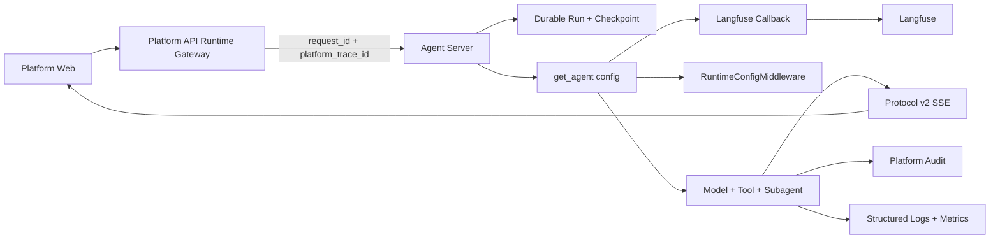

# Runtime 公共可观测与 Langfuse 架构设计（Draft）

> 文档类型：Draft
>
> 状态：讨论结论，暂不替代 `docs/standards/` 下的现行规范
>
> 关联文档：`12-runtime-context-and-local-debug-architecture.md`、
> `13-runtime-service-target-code-layout.md`、
> `14-runtime-contracts-and-resolution-design.md`、
> `15-runtime-middleware-lifecycle-and-failure-semantics.md`、
> `17-platform-observability-query-and-admin-console-design.md`
>
> 冻结范围：可观测职责边界、Langfuse 接入点、Trace 数据模型、关联字段、数据采集、
> 失败语义、Subagent 传播、本地调试与部署边界
>
> 暂不展开：Langfuse 基础设施部署清单、跨服务 OpenTelemetry parent 传播、平台内嵌 Trace UI、
> 动态采样和告警规则实现

> R5 实施边界：以 `openspec/changes/archive/2026-08-30-runtime-service-r5-observability/` 为准。
> 当前审核结论为 adapter/local-contract 部分完成；正文采集、多模式 exporter 与 Platform 查询不在本阶段。

## 1. 本轮结论

Runtime Service 使用 Langfuse 作为 Agent 工程 Trace Backend，但 Langfuse 不是整个平台的
唯一可观测事实源。

首期设计遵守以下规则：

1. Langfuse 负责 Agent、Model、Tool 和 Subagent 的执行时间线、耗时、Token 与错误定位。
2. Durable Run、SSE、Audit、结构化日志和基础设施指标继续各自承担独立职责。
3. 保持统一入口 `async def get_agent(config: RunnableConfig) -> Pregel`，不照搬 Open SWE
   为 LangSmith 设计的异步 `traced_graph_factory()`。
4. Langfuse 通过 LangChain Callback 接入，不创建 `ObservabilityMiddleware`，也不在每个 Tool
   中重复手写基础埋点。
5. 生产默认只记录 metadata，不上传完整 Prompt、模型响应和 Tool 输入输出。
6. Langfuse 运行期故障必须 fail-soft，不能改变 Agent Run 的业务结果。
7. 身份、租户和项目字段只能来自已验证的 `RuntimePrincipal`，不能信任用户传入的
   `RunnableConfig.metadata` 或 `configurable`。
8. 首期只实现 Langfuse，不建立单实现的 Provider、Registry、Builder 或插件框架。

## 2. 五个观察面与事实源



| 观察内容 | 唯一事实源 | Langfuse 的角色 |
| --- | --- | --- |
| Run 创建、状态、恢复、中断、取消、checkpoint | Agent Server / Run Coordinator | 只保存关联 ID 和执行 Trace |
| 用户实时进度、消息、Tool 和 Subagent 展示 | Protocol v2 SSE | 不作为前端事件源 |
| Model、Tool、Subagent、耗时、Token、错误链路 | Langfuse | 主要事实源 |
| 权限决策、人工审批和外部副作用 | Platform Audit | 可保存脱敏关联摘要，不替代审计 |
| HTTP、数据库、进程健康和 exporter 故障 | Structured Logging / Metrics | 不替代服务级诊断 |

边界含义：

- Langfuse Trace 存在不代表 Run 已成功持久化；最终状态以 Run Coordinator 为准。
- SSE 断开不代表 Agent 停止；恢复和取消仍由 Durable Run 管理。
- Tool Span 成功不等于副作用审计完成；外部资源 ID 和 `success/failed/unknown` 结果以 Audit
  为准。
- Langfuse 不参与鉴权、Tool allowlist、Prompt 选择或重试决策。

## 3. Open SWE 的借鉴与拒绝项

### 3.1 借鉴

Open SWE 的 `agent/utils/langfuse.py` 证明了最小接入方式：给返回的 `Pregel` 合并 Langfuse
Callback 和 metadata，由 LangChain 自动捕获 Model、Tool 和嵌套 Runnable。

本项目借鉴：

- 在 graph 入口统一注入 Callback；
- `thread_id -> Session` 的会话聚合；
- 一次 graph invocation 对应一条根 Trace；
- LangChain Callback 自动捕获 Generation、Tool 和 Subagent Observation；
- 自托管 Langfuse，Runtime 服务端持有 key；
- 常见 secret key 和 token pattern 脱敏；
- 本地优先用 Runtime、SSE、日志和断点分层排障。

### 3.2 不照搬

Open SWE 的 `traced_graph_factory()` 使用异步上下文管理器，主要目的是让 graph 执行期间保持：

```python
with langsmith.tracing_context(project_name=project_name):
    yield graph
```

这不是 Langfuse Callback 的必要条件。本项目已经冻结 `get_agent(config) -> Pregel` 作为唯一
Service 入口，因此不再增加第二种上下文管理器入口。

本项目同时拒绝：

- 从普通 `configurable` 读取用户、租户和项目身份；
- 配置缺失时静默关闭已经显式启用的生产 Trace；
- 仅依靠正则脱敏后上传完整私有代码和 Prompt；
- 每次 Run 创建多个 Langfuse Client；
- 把 coding agent 私有的 Sandbox、GitHub、Slack 或 Linear 埋点提升为公共 Runtime 能力。

## 4. 最小公共目录与 API

首期只增加：

```text
src/runtime_service/
└── observability/
    ├── __init__.py
    └── langfuse.py
```

不创建：

```text
observability/provider.py
observability/registry.py
observability/builder.py
observability/tracing_factory.py
middlewares/observability.py
```

`observability/langfuse.py` 只承担三个边界：

1. 在应用 lifespan 初始化和关闭进程级 Langfuse Client；
2. 为单次 graph invocation 创建 Callback，并将 Callback、tags 和 metadata 合并到 graph；
3. Runtime 决议成功后，用可信的安全摘要补充当前根 Trace。

目标调用方式：

```python
async def get_agent(config: RunnableConfig) -> Pregel:
    graph = create_deep_agent(
        model=BOOTSTRAP_MODEL,
        tools=TOOLS,
        middleware=MIDDLEWARE,
        context_schema=RuntimeContext,
    )
    return with_langfuse_tracing(graph, config, graph_id=GRAPH_ID)
```

`with_langfuse_tracing()` 必须满足：

- `LANGFUSE_ENABLED` 非 `true` 时原样返回 graph；
- 保留并合并已有 callbacks、metadata 和 tags，禁止覆盖调用方配置；
- 不创建 graph，不选择 Model、Prompt、Tool、Skill、Backend 或 Subagent；
- 不读取业务数据库，不验 JWT，不把 Trace metadata 当作授权输入；
- 初始化或导出失败不修改 Agent 输入、输出和异常语义。

首期允许进程级 Client 复用，但 Callback 是否按 Run 创建，以锁定 Langfuse SDK 的并发契约为
准。实施测试必须证明并发 Run 不会串联 Trace 或 metadata。

## 5. Trace 数据模型

```text
Session: thread_id
  Trace: one graph invocation / run_id
    Agent root
      runtime.config.resolved summary
      Generation: model call
      Tool span: tool call
      Subagent observation
        Generation: subagent model call
        Tool span: subagent tool call
```

映射规则：

| Runtime 概念 | Langfuse 概念 | 规则 |
| --- | --- | --- |
| `thread_id` | Session | 聚合同一任务或对话的多次 Run |
| graph invocation / `run_id` | Trace | 每次 invocation 创建新 Trace |
| graph 根执行 | Agent root observation | 包含本次 Agent 时间线 |
| 模型调用 | Generation | 记录模型、Token、耗时和错误 |
| Tool 调用 | Tool / Span | 记录工具名、安全摘要、耗时和错误 |
| Subagent | Nested Observation | 默认不创建独立 Trace |

Interrupt 后恢复会形成新的 graph invocation，因此创建新 Trace，但继续使用同一个 Session。
不能让一条 Trace 跨数小时等待人工恢复。

只有独立的顶层 Service Run 才创建新 Trace。父 Agent 内通过 `task` 等机制调用的 Subagent，
应保持为父 Trace 的嵌套 Observation。

## 6. 关联字段与信任边界

### 6.1 根 Trace 字段

```text
session_id = thread_id
trace_name = graph_id
user_id    = RuntimePrincipal.user_id
```

推荐 metadata：

```text
request_id
platform_trace_id
run_id
thread_id
assistant_id
assistant_version
graph_id
tenant_id
project_id
deployment_version
model_id
config_hash
prompt_version
prompt_hash
policy_version
```

tags 只允许低基数字段：

```text
environment
service
graph_id
source
release
```

`run_id`、`thread_id`、`request_id`、`user_id`、`tenant_id` 和 `project_id` 不进入 tags，避免高
基数标签污染查询和成本。

### 6.2 两阶段补充

graph factory 只允许附加 Agent Server 已规范化的技术关联字段，例如 `thread_id`、`run_id`、
`request_id` 和 `platform_trace_id`。这些字段只用于关联，不能参与授权。

`RuntimeConfigMiddleware` 在 Auth 已构造 `RuntimePrincipal`、`RuntimePolicy` 且
`resolve_runtime_config()` 成功后，才补充：

- `user_id`、`tenant_id`、`project_id`；
- `model_id`、`config_hash`；
- `prompt_version`、`prompt_hash`、`policy_version`；
- Required/Optional Tool 的名称摘要，不包含实现对象和完整参数。

补充 Trace metadata 失败只写结构化告警，不能让已通过的 Runtime 决议失败。若锁定版本无法
从 Middleware 安全更新当前根 Trace，首期省略这些字段，禁止退回读取未签名身份 metadata。

### 6.3 跨服务关联

当前阶段：

- Platform API 的 `platform_trace_id` 作为 Langfuse metadata；
- 外部传入的 `x-trace-id` 只能作为普通 correlation label；
- 不接受公网传入的 `traceparent` 或 `baggage` 作为可信 parent；
- Langfuse Trace ID 不强制等于 Platform Trace ID。

只有未来 Agent Server 明确建立可信的 OpenTelemetry 传播契约后，才讨论跨进程 parent/child
Trace。该能力不进入首期实现。

## 7. 数据采集与隐私

R5 使用单一部署级 metadata 模式，配置沿用运行时 `.env`：

```text
LANGFUSE_ENABLED=false
LANGFUSE_PUBLIC_KEY=...
LANGFUSE_SECRET_KEY=...
LANGFUSE_BASE_URL=...
LANGFUSE_TRACING_ENVIRONMENT=...
```

规则：

- `LANGFUSE_ENABLED` 未显式设置为 `true` 时不初始化 Langfuse；
- 显式启用但 key 或 base URL 缺失时，lifespan 初始化失败；
- R5 不实现 `content` 采集。未来如需开放正文采集，必须另起变更；
- 该配置来自 env/secret deployment，不进入 `RuntimeContext`、Assistant 或 Run payload；
- metadata 在导出边界直接丢弃完整 input/output，不把脱敏正则当作唯一 DLP。

### 7.1 metadata 模式记录

- graph、Model、Tool 和 Subagent 的层级；
- 模型 ID、Token usage、耗时和完成状态；
- Tool 名称、参数/结果的安全摘要、错误类型和耗时；
- 第 6 节允许的关联字段；
- 外部副作用的安全资源 ID，例如允许展示的 PR URL 或 commit SHA。

### 7.2 永不记录

- JWT、API key、OAuth token、Cookie、Authorization header；
- 模型内部思维链；
- 未脱敏私有源码；
- 完整 Prompt、完整模型响应、完整 Tool 参数和结果；
- Python Model、Tool、Client、Backend、Sandbox 或 credential 对象。

Open SWE 的 key/pattern 脱敏可以作为纵深防御，但无法识别所有业务 secret。`content` 模式仍须
执行脱敏，并通过环境隔离、访问控制和保留期限限制风险。

## 8. 生命周期与失败语义

### 8.1 启动

- `LANGFUSE_ENABLED` 非 `true`：不导入或初始化 Langfuse Client；
- 显式启用且 key、base URL 等必填配置缺失：启动失败；
- 不用启动网络探测决定服务是否可用，避免 Langfuse 短暂不可达阻止 Runtime 启动；
- Client 在应用 lifespan 中初始化一次，不在每个 Run 重建。

### 8.2 运行

- Callback/exporter 网络错误 fail-soft；
- exporter 队列必须有界，背压时允许丢弃 Trace，禁止阻塞 Agent；
- 丢弃、导出失败和队列状态进入结构化日志与服务指标；
- 不在每个 Run 结束时同步 `flush()`；
- Langfuse 错误不能覆盖原始 Model、Tool、interrupt、cancel 或 Run 异常。

### 8.3 退出

- 服务 shutdown/lifespan 统一执行有界 flush；
- flush 超时只告警，不让进程无限等待；
- 单进程本地脚本在退出前显式 flush；
- worker 被强制终止时允许丢失末尾 Trace，Durable Run 和 Audit 仍必须保持正确。

## 9. Subagent 与上下文传播

Runtime Context 传播、Middleware 继承和 Callback 传播是三件不同的事：

- Deep Agents 可以将 Runtime Context 传入 Subagent；
- 父 Agent Middleware 不会因此自动成为 Subagent Middleware；
- Runnable callbacks、metadata 和 tags 应沿同一执行链传播，但必须通过锁定版本测试确认。

首期规则：

1. 同进程、同调用链 Subagent 必须出现在父 Trace 下。
2. 自定义 Subagent 显式配置自己的 Runtime、Tool Policy、调用上限和 timeout。
3. detached task、后台任务或跨进程 Subagent 必须显式传播可观测上下文。
4. 无法可靠传播时，宁可创建带 `parent_run_id` metadata 的独立 Trace，也不能伪造父子关系。
5. Trace 传播不授予身份、Tool 权限或数据访问权限。

## 10. 本地调试路径

本地开发不依赖 Platform API，但不能只靠 Langfuse 排障。

### 10.1 纯 Agent 调试

适合隔离 Model、Prompt、Tool schema 和单个 Tool：

```text
PyCharm / pytest
  -> 构造可信 fixture RuntimePrincipal + RuntimePolicy
  -> await get_agent(config)
  -> graph.ainvoke / graph.astream
```

该路径不证明 Agent Server Auth、checkpoint、恢复和 SSE 正确。

### 10.2 完整 Runtime 调试

适合验证生产链路：

```text
本地短期 Delegation JWT
  -> langgraph dev
  -> SDK / curl 创建 thread 和 run
  -> 查看 Protocol v2 SSE
  -> 对照结构化日志、断点和 Langfuse Trace
```

固定排障顺序：

1. Run 是否创建并取得 `thread_id/run_id`；
2. SSE 是否持续到达，当前卡在哪个节点；
3. Runtime Auth 和配置决议是否成功；
4. Langfuse 中 Model、Tool、Subagent 的时间线；
5. 外部副作用对应的 Platform Audit；
6. 最后才在受控本机断点查看完整逻辑请求。

## 11. 部署与访问边界

首期冻结：

1. 生产使用自托管 Langfuse；Cloud 只用于允许数据上传的开发验证。
2. 一个环境对应一个 Langfuse Project，不按 tenant 创建 Project。
3. tenant、project 通过可信 metadata 过滤。
4. Langfuse UI 只对内部开发、运维和获授权安全人员开放。
5. Platform Web 不直接请求 Langfuse，浏览器永远不持有 Langfuse key。
6. 未来若向平台用户展示 Trace，由 Platform API 提供授权后的只读查询，不直连 Langfuse。

自托管基础设施、备份、保留期限、删除流程和灾备属于部署设计，不复制 Langfuse 官方
Compose 到 Runtime Service 仓库。

## 12. 实施前契约测试

实现阶段至少验证：

1. `with_langfuse_tracing()` 不覆盖已有 callbacks、metadata 和 tags；
2. 同一 `thread_id` 的多次 Run 进入同一 Session，但各自生成独立 Trace；
3. Interrupt/resume 不形成跨等待期的长 Trace；
4. Model、Tool、普通 Subagent 正确形成父子 Observation；
5. 两个并发 Run 不串联 Callback 状态、user metadata 或 Session；
6. detached/cross-process Subagent 的显式传播或降级行为可预测；
7. `metadata` 模式不导出 Prompt、模型正文、Tool 完整参数或私有源码；
8. secret mask 覆盖常见 Header、Token 和嵌套 Mapping，但不作为唯一 DLP；
9. Langfuse 不可达、队列满和 flush 超时不改变 Agent Run 结果；
10. 显式启用但配置缺失时启动失败，`off` 时不初始化 SDK；
11. `RuntimePrincipal` 字段只能在可信决议后进入 Trace；
12. Platform `request_id/platform_trace_id`、Runtime `run_id/thread_id` 可以相互查询关联。

LangChain、LangGraph、Deep Agents 和 Langfuse 的版本都必须锁定。Subagent Callback 传播、
Langfuse 当前 Trace 更新和并发 Handler 行为以真实契约测试为准，不能只根据文档假设。

## 13. 实施顺序与边界

建议在后续 B3 OpenSpec change 中实施：

1. 锁定 SDK 版本并编写 Callback、并发、Subagent 和脱敏契约测试；
2. 创建 `observability/langfuse.py`，实现 `off/metadata/content` 和生命周期；
3. 在 `reference_agent.get_agent()` 注入 Callback；
4. 在 `RuntimeConfigMiddleware` 决议成功后补充可信安全摘要；
5. 接入 shutdown flush、结构化告警和丢弃指标；
6. 用本地 `langgraph dev` 验证 Session、Trace、Generation、Tool 和 Subagent；
7. 再接入 Platform Gateway，验证四类关联 ID 和访问边界。

首期不实现：

- 通用 Observability Provider；
- Platform 内嵌 Langfuse 页面；
- 动态采样服务；
- 跨服务可信 OTel parent；
- coding agent 私有副作用 Span 全家桶；
- 自研 Trace 存储或查询 UI。

## 14. 参考依据

- Open SWE：`agent/utils/tracing.py`
- Open SWE：`agent/utils/langfuse.py`
- Open SWE：`agent/server.py`
- Open SWE 学习文档：`18-traced-graph-factory-context-manager.md`
- Open SWE 学习文档：`19-local-observability/README.md`
- Open SWE 学习文档：`19-local-observability/03-self-hosted-langfuse.md`
- LangChain `RunnableConfig` callbacks、metadata 和 tags 传播契约
- Langfuse Python SDK 与 LangChain Callback integration

## 15. R5 Harness 对齐审核（2026-09-01）

本表按当前源码、当前测试和可重跑命令审核，覆盖并修正 R5 归档记录中的乐观结论。`是否实现` 只有
Requirement 整体有正确边界、实现和可失败验证时才填 `✅`；`local` 不等于生产，明确后置项也不
伪装成已实现。

| Requirement | 是否实现 | 实现位置 | 测试/验证位置 | 证据与缺口 |
| --- | --- | --- | --- | --- |
| R5-001 Langfuse 默认关闭、显式开启校验、lazy SDK import | ✅ | `src/runtime_service/observability/langfuse.py`；`src/runtime_service/webapp.py` | `tests/observability/test_langfuse.py`；dev server 和目标镜像均加载 `webapp.py:app` | 默认关闭和显式缺失配置成立；目标镜像在 combined lifespan 进入前被 Agent Server entitlement `403` 阻断 |
| R5-002 进程级 Client 与 shutdown bounded flush | ✅ | `webapp.py:lifespan`；`langfuse.py:initialize_langfuse/close_langfuse` | `uv run pytest tests/observability -q`：`25 passed`；dev server 可启动 | Runtime 本地 lifespan 已接管 client；目标镜像未进入 application startup，生产 SIGTERM/drain 仍无证据 |
| R5-003 Graph return boundary 合并 callbacks、metadata、tags | ✅ | `langfuse.py:_approved_metadata/_trusted_metadata/_merge_config`；五个 Demo 返回边界 | `tests/observability/test_langfuse.py`；`tests/observability/test_graph_tracing.py` | caller 只保留 allowlist，trusted 值覆盖 attacker，高基数 tag 丢弃 |
| R5-004 可信 Runtime metadata 覆盖不可信身份 | ✅ | `reference_agent`、`deep_agent_demo`、`backend_demo`、`mcp_demo` 传入 resolver 摘要；workflow 只保留技术字段 | `tests/observability/test_langfuse.py`；`tests/services/test_r4_capability_demos.py`；`test_graph_tracing.py` | 未验证 metadata 不生成 `langfuse_user_id`；workflow 不伪造匿名身份 |
| R5-005 metadata-only、完整正文丢弃和敏感字段脱敏 | ✅ | `langfuse.py:_redact/_mask` | `tests/observability/test_langfuse.py`；真实 smoke | 本地边界和真实 SDK callback 通过；不是完整 DLP |
| R5-006 Run/Tool/Token/耗时诊断信号 | ✅ | `langfuse.py:_RuntimeDiagnosticsCallback/get_observability_metrics` | `tests/observability/test_langfuse.py`；真实 Agent/Deep Agent graph tests | 日志含 graph/run/thread/request、状态、耗时、Tool error 和 token；远端 metrics exporter 不由 Runtime 自建 |
| R5-007 Langfuse/exporter/queue/flush 故障 fail-soft | ❌ | `langfuse.py:_FailSoftCallback/close_langfuse`；正式 OpenTelemetry `BatchSpanProcessor` queue 配置 | `tests/observability/test_langfuse.py` 覆盖 401/429/5xx/timeout 分类、callback/flush failure、SDK queue saturation、原始 Model/Tool/interrupt/cancel/timeout 语义；`event_dropped` Counter 已接入 | 本地 queue-full 非阻塞和真实 Trace/Observation 查询成立，但真实 exporter 服务端故障、独立 generic OTLP destination 和生产 SIGTERM/drain 尚未可重跑；因此仍不填 `✅` |
| R5-008 Model、Tool、Subagent 父子 Trace 层级与并发隔离 | ✅ | adapter callback 绑定；现有 `create_agent`/`create_deep_agent` graph | `tests/observability/test_graph_tracing.py`：Model/Tool/Subagent 传播通过 | 已证明 LangChain callback 事件传播和本地隔离；尚未查询 Langfuse 服务端最终 observation 树 |
| R5-009 五个 Service 都接入统一 adapter | ✅ | `services/{reference_agent,workflow_demo,deep_agent_demo,mcp_demo,backend_demo}/agent.py` | `tests/services/test_r4_capability_demos.py`；全量 Runtime tests | 五个入口统一接线，MCP trusted metadata 已补齐，workflow 保持匿名边界 |
| R5-010 跨服务 request/platform trace 与 Runtime run/thread 传播 | ❌ | adapter 只读取传入 `RunnableConfig` metadata/configurable | 无 Agent Server -> Service -> Langfuse 传播测试 | Platform Gateway、可信 parent、四类关联 ID 查询链未实现；文档已明确后置，不能计入 R5 完成 |
| R5-011 Run 状态、SSE、Audit 与 Langfuse 职责分离 | ✅ | 本文 §2、§6；R5 未实现 Run Coordinator/查询代理 | 设计静态检查；无 Runtime 代码复制状态机 | 作为“不建设”的边界成立；不代表 Run Event、Run Explorer 已存在 |
| R5-012 真实 Langfuse Trace smoke 可重跑 | ✅ | `tests/e2e/test_langfuse_real.py` | `RUNTIME_E2E=1 RUNTIME_R5=1 uv run --frozen pytest tests/e2e/test_langfuse_real.py -m e2e -q`：`1 passed in 3.09s`；`.env` 凭据已实际读取 | workflow Trace、`auth_check()` 和 flush 通过；服务端异步可查询性和 UI 查询不在当前 smoke 内 |

### 15.1 本文 R5 判定

```text
R5 runtime-contract/lifecycle/real-smoke = complete-local
R5 exporter queue-drop/production-container evidence = incomplete
R5 cross-service propagation = deferred-by-design
```

当前可以确认：服务 lifespan、Client/Callback adapter、可信 metadata allowlist、五个入口接线、
Model/Tool/Subagent callback 传播、结构化诊断和真实 Langfuse smoke 均有可重跑证据。不能确认：
目标镜像已证明 Docker 配置能加载 custom auth、`webapp.py:app` 并连接 PostgreSQL/Redis，但 Agent Server
entitlement 检查返回 `403`，在 application startup 完成前以退出码 `3` 退出。因而仍不能确认生产容器
SIGTERM/drain、SDK queue drop 的 Runtime Counter、服务端最终 observation 树和跨服务传播。
因此 R5 可写成 `complete-local`，不能写成生产全链路完成。

## 16. GraphHarbor 与 Runtime 的观测责任分界（2026-09-02）

观测链路尚未达到生产门槛时，先判断缺口属于哪个边界。Runtime Service 不把 Langfuse
业务逻辑移入 GraphHarbor；GraphHarbor 只需要保证通用执行链路不丢失关联字段和生命周期
证据。

| 观测问题 | Runtime Service | GraphHarbor | 当前判定 |
| --- | --- | --- | --- |
| Model、Tool、Subagent 的 Observation 和 metadata allowlist | 负责 Callback、可信字段和脱敏 | 只保留通用 `RunnableConfig` 传递 | Runtime 已有本地实现 |
| `run_id/thread_id/graph_id/request_id` 跨 API、队列和 Worker | 负责映射和查询约定 | 负责通用传递、持久化和事件日志 | 必须做集成契约测试 |
| API 到 Worker 的 trace/correlation context | 负责只接受可信关联值 | 负责跨进程保留和恢复 | 当前跨服务传播仍未验收 |
| queue lag、lease recovery、checkpoint latency、Run terminal | 使用这些信号定位业务问题 | 负责通用日志/指标 | GraphHarbor 已有基础能力，生产水位仍需验收 |
| Langfuse endpoint、队列满、401/429/5xx/timeout、bounded flush | 负责 fail-soft 和 `event_dropped` | 不感知 Langfuse | Runtime 本地矩阵已覆盖，生产组合未闭合 |
| Platform Audit、成本归属、Trace 查询授权 | Platform/Runtime 负责 | 不负责 | 不进入 GraphHarbor |

因此对“`langgraph` 的 runtime-service 这一层还需不需要触及 GraphHarbor”的回答是：

1. 需要触及 GraphHarbor 的**通用协议边界**，验证 metadata/context/correlation 是否从 API
   到 Worker 且跨重启保持一致；发现丢失才在 GraphHarbor 创建独立改动。
2. 不需要把 `LangfuseCallback`、项目模型字段、Tool Policy、脱敏规则或 Platform 查询 API
   写入 GraphHarbor。
3. 当前 `30-R6-013` 的 `partial` 不是 GraphHarbor 必须接管 Langfuse 的结论，而是生产
   exporter 故障、generic OTLP 和跨服务传播证据还没有闭合。

最小生产化证据应同时包含：同一 Run 的 API/Worker/PG/Redis/Langfuse 关联查询；Worker 替换
后的 trace context 连续性；exporter 不可达或队列满时 Run 仍能 finalize；日志和指标不输出
凭据、完整 Prompt、模型响应或无限制 Tool 参数。没有这些证据，不能把 local callback
测试升级为生产观测完成。
