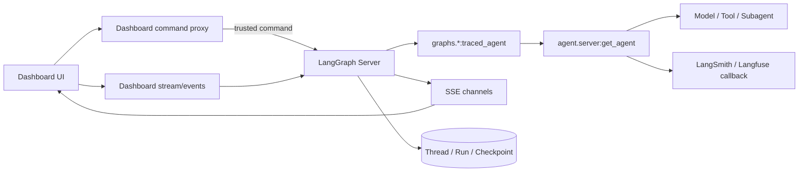

# Open SWE 借鉴与 Runtime Run Event / Run Explorer 设计（Draft）

> 文档类型：Draft
>
> 状态：讨论稿，不替代 `docs/standards/` 下的现行规范
>
> 关联文档：`11-agent-service-directory-architecture.md`、
> `12-runtime-context-and-local-debug-architecture.md`、
> `14-runtime-contracts-and-resolution-design.md`、
> `15-runtime-middleware-lifecycle-and-failure-semantics.md`、
> `16-runtime-observability-and-langfuse-design.md`、
> `17-platform-observability-query-and-admin-console-design.md`
>
> 参考项目：`open-swe` 外部研究副本

## 1. 结论

我们的 Runtime Run Event 和 Run Explorer 设计借鉴了 Open SWE 的运行链路思想，但不是
照搬 Open SWE 的实现。

Open SWE 没有平台级 `runtime_run_events` 事件表，也没有独立的 Run Explorer 聚合 API。
它主要依赖 LangGraph Server 原生的 Thread、Run、Checkpoint 和 SSE，再由 Dashboard 做：

- 服务端可信命令重建；
- 命令面与观察面分离；
- 可恢复 SSE 订阅；
- Thread metadata 的轻量索引；
- 前端对消息、Tool、Subagent 的稳定投影。

本项目要建设的是多 Agent 平台，必须额外解决历史查询、项目权限、审计、跨来源聚合、数据
保留和外部观测系统降级，因此需要一层平台自己的事件契约。

## 2. Open SWE 的真实运行模型



### 2.1 命令面和观察面分离

Open SWE 明确把下面两条路径分开：

```text
POST /threads/{thread_id}/commands
  -> run.start / input.respond / cancel
  -> 快速返回 run_id

POST /threads/{thread_id}/stream/events
  -> 订阅 messages / tools / lifecycle / checkpoints
  -> 返回可恢复 SSE
```

命令接口不等待 Agent 完成；SSE 接口不触发新的 Run。这个分离是我们必须保留的核心思想。

### 2.2 服务端重建可信配置

Open SWE 不直接信任浏览器提交的 `github_login`、仓库、来源和模型字段，而是由 Dashboard
根据 session、Thread metadata 和团队配置重新构建 `configurable`。这比对客户端 payload
逐个删除危险字段更可靠。

我们对应采用：

- `project_id` 从已验证请求上下文派生；
- assistant/graph 归属由 Platform API 校验；
- RuntimeContext 和运行策略由服务端决议；
- 客户端不能通过 `configurable` 或 metadata 提升权限。

### 2.3 Open SWE 的事件游标

Open SWE 的 Dashboard 通过 LangGraph v2 SSE 的 `since` / `seq` 进行断线补接：

```json
{
  "channels": ["messages", "tools", "lifecycle", "checkpoints"],
  "since": 42
}
```

这解决的是“如何继续读取上游事件流”，不是“平台如何保存产品历史事件”。上游 `seq`：

- 由 LangGraph Server 产生；
- 只对对应的上游流或 Thread 语义有效；
- 不包含 Platform API 自己生成的 `run.submitted`、审计或 Operation 事件；
- 不能直接作为跨来源的产品时间线主键。

因此本项目必须区分：

```text
LangGraph since/seq       上游 SSE 代理游标
Platform event_id/sequence 平台历史事件游标
```

### 2.4 Thread metadata 不是事实源

Open SWE 会在 Thread metadata 中保存 `latest_run_id`、状态、仓库和用户索引，帮助 Dashboard
快速渲染列表和按钮。但它明确不是 LangGraph Run 状态或完整 checkpoint 的替代品。

我们的规则相同：

- `runtime_runs` 是平台 Durable Run 事实源；
- `runtime_run_events` 是平台产品时间线事实源；
- LangGraph checkpoint 是执行恢复事实源；
- Thread metadata 只能做轻量索引，不能作为终态判断依据。

## 3. 必须借鉴的 Open SWE 能力

### 3.1 入口和执行时序

借鉴 `agent/graphs/*.py` + `agent/server.py` 的清晰入口：

```text
langgraph.json
  -> traced graph entrypoint
  -> async get_agent(config)
  -> create_deep_agent / static graph
  -> model + tools + middleware + subagents
```

事件设计上对应为：命令先拿到 `run_id`，执行过程由独立事件流观察，不能让一个 HTTP 请求
同时承担启动、长轮询、最终答案和历史持久化。

### 3.2 SSE 预检在 generator 外完成

Open SWE 在开始 SSE generator 之前完成 JSON 类型、Thread 可读性和权限检查，避免流已经
开始后才把 401/403 变成难以处理的 SSE 片段。

我们必须保留这条规则：

```text
鉴权/项目范围校验
  -> 查询 last event / after_sequence
  -> 建立历史补发与实时订阅
```

### 3.3 可恢复流和稳定关联键

Open SWE 前端使用 `tool_call_id`、Subagent namespace 和事件序号合并多次增量，而不是按
消息到达顺序简单追加。我们借鉴：

- 事件必须有稳定 `event_id`；
- 同一 Run 使用单调 `sequence`；
- 历史和实时事件按 `event_id` 去重；
- Subagent 使用 namespace 或显式 source ID 关联；
- UI 不把同一 Tool 的 started、delta、completed 渲染成多条无关记录。

### 3.4 状态、Checkpoint、Sandbox 分层

Open SWE 将 Thread metadata、LangGraph checkpoint、Sandbox 和 Git turn ref 分开，各自
解决不同问题。我们对应保持：

```text
runtime_runs         平台运行生命周期和权限关联
runtime_run_events   平台产品时间线
LangGraph checkpoint 执行状态、interrupt、resume
Langfuse             Model/Tool/Subagent 工程 Trace
Audit                权限、审批和外部副作用
```

不能把事件表变成 checkpoint 的复制品，也不能把 Langfuse Trace 当作 Run 状态表。

## 4. 不应照搬的 Open SWE 能力

### 4.1 Coding Agent 私有状态

Open SWE 的 Sandbox、GitHub proxy、Slack/Linear、PR、代码 diff 和组织 Profile 都是
coding agent 业务能力，不进入公共 Runtime Run Event 契约。公共事件最多保存脱敏资源 ID、
工具名、耗时和成功/失败/未知状态。

### 4.2 Dashboard metadata 直接当平台历史

`latest_run_id`、`latest_run_status` 适合 UI 快速索引，不适合作为跨项目 Run Explorer 的
历史事实。平台必须使用自己的 `runtime_runs` 和 `runtime_run_events`。

### 4.3 上游 SSE 原样暴露为平台事件

Open SWE 的 Dashboard 尽量透明转发 LangGraph SSE，这对单一应用很合适；平台场景还需要：

- 统一事件字典；
- 低敏安全摘要；
- 生命周期事件和 Operation/Audit 关联；
- 项目权限和 Admin 权限分层；
- 外部数据源部分返回。

因此平台可以提供一个 LangGraph Protocol 代理，但 Run Explorer 必须使用平台自己的查询域；该
代理不承担旧项目代码或旧业务路由兼容。

### 4.4 LangSmith tracing context 不是平台事件存储

Open SWE 的 `traced_graph_factory()` 用上下文管理器把一次 Graph 执行路由到 LangSmith
project；Langfuse callback 负责 Model、Tool、Subagent Trace。它解决的是 Trace 归属，
不解决 Run 状态、产品事件、SSE 重放或权限查询。

## 5. 我们的适配设计

### 5.1 平台事件身份

`run.submitted` 发生时上游 `run_id` 可能还不存在，所以事件必须由平台 Durable Run 锚定：

```text
durable_run_id  必填，平台 UUID
run_id          可选；run.started 之后必填
thread_id       必填
event_id        平台生成，全局唯一
sequence        durable_run_id 范围内递增
```

### 5.2 生命周期和细节分层

```text
生命周期：run.submitted / started / interrupted / resumed /
          cancel_requested / cancelled / completed / failed
          -> Platform API 生成，与 Run/Operation 同事务

细节：approval.* / agent.node.* / tool.side_effect.*
      -> Runtime 受认证投递，at-least-once，可部分丢失
```

这比 Open SWE 单纯依赖上游 SSE 多一层平台事实，但没有复制完整模型消息和 Tool 内容。

### 5.3 查询域

```text
项目 Workspace：
GET /api/runtime/runs
GET /api/runtime/runs/{run_key}
GET /api/runtime/runs/{run_key}/events

平台 Admin：
GET /api/admin/runtime/runs
GET /api/admin/runtime/runs/{run_key}
```

项目路由从可信上下文派生 `project_id`；Admin 路由单独执行平台权限校验。两者都不能
把 Langfuse、Prometheus 或 Loki 凭据返回给浏览器。

### 5.4 部分失败

Open SWE 的 Dashboard 主要围绕 LangGraph Runtime 运行；平台查询还需要聚合 Audit、
Operation、Langfuse 和日志/指标。因此详情响应必须携带：

```json
{
  "run": {},
  "timeline": [],
  "operation": null,
  "audit_events": [],
  "agent_trace": null,
  "source_status": {
    "run": "available",
    "events": "available",
    "audit": "partial",
    "langfuse": "unavailable"
  }
}
```

核心 Run 或权限读取失败才返回错误；Langfuse、Audit、日志、指标单独失败只标记来源状态。

## 6. 最终借鉴清单

| Open SWE 思想 | 本项目落地 | 结论 |
| --- | --- | --- |
| commands 与 stream/events 分离 | 命令接口与 Run Explorer/SSE 分离 | 必须借鉴 |
| 服务端重建可信 configurable | RuntimeContext、Policy、项目范围由服务端决议 | 必须借鉴 |
| `stream_resumable` + `since/seq` | 平台 `event_id/sequence`，上游游标不外泄 | 借鉴思想，重新实现 |
| Thread metadata 轻量索引 | `runtime_runs` 是平台事实源，metadata 仅缓存 | 必须借鉴边界 |
| `tool_call_id` / namespace 关联 | 事件稳定 ID 和 Subagent source 关联 | 必须借鉴 |
| 透明 SSE 代理 | 提供 `/api/langgraph/*` Protocol 代理 | 局部借鉴 |
| LangSmith tracing factory | Langfuse callback + `get_agent(config) -> Pregel` | 借鉴职责，不照搬入口 |
| Sandbox/GitHub/Slack/Linear 全家桶 | 不进入公共 Runtime 契约 | 明确拒绝 |

## 7. 后续设计顺序

1. 先冻结平台事件信封、状态机、幂等和 sequence；
2. 再冻结新建 `runtime_runs` / `runtime_run_events` 的 SQLAlchemy 字段和索引；
3. 再冻结 `/api/runtime/*` 与 `/api/admin/*` 的请求、响应和错误码；
4. 再决定 Runtime 细节事件使用内部 HTTP 还是消息队列；
5. 最后实现平台 SSE、Run Explorer 前端和外部摘要 adapter。

在上述契约全部确认前，不实施数据库、API 或 Runtime 事件投递代码。

## 8. 参考依据

- Open SWE：`agent/server.py`
- Open SWE：`agent/utils/tracing.py`
- Open SWE：`agent/utils/langfuse.py`
- Open SWE 学习文档：`docs/open-swe-learning/00-architecture-overview.md`
- Open SWE 学习文档：`docs/open-swe-learning/02-2-dashboard-command-proxy.md`
- Open SWE 学习文档：`docs/open-swe-learning/02-threads-runs-and-checkpoints.md`
- Open SWE 学习文档：`docs/open-swe-learning/10-langgraph-sdk-command-and-sse.md`
- Open SWE 学习文档：`docs/open-swe-learning/11-dashboard-ui-event-projection.md`
- 本项目：`17-platform-observability-query-and-admin-console-design.md`
