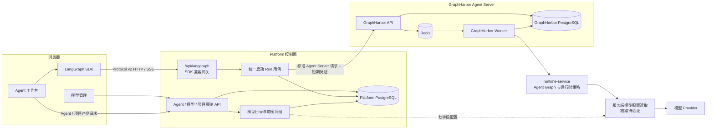
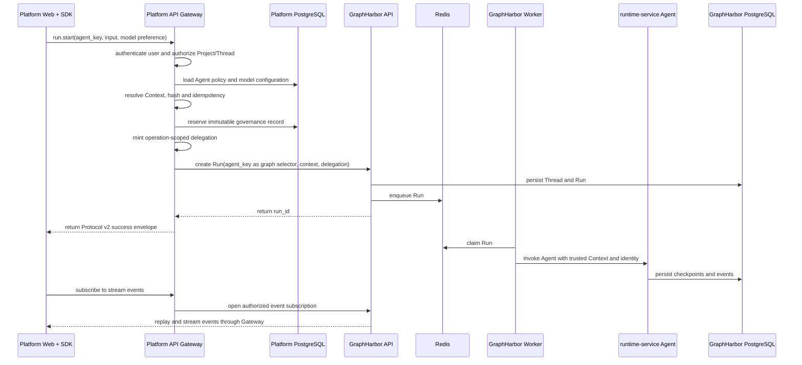

# P1 目标架构与契约

- 文档类型：Draft Supporting Design
- 状态：owner 已冻结方案；实现与证据进行中
- 规范真源：[OpenSpec design](../../../../../openspec/changes/redesign-platform-runtime-integration/design.md)

> 方案更新（2026-09-04）：本文旧的模型代理、版本引用和 Secret Store 描述已由
> [推荐基线](./04-recommended-baseline-and-open-decisions.md) 与
> [DeepSeek Harness 最小方案](./08-deepseek-harness-model-entry-reference.md) supersede。
> 当前只实施 provider、display_name、base_url、protocol、model、api_key、enabled；API key 只写不读并由
> 服务端加密保存。旧的 execution_model_id、model_revision、生产 proxy/JWKS/workload identity 和统一模型代理
> 方案已废弃（`Superseded/Rejected`），以下旧段落仅供追溯，不得作为实施依据。

## 1. 先说结论

平台产品层只使用 **Agent** 这个概念，不再让用户区分 Assistant 和 Graph：

- 页面、菜单、产品 API 和权限名称统一使用“Agent”；
- 一个 Agent 的稳定执行键为 `agent_key`，它与 Runtime 部署的 `graph_id` 使用同一个值；
- 前端使用 LangGraph SDK 时仍必须填写 SDK 参数 `assistantId`，但其值直接传 `agent_key`；
- Platform 不再创建、同步或保存 GraphHarbor Assistant；
- `assistant_id` 和 `graph_id` 只允许出现在 SDK、Agent Server adapter 和 Runtime 部署层，不能继续变成两套产品对象。

前端增加模型管理区域，但不提供 Tools 管理或每次运行的 Tools 选择：

- 管理员可以录入、编辑和启停模型；连接验证接口不属于当前最小闭环；
- Agent 或 Project 可以选择已启用模型作为默认模型；
- Chat 最多选择已授权模型和生成参数；
- Tools 由 Runtime Agent 代码、服务端策略和当前用户权限共同决定，浏览器不能增加、删除或覆盖。

## 2. 名词解释

| 名词 | 本项目中的含义 | 用户是否需要看到 |
| --- | --- | --- |
| Platform Web | 平台前端，即浏览器中的管理页面和 Agent 工作台 | 是 |
| Platform API | 平台后端，负责登录、项目权限、Agent、模型、策略和审计 | 是，但不需要知道内部模块 |
| Agent | 用户使用的智能体产品，例如通用 Agent、Reviewer Agent | 是，平台统一使用这个名称 |
| Graph | 用 LangGraph 编写并部署的可执行工作流，是 Agent 的技术实现 | 否，只在 Runtime 和部署层出现 |
| `agent_key` | Agent 的稳定字符串键，例如 `agent`、`reviewer`；同时作为 `graph_id` 使用 | 管理页可见，高级标识 |
| `graph_id` | Agent Server 用来定位已部署 Graph 的技术字段 | 普通用户不可见 |
| `assistant_id` / `assistantId` | LangGraph HTTP 协议和 SDK 已固定的参数名；本项目统一传 `agent_key`，不把它建成第二个产品 ID | 普通用户不可见，代码不能擅自改名 |
| Agent Server | 提供 Thread、Run、Checkpoint 和事件流协议的执行服务 | 否 |
| GraphHarbor | 本项目采用的通用 LangGraph-compatible Agent Server | 否，前端不得写 GraphHarbor 专用逻辑 |
| SDK | 官方客户端库，负责构造 Agent Server 请求和消费事件流 | 否 |
| Gateway | Platform API 中位于浏览器和 GraphHarbor 之间的受控网关 | 否 |
| Thread | 一段可以持续、恢复和追加消息的会话 | 是，可显示为会话 |
| Run | Agent 在一个 Thread 中的一次执行，例如发送一条消息后产生的一次处理 | 是，可显示为运行状态 |
| State | Thread 当前可恢复状态，包括消息和 Graph 状态 | 通常以页面内容体现 |
| Checkpoint | Agent Server 保存的某个执行恢复点 | 普通用户不必看到 |
| Event | Run 执行时产生的增量消息、工具调用、状态变化等事件 | 页面消费，不展示技术名称 |
| SSE | Server-Sent Events，服务端持续向浏览器推送事件的 HTTP 流 | 否 |
| Context | 一次 Run 的非敏感运行参数，例如最终模型和生成参数 | 否，页面只展示可编辑部分 |
| Policy | 服务端限制某个 Project 或 Agent 可以使用哪些模型和参数 | 管理员可见 |
| Catalog / Registry | 已注册且 Runtime 确认可用的 Agent 或模型目录 | 管理员可见 |
| Delegation credential | Platform API 给单次上游操作签发的短期凭证，用来证明用户、项目、Agent 和 Context 已通过校验 | 否 |
| Source of truth | 某类数据唯一允许写入和最终裁决的位置，即“唯一事实源” | 否 |
| Snapshot | Run 开始时保存的不可变配置副本，后续修改默认配置不会改写旧 Run | 管理员排障时可见摘要 |
| Hash | 对规范化配置计算的摘要，用于证明请求和快照一致，不包含密钥 | 否 |
| Allowlist | 明确允许通过 Gateway 的接口清单，清单外默认拒绝 | 否 |
| Fixture | 放进自动化测试的固定样例数据 | 否 |
| Fallback | 新路径失败时偷偷改走旧接口或旧解析逻辑的兜底分支 | 否 |
| Canary | 只让少量真实流量先使用新版本的灰度发布方式 | 管理员可能看到发布状态，本 P1 不做 |
| Run Explorer | 面向运维人员查询历史 Run、失败原因和事件时间线的管理页面 | 当前不做 |

## 3. 目标组件图



这张图只表达 owner 和调用方向：

- LangGraph SDK 拥有浏览器侧传输、重连和当前会话的实时状态；
- Platform API 拥有 Agent 产品目录、模型配置、项目权限、运行参数决议和审计；
- GraphHarbor 拥有可恢复的 Thread、Run、Checkpoint 和 Event 生命周期；
- `runtime-service` 拥有 Agent Graph、Prompt、Tools、Middleware 及最终模型构造；
- PostgreSQL 和 Redis 是执行基础设施，不变成 Platform 产品对象；
- 模型密钥如何安全到达模型调用边界仍需单独冻结，绝不能借 GraphHarbor Run payload 传递。

## 4. Open SWE 到底怎么处理 Agent、Assistant 和 Graph

Open SWE 不是“底层没有 Graph”，而是“产品层没有让用户管理 Assistant 和 Graph 两套对象”。代码事实：

1. `langgraph.json` 注册 `agent`、`reviewer`、`analyzer`、`chat`、`scheduler` 五个 Graph；
2. `ui/src/features/agents/lib/AgentThreadStreamProvider.tsx` 的产品区域叫 Agents；
3. 同一文件给 SDK 传固定的 `assistantId="agent"`；
4. `agent/dashboard/thread_api.py` 在服务端把命令中的 `assistant_id` 强制改为受信的 `_ASSISTANT_ID`；
5. `agent/dispatch.py` 默认 `assistant_id="agent"`，注释明确它选择 `agent` 或 `reviewer` Graph；
6. Open SWE 没有让用户创建并同步一份 LangGraph Assistant 产品记录。

因此本项目借鉴的是：

```text
用户看到：Agent
Platform 产品 API：agent_key
SDK 固定参数名：assistantId = agent_key
Agent Server 协议字段：assistant_id = agent_key
Runtime 部署查找：graph_id = agent_key
```

名字统一不等于删除技术边界。`assistantId` 是第三方 SDK 参数，`graph_id` 是 Agent Server 的部署标识，
它们仍存在于 adapter 内；只是 Platform 不再为它们分别建立页面、UUID 和同步状态。

如果同一个 Agent 对不同 Project 有不同默认模型或启用状态，Platform 只保存
`(project_id, agent_key)` 的策略覆盖，不再制造另一个执行 ID。

## 5. Agent 与模型产品模型

### 5.1 Agent

建议的 Platform 产品字段：

```text
agent_key          稳定执行键，与 graph_id 相同
display_name       页面名称
description        页面说明
enabled            当前 Project 是否可用
default_model_id   默认模型，可为空并继承 Project 默认值
policy_revision    当前策略版本
```

Agent 的 Graph、Prompt、默认 Tools 和 Middleware 仍由 `runtime-service` 代码及部署版本定义。Platform
不能通过数据库动态上传 Python Graph，也不能修改 Tool 实现。

### 5.2 模型管理页面

模型管理在现有目录上增加最小连接配置，不引入第二套模型注册表。当前字段固定为：

| 字段 | 用途 | 安全规则 |
| --- | --- | --- |
| `provider` | Provider 标识 | 必填，使用服务端支持的值 |
| `display_name` | 页面展示名称 | 必填 |
| `base_url` | Provider API 根地址 | 必填，仅允许 `http`/`https`，不得嵌入凭据 |
| `protocol` | 请求协议 | 必填，使用服务端支持的值 |
| `model` | Provider 接受的模型名 | 必填 |
| `api_key` | Provider 密钥 | 只写不读，服务端加密 |
| `enabled` | 是否允许新 Run 使用 | 禁用后新 Run 拒绝 |

目标流程：

```text
管理员录入模型
  -> Platform API 校验七字段、Provider、URL 和协议
  -> 非敏感模型记录写 Platform PostgreSQL
  -> API key 使用部署级 master key 加密，只返回脱敏状态
  -> 通过后模型进入 Project/Agent 可选目录

启动 Run
  -> Platform 决议 agent_key + model
  -> Run Context 只携带逻辑 model 和生成参数，不携带 Base URL/API Key
  -> Runtime 使用已授权的服务端配置（当前本地链仍待验证）
  -> runtime-service 创建 ChatModel 并调用 Provider
```

当前 Runtime 使用服务端保存的连接配置；本地兼容时可继续读取既有环境变量。当前不建设统一模型代理：

| 方案 | 做法 | 判断 |
| --- | --- | --- |
| 部署环境变量 | 录入后仍由运维手工改 Worker 环境并重启 | 只能作为当前兼容路径，不满足动态录入 |
| Runtime 受信拉取 | Runtime 直接读取 Platform/Secret Store | 不实施；会扩大服务身份和 Secret 边界 |
| 服务端配置读取 | Platform 保存七字段配置，Runtime 使用受信配置 | 目标方案；当前链路待验证 |

`GATE-11` 已由 owner 接受。旧统一模型代理及其 owner、Secret Store、版本路由和服务身份门禁已废弃，
不再阻塞当前实现；未来需求另立 change。

### 5.3 Tools 为什么从前端删除

Tools 决定 Agent 能执行哪些外部动作，属于权限和代码能力，不是普通运行偏好。目标规则：

- 删除 `RuntimeToolsPage`、Tools Policy 页面入口和 Chat Tools 选择器；
- 浏览器请求不得包含 `tools` 或 `enable_tools`；
- Agent 必需/可选 Tools 在 Runtime Agent 定义中声明；
- Platform API 可以保留内部 Tool allowlist 供 delegation 使用，但不向产品前端开放编辑；
- Runtime 在执行前再次校验 Agent 声明、Project 策略和用户权限；
- SDK 事件中的 `tools` channel 仍保留，因为它是“展示 Agent 正在调用什么”，不是“让用户配置 Tools”。

## 6. Product API 与 Agent Server Gateway

### 6.1 Product API

页面通过 Product API 管理：

- Agent 列表、详情和 Project 启用策略；
- 模型录入、验证、启停和默认模型；
- Project Runtime Policy；
- 最小 Run 治理和审计摘要。

当前模型管理接口为 `/api/runtime/models`；后续产品页面可在不改变该服务边界的前提下封装，不把接口伪装成
LangGraph SDK API。

### 6.2 Agent Server Gateway

LangGraph SDK 通过 `/api/langgraph` 执行。P1 首期 allowlist：

| 能力 | 路径族 | Platform 负责的校验 |
| --- | --- | --- |
| Thread 创建、查询、获取、删除 | `/api/langgraph/threads...` | 登录、Project scope、Agent 归属 |
| State 与 History | `/threads/{id}/state`、`/history` | Thread ownership 和只读权限 |
| Protocol command | `/threads/{id}/commands` | 命令类型、Agent、模型、幂等和写权限 |
| Protocol event | `/threads/{id}/stream/events` | SSE 建立前完成只读授权 |
| Run 获取、列表、取消 | `/threads/{id}/runs...` | Thread ownership 和操作权限 |

Assistants mutation、Cron、Batch、Store 和 System admin 默认不公开。`ChatDebugPage` 已决定删除，
因此不能以 debug 为理由扩大正式 Gateway。

## 7. Gateway server-side promotion 是什么

### 7.1 为什么需要它

当前锁定版本为：

```text
@langchain/vue 1.0.29
@langchain/langgraph-sdk 1.9.28
@langchain/protocol 0.0.18
```

当前 Protocol v2 的 `run.start` 只定义 `assistant_id`、`input`、`config` 和 `metadata`，没有标准顶层
`context`。但 `runtime-service` 的正式运行配置入口是 Agent Server Runs API 的顶层 `context`。

例如用户在页面选择模型 `openai:gpt-5`：

```text
浏览器知道：用户想用哪个模型
Platform API 知道：用户是否有权使用、Agent 默认值、Project 限制和模型版本
GraphHarbor 需要：标准顶层 context
Runtime 只应信任：Platform 最终决议后的 context
```

### 7.2 promotion 的实际步骤

`server-side promotion` 可翻译为“服务端提升并转为正式参数”：

```text
1. Web 在 Protocol v2 的 config 中提交非可信模型偏好
2. Gateway 不直接转发该 config
3. Gateway 根据登录用户、Project、Agent 和模型策略重新校验并决议
4. Gateway 删除浏览器私有字段，生成最终 Runtime Context 和 context_hash
5. Gateway 调用 GraphHarbor 标准 Runs API，把最终值放到顶层 context
6. Gateway 把标准 v2 成功响应返回 SDK，事件订阅仍走 v2
```

“提升”指把浏览器的候选偏好转成服务端认可的正式 Context，不是把字段原样从内层搬到外层。
身份、Project、权限、Base URL、API Key 和 Tools 都不能由浏览器通过这个通道设置。

### 7.4 GraphHarbor 修改边界

GraphHarbor 的定位是通用 LangGraph-compatible Agent Server，等价于本项目所需的 `langgraph dev`
暴露面；它不拥有 Platform 的 Project、Agent、Policy、模型目录、Secret 或 Run governance。因而
Platform 不能为了自身扩展字段去修改 GraphHarbor 的 Protocol v2 契约，也不能把 Platform 私有字段
伪装成通用 `run.start` 参数。

本 change 对 GraphHarbor 的修改门槛固定为：只有锁定 Compatibility Profile 后发现通用 Agent Server
契约与标准 SDK/REST/SSE 行为不一致，才在 GraphHarbor 通用适配层做最小兼容修复，并配套其自身的
通用契约测试和版本锁定。`durability`、`stream_resumable`、`on_disconnect` 等 Runs/stream 选项
不得因为 Platform 的 `run.start` normalization 就直接添加到 GraphHarbor Protocol v2 handler；这类
值由 Platform Gateway 消费后，通过标准 Runs API 的既有字段传递。

2026-09-04 复核结论：本轮曾尝试在 GraphHarbor `protocol_api.py` 中透传上述三个字段，验证发现这会
扩大通用协议而非修复通用兼容性，已精确撤回。GraphHarbor 保持未因 Platform 业务需求而修改；后续
若 Profile 证明存在真正的通用缺口，必须先补 Compatibility Profile 证据，再单独评审 GraphHarbor
仓库的最小 patch。

Open SWE 的 `agent/dashboard/thread_api.py` 采用了同类思想：后端收到 command 后，强制覆盖
`assistant_id`，再根据 session、Thread 和团队设置重建 `configurable`。本项目因为 Runtime 正式契约
使用 `context`，所以最后一步是由 Gateway 转调标准 Runs API。

### 7.3 为什么不 fork SDK

另一条路是修改 `@langchain/protocol`、`@langchain/vue` 和 SDK，让 v2 原生支持 `context`。这样字段
更直接，但正式上游发布前要长期维护补丁和版本组合。Gateway promotion 只修改本项目拥有的 Platform
API，而且 GraphHarbor 仍接收标准 Runs API，因此当前风险更低。

代价是 Gateway 需要维护一段明确的 v2-to-Runs 适配代码，所以必须用真实请求合同测试保护，不能做
万能转发代理。

## 8. 数据事实源

| 领域 | 唯一事实源 | Platform 的处理 |
| --- | --- | --- |
| 用户、租户、Project、权限 | Platform IAM | 校验后签发短期 delegation |
| Agent 产品信息和 Project 启用策略 | Platform PostgreSQL | 使用 `agent_key`，不创建 upstream Assistant |
| 模型元数据、状态和策略 | Platform PostgreSQL | Credential 只存 Secret 引用或密文，不回显 |
| Thread、Run、State、Checkpoint、Event | GraphHarbor PostgreSQL | 通过 Gateway 查询，不复制完整可写状态 |
| Queue、lease、短期协调 | Redis | 不作为持久事实源 |
| 当前页面消息、加载、interrupt 和 Tool 调用展示 | SDK StreamController | 页面只做只读展示转换 |
| Agent Graph、Prompt、Tools、Middleware | `runtime-service` | Platform 不执行或动态上传代码 |

## 9. 正式 Run 时序



## 10. 历史 Thread、fixture 和 fallback

“历史 Thread”指旧前端和旧 Gateway 已经创建的会话数据。它们可能使用旧字段、旧事件形状或旧路由。

“真实 fixture”指从仍需支持的历史 Thread 中提取、脱敏并固定到测试里的最小样例。例如某个旧
checkpoint 确实使用 `legacy_message_blocks`，测试就保存这个形状，证明新页面仍能只读打开它。

“fallback”指新代码失败后自动改走旧 `/runs/stream`、旧 payload 或旧解析器。永久保留这种分支会
形成两套协议，任何故障都可能被错误兜底掩盖。

目标规则：

1. 先盘点是否存在必须保留的真实历史 Thread；
2. 有真实数据且业务要求继续读取时，建立脱敏 fixture，只保留读取归一化；
3. 不允许历史兼容路径创建新格式数据，也不允许写回旧 Thread；
4. 如果没有真实历史数据或没有保留要求，新链 E2E 通过后直接删除旧 fallback；
5. 这里的“删除”不是先删数据，而是删除没有用户价值的旧代码分支。

## 11. Run Explorer 和 canary

### 11.1 Run Explorer

Run Explorer 是未来给运维或管理员使用的“运行查询器”，通常包含：

- 按 Agent、Project、状态和时间查询历史 Run；
- 查看一次 Run 的开始、结束、失败、取消和 interrupt；
- 关联 Operation、Audit 和安全摘要；
- 排查为什么某次执行失败。

它不是用户聊天页面，也不是 GraphHarbor 执行所必需。旧设计还准备在 Platform 复制完整
`runtime_run_events`，这与“GraphHarbor 是执行事件事实源”的新边界冲突。因此本 P1 不实现 Run
Explorer；旧 active change 先保持 deferred，P1 完成后按 GraphHarbor 查询或最小只读投影重新设计。

### 11.2 Canary

Canary 即灰度切流：例如先让 1% Project 使用 GraphHarbor，其余仍使用旧 LangGraph Server，验证后再
逐步扩大。它需要同时维护两套 upstream、路由归属和回滚逻辑。

当前已决定只采用 GraphHarbor 且暂不做 Platform 灰度，所以
`platform-runtime-graphharbor-canary-routing` 与当前目标冲突。该 change 应标记 `Abandoned`，不把
delta spec 同步为现行规范，待 owner 批准处置后归档。

## 12. 剩余待冻结项

| ID | 问题 | 当前建议 | 状态 |
| --- | --- | --- | --- |
| `GATE-01` | Context transport | Gateway server-side promotion，不 fork 官方 SDK；扩展只在 Gateway 消费 | Accepted by owner |
| `GATE-02` | 产品命名和执行标识 | 产品只叫 Agent，`agent_key = graph_id`，SDK `assistantId` 传该值 | Accepted by owner |
| `GATE-03` | Thread/Run/Checkpoint/Event 事实源 | GraphHarbor PostgreSQL | Accepted by owner |
| `GATE-04` | Platform Run 记录 | 只保存不可变治理快照和关联，不复制执行 payload | Accepted by owner |
| `GATE-05` | Gateway endpoint | 只开放正式 Chat 所需 allowlist，不增加 Debug surface | Accepted by owner |
| `GATE-06` | upstream Assistant mirror | 不创建或同步，Platform 不保存独立执行 Assistant | Accepted by owner |
| `GATE-07` | Run Explorer | 不属于 P1，后续按 GraphHarbor 事实源重做 | Deferred by owner |
| `GATE-08` | Canary | 不实施，旧 change 标记 Abandoned 后归档 | Deferred by owner |
| `GATE-09` | `ChatDebugPage` | 删除，调试使用 Runtime Web/测试工具 | Accepted by owner |
| `GATE-10` | 历史 Thread | 先盘点；只为真实且必须保留的数据维护读取 fixture | Pending inventory（非 owner 决策） |
| `GATE-11` | 模型录入后如何供 Runtime 使用 | 七字段配置，API key 只写不读，服务端加密 | Accepted by owner |

`GATE-13` 已由 owner 接受。现有 delegation、GraphHarbor Auth 和 Runtime 执行前复核仍需实现与验证；旧
RS256/JWKS 方案不再属于当前 change。`GATE-10` 是实施开始后的数据盘点，它决定是否需要
读取 fixture，但不允许系统预先保留无证据 fallback。
