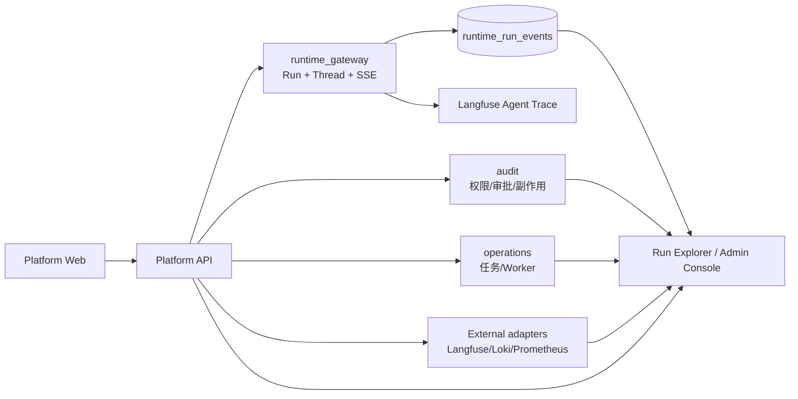

# 平台侧可观测查询与 Admin Console 架构设计（Draft）

> 文档类型：Draft
>
> 状态：讨论结论，暂不替代 `docs/standards/` 下的现行规范
>
> 关联文档：`12-runtime-context-and-local-debug-architecture.md`、
> `13-runtime-service-target-code-layout.md`、
> `14-runtime-contracts-and-resolution-design.md`、
> `15-runtime-middleware-lifecycle-and-failure-semantics.md`、
> `16-runtime-observability-and-langfuse-design.md`
>
> Open SWE 适配细节见：`18-open-swe-to-runtime-event-and-run-explorer-design.md`
>
> 冻结范围：Langfuse 之外的事实源、Run 查询聚合、产品事件持久化、权限代理、
> Workspace/Admin 信息架构、降级语义、数据保留与首期实施边界
>
> 暂不展开：具体数据库建表脚本、Langfuse/Prometheus/Loki 部署清单、告警阈值、
> OpenTelemetry parent 传播和完整 Trace UI

## 1. 本轮结论

Langfuse 只负责 Agent 工程 Trace。平台侧不能把 Langfuse 当作 Run 状态、SSE、审计、
权限或基础设施监控的事实源。平台 API 继续按现有模块职责聚合这些数据，并向前端提供
授权后的只读视图。

首期不拆第二套后端、数据库或权限系统：继续使用 `platform-api`，在同一个
`platform-web` SPA 内按路由和布局分出 Workspace 与 Admin。只有出现网络隔离、不同
SSO/MFA、独立发布团队或合规物理隔离等硬条件，才拆出独立 `platform-admin-web`。

平台查询必须以“部分可用”为正常语义：Langfuse、日志或指标后端短暂不可用时，Run
核心状态和产品事件仍可返回，并明确标记数据源状态，不能让整页查询失败。

## 2. 观察面与唯一事实源



| 数据 | 唯一事实源 | 平台 API 的职责 |
| --- | --- | --- |
| Run 创建、状态、恢复、中断、取消、checkpoint | `runtime_gateway` + LangGraph | 持久化并查询 Run 核心状态 |
| 产品侧历史时间线 | `runtime_run_events` | 记录和分页返回产品有意义事件 |
| Model、Tool、Subagent、Token、耗时、错误链路 | Langfuse | 返回授权后的 Trace 摘要或链接 |
| 权限、审批、外部副作用 | `audit` | 返回审计事件，不复制完整 Trace |
| 异步任务、队列、Worker | `operations` | 返回操作状态和失败原因 |
| HTTP、进程、队列和 exporter 指标 | Prometheus（开发期可用内存 metrics） | 只读查询健康和指标摘要 |
| 服务日志 | Structured Logs + Loki | 按 request/run 关联查询摘要 |

以下边界不可混淆：Langfuse Trace 存在不代表 Run 已成功持久化；SSE 断开不代表 Agent
停止；Tool Span 成功不代表副作用审计成功；任何观测数据都不授予用户新的权限。

## 3. 当前系统能力盘点

当前代码已经具备可复用基础，不新建平行体系：

- `apps/platform-api/app/core/context` 提供 `request_id`、`trace_id`；
- `app/core/observability/logging.py` 输出带 request/trace/project/actor 字段的结构化日志；
- `app/core/observability/metrics.py` 提供进程内 HTTP metrics，重启丢失且多副本不可聚合；
- `app/modules/audit` 提供正式审计模块和分页查询；
- `app/modules/operations` 提供 Operation 状态机、Worker、队列和分页查询；
- `app/modules/runtime_gateway` 已有 Durable Run、Thread、Run、SSE、Cancel、Interrupt 代理；
- `app/modules/platform_config` 已有 `get_observability_snapshot()`；
- `apps/platform-web/src/router/routes.ts` 已有项目工作台和运维相关路由守卫。

因此不创建万能 `ObservabilityService`。查询职责必须留在上述模块，Run 详情只做薄聚合。

## 4. Run 持久化模型

### 4.1 扩展现有 `runtime_runs`

不新增重复 Run 表。扩展
`apps/platform-api/app/modules/runtime_gateway/infra/sqlalchemy/models.py` 中的
`runtime_runs`，补充或关联以下字段：

```text
assistant_id
assistant_version
graph_id
actor_user_id
request_id
platform_trace_id
langfuse_trace_id
error_code
config_hash
started_at
finished_at
```

字段用于关联和筛选，不承载完整 Prompt、模型正文或私有源码。`status` 仍由 Run 状态机
维护，不能通过 Langfuse 回写。

### 4.2 最小 `runtime_run_events`

仅记录产品有意义、需要历史查询或恢复展示的事件：

```text
run.started
run.interrupted
run.resumed
run.cancelled
run.completed
approval.requested
approval.resolved
tool.side_effect.started
tool.side_effect.completed
tool.side_effect.unknown
```

建议字段：

```text
run_id
sequence
event_type
node
subagent
tool_name
status
safe_metadata
occurred_at
```

`safe_metadata` 只能放脱敏、低敏的展示字段，例如资源 ID、错误码和摘要。禁止复制完整
Prompt、Token 流、Tool 参数、模型响应或私有代码。事件表需要 `(run_id, sequence)` 唯一约束，
并为 `run_id + occurred_at` 建索引。

## 5. 事件写入与实时流

首期由 Platform API 的 `runtime_gateway` 负责写入 `runtime_run_events`，因为它拥有
Durable Run 状态和用户鉴权上下文。Runtime 不直接写平台数据库。

Runtime 向 Gateway 发送的运行事件必须包含 `run_id`、事件类型、单调递增序号和幂等键；
Gateway 在写入事件表和转发 SSE 时执行幂等处理。SSE 是实时展示通道，事件表是历史查询
通道，两者不是互相替代的事实源。

事件版本和去重规则在下一阶段单独冻结：新客户端遇到未知事件应被忽略而不是导致整条流失败。
不为旧客户端保留兼容字段。断线重连以 `sequence` 或 `Last-Event-ID` 补发，不能依赖前端猜测。

### 5.1 事件信封

平台事件统一使用下面的信封。字段名和语义属于平台契约，不随 LangGraph 上游版本变化：

```json
{
  "event_id": "01JEXAMPLE0000000000000000",
  "event_version": 1,
  "run_id": "lg-run-123",
  "thread_id": "thread-123",
  "sequence": 42,
  "event_type": "run.completed",
  "occurred_at": "2026-08-29T10:02:00Z",
  "source": "platform",
  "node": null,
  "subagent": null,
  "tool_name": null,
  "status": "succeeded",
  "safe_metadata": {
    "error_code": null
  },
  "correlation": {
    "operation_id": "operation-123",
    "request_id": "request-123",
    "platform_trace_id": "trace-123"
  }
}
```

约束：

- `event_id` 为平台生成的全局唯一 ID；
- `event_version` 从 1 开始递增，新版本只增加字段，不改变已冻结字段语义；
- `sequence` 只在同一 `run_id` 内有序，从 1 开始且不可复用；
- `event_type` 使用白名单，未知类型只能进入隔离日志，不能直接写入产品时间线；
- `source` 只能是 `platform`、`runtime`、`worker`；
- `status` 使用 `submitted`、`running`、`waiting`、`cancel_requested`、`succeeded`、
  `failed`、`cancelled`、`unknown`；
- `node`、`subagent`、`tool_name` 只允许安全名称，不允许实现对象和任意长文本；
- `safe_metadata` 有字段白名单和大小上限，写入前后都执行脱敏；
- `correlation` 只用于查询关联，不能被 Resolver、鉴权或权限判断信任。

### 5.2 事件字典与状态转移

首期事件字典和合法状态转移如下：

| 事件 | 前置状态 | 目标状态 | 写入者 | 可靠性 |
| --- | --- | --- | --- | --- |
| `run.submitted` | 无 | `submitted` | Platform API | 事务化 |
| `run.started` | `submitted` | `running` | Platform API | 事务化 |
| `run.interrupted` | `running` | `waiting` | Platform API | 事务化 |
| `run.resumed` | `waiting` | `running` | Platform API | 事务化 |
| `run.cancel_requested` | `submitted/running/waiting` | `cancel_requested` | Platform API | 事务化 |
| `run.cancelled` | `cancel_requested/running/waiting` | `cancelled` | Platform API | 事务化 |
| `run.completed` | `running` | `succeeded` | Platform API | 事务化 |
| `run.failed` | `submitted/running/waiting` | `failed` | Platform API | 事务化 |
| `approval.requested` | `running` | `waiting` | Runtime/Platform | at-least-once |
| `approval.resolved` | `waiting` | `running` | Runtime/Platform | at-least-once |
| `tool.side_effect.*` | `running` | `running` | Runtime | at-least-once |

终态 (`succeeded`、`failed`、`cancelled`) 不允许再次写入生命周期事件。重复终态请求按幂等
成功处理；冲突状态转换返回业务冲突并记录审计。`run.interrupted` 和 `run.resumed` 的
interrupt 详细 payload 仍保存在 LangGraph checkpoint，不进入事件表。

### 5.3 幂等键与序号分配

Runtime 或 Worker 投递细节事件时必须携带 `source_event_id`；Platform API 生成生命周期事件
时使用内部 `operation_id + event_type + transition_version` 作为幂等键。数据库约束为：

```text
UNIQUE (run_id, sequence)
UNIQUE (run_id, source, source_event_id)  -- source_event_id 非空时
```

事件仓储在同一事务中锁定当前 Run 的最后序号，分配下一个 `sequence` 后写入事件。并发请求
不能共享序号。重复幂等键返回已存在事件，不重新分配序号；不同 payload 使用同一幂等键时
返回 `event_idempotency_conflict`。

## 6. Run Explorer 查询 API

## 6. Run Explorer 查询 API

### 6.1 查询边界

`runtime_gateway` 提供项目范围的三类接口；平台管理员的跨项目查询使用独立 Admin 路由，避免
把项目上下文和全局权限混在一个参数里：

- Run 列表：按项目、assistant、graph、status、actor、时间窗口分页筛选；
- Run 详情：聚合 Run 核心记录、产品事件时间线、Operation、Audit 摘要和 Langfuse Trace 摘要。
- Run 事件：按平台 `sequence` 分页查询，并作为断线恢复的历史来源。

```text
GET /api/runtime/runs
GET /api/runtime/runs/{run_id}
GET /api/runtime/runs/{run_id}/events

GET /api/admin/runtime/runs
GET /api/admin/runtime/runs/{run_id}
```

`/api/runtime/*` 必须从已验证的项目上下文派生 `project_id`；请求参数中的同名字段只能被
拒绝或忽略。`/api/admin/*` 只允许平台管理员使用，项目筛选是服务端授权后的查询条件。

接口不返回外部观测系统的凭据，不让浏览器直连 Langfuse、Prometheus 或 Loki。

示意响应：

```json
{
  "run": {},
  "timeline": [],
  "operation": {},
  "audit_events": [],
  "agent_trace": {},
  "source_status": {
    "langfuse": "available",
    "logs": "unavailable",
    "metrics": "available"
  }
}
```

`source_status` 允许 `available`、`unavailable`、`partial`。核心 Run 记录不可用时接口
才失败；单个外部 adapter 失败只返回空摘要和状态。

### 6.3 分页与排序

Run 列表使用不透明 cursor，内部至少包含 `created_at`、主键 `id`、契约版本和查询范围摘要：

```text
cursor = base64url({"v": 1, "created_at": "...", "id": "...", "scope": "..."})
```

服务端验证 cursor 版本、项目/管理员范围和时间窗口；非法或跨范围 cursor 返回 400。默认
`created_at DESC, id DESC`，单页 `limit` 有硬上限（首期建议 100）。事件接口使用
`after_sequence` + `limit`，固定 `sequence ASC`，不支持任意排序，避免补发时顺序漂移。

### 6.4 稳定响应结构

列表响应固定为：

```json
{
  "items": [],
  "page": {
    "next_cursor": null,
    "has_more": false
  }
}
```

事件响应固定为：

```json
{
  "items": [],
  "next_after_sequence": 42,
  "has_more": false
}
```

详情响应的 `timeline` 只返回有限条目；完整历史必须通过事件接口查询。空的外部摘要使用
`null` 或空数组，并由 `source_status` 说明原因，不能伪造“无数据”。

### 6.2 外部系统代理

按事实源提供小型、明确的 adapter，放在所属模块的 infra 层：

- runtime_gateway：Langfuse Trace 摘要和安全链接；
- operations：Prometheus/Worker 摘要；
- platform observability：Loki 日志摘要（若部署了 Loki）。

不抽象出可替换 Provider、Registry 或万能查询 Builder。当前每个外部系统只有一个实现，
直接函数调用即可；当第二个实现真实出现时再抽象。

## 7. 权限、租户隔离与安全代理

- 项目用户只能查询自己有权限的项目 Run；平台管理员可以查看全局运行元数据和健康状态；
- 平台管理员默认不能读取项目 Prompt、消息和 Tool 内容；深度查看必须显式接管或 break-glass；
- 接管原因、操作者、目标项目和时间必须写入 `audit`；
- Langfuse、Prometheus、Loki 的凭据只存在 Platform API/部署环境，浏览器永远不持有；
- Trace URL 必须是服务端生成的短时授权链接或内部跳转，不拼接用户可控的任意查询参数；
- 所有跨模块查询都重新执行项目权限校验，不能因为拥有 Run ID 就绕过租户边界。

## 8. 数据保留与脱敏

平台数据库只保留 Run 元数据和产品事件，按项目合规策略设置保留期限。Langfuse 的详细
Trace 遵循独立保留策略；两者删除不要求同步复制内容。

脱敏在写入和查询两个边界都执行。默认只返回错误码、工具名、资源 ID、耗时和计数；
完整 Prompt、模型响应、Token 明细和 Tool 参数只有受控开发环境允许，并且不能进入 Admin
默认列表。

## 9. Workspace 与 Admin 信息架构

首期继续一个 `platform-web`，只拆路由域和布局：

```text
/workspace/*     项目工作台
/admin/*          平台运维后台

platform-web/src/
├── layouts/
│   ├── WorkspaceLayout.vue
│   └── AdminLayout.vue
└── modules/
    ├── runtime-runs/
    └── admin-ops/
```

现有页面不作为新信息架构的迁移约束。新页面直接按目标信息架构创建，不保留兼容跳转，也不同时
维护两套业务实现。

只有满足以下硬条件才拆独立 `platform-admin-web`：内网访问隔离、不同 SSO/MFA/Session 策略、
独立发布团队、合规要求物理隔离，或公网包不能包含后台路由和代码。

## 10. 实施阶段

1. 先冻结事件字典、状态转移、信封字段、幂等键和 sequence 分配规则；
2. 创建新 `runtime_runs` 和事件表、索引、唯一约束；不读取或迁移旧 Runtime 表；
3. 在 `runtime_gateway` 接入生命周期事件事务和事件仓储；
4. 增加项目 `/api/runtime/*` 查询接口，先只返回平台 Run 与事件数据；
5. 增加 `/api/admin/*` 的平台管理员元数据查询和 break-glass Audit；
6. 接入 Langfuse、Audit、Operation、日志和指标摘要的 fail-soft adapter；
7. 再实现平台事件 SSE、`Last-Event-ID` 补发和前端 Run Explorer；
8. 最后评估 Prometheus/Loki/OTel 的生产部署、SLO 和告警规则。

## 11. 明确不做

- 不把 Langfuse 作为 Run、SSE、Audit 或权限事实源；
- 不新增重复 Run 表或万能 `ObservabilityService`；
- 不让浏览器直连外部观测后端；
- 不在首期拆独立 Admin 后端、数据库和登录系统；
- 不复制完整 Prompt、模型正文、Tool 参数和私有源码到平台查询表；
- 不为尚不存在的第二个日志/指标供应商提前建立 Provider 抽象。
- 不在本阶段把 LangGraph 上游 `last_event_id` 直接暴露为平台事件游标。
- 不在本阶段实现 Runtime 细节事件的跨服务队列；先完成生命周期事件和历史查询契约。

## 12. 验收契约

实现阶段至少证明：

1. Run 状态和事件在 Langfuse 不可用时仍可查询；
2. 同一事件重复投递不会产生重复时间线；
3. SSE 断线可按序号补发，历史事件与实时事件不重复；
4. 项目和平台权限边界在列表、详情、Trace 摘要和日志摘要上均生效；
5. 外部数据源单独失败时返回 `source_status`，不影响核心 Run 响应；
6. 默认响应不包含完整 Prompt、模型响应、Tool 参数或凭据；
7. Admin 接管行为写入 Audit；
8. Workspace/Admin 路由使用不同布局和导航，但共享同一套后端权限校验。

## 13. 下一阶段讨论

下一轮优先冻结 **Runtime Run Event Contract 与 Run Explorer 查询 API**：

- 事件是否只由 Platform API 写入，以及 Runtime 到 Gateway 的投递协议；
- `sequence`、幂等键、事件版本和未知事件处理；
- 生命周期事件是否全部由 Gateway 产生，还是允许 Runtime 产生 `approval.*`；
- SSE 实时事件与持久化事件的去重、断线补发和 `Last-Event-ID`；
- Run 列表/详情/事件接口的最终字段、分页和时间窗口限制；
- Langfuse Trace URL/摘要的安全返回方式；
- 项目级与平台级查询权限，以及各数据源部分返回结构。

该契约冻结后，再讨论 Prometheus/Loki/OpenTelemetry 部署边界、Admin 路由迁移、生产告警
与 SLO，最后确定 Runtime 与 Platform 的事件投递实现。

## 14. 参考依据

- `16-runtime-observability-and-langfuse-design.md`
- `apps/platform-api/app/modules/runtime_gateway`
- `apps/platform-api/app/modules/audit`
- `apps/platform-api/app/modules/operations`
- `apps/platform-web/src/router/routes.ts`
- `apps/platform-web/src/components/layout/AppSidebar.vue`
- Open SWE 学习资料：`docs/agent-engineering-learning/18-traced-graph-factory-context-manager.md`
- Open SWE 学习资料：`docs/agent-engineering-learning/19-local-observability/README.md`
