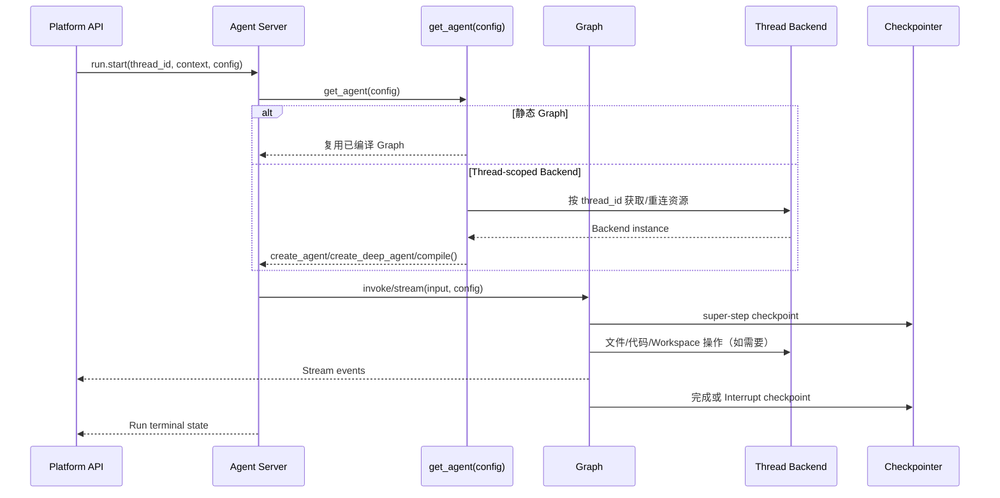

# Graph、Thread、Backend 与 Checkpoint 生命周期设计（Draft）

> 文档类型：Draft
>
> 状态：讨论结论，暂不替代 `docs/standards/` 下的现行规范
>
> 关联文档：`10-production-agent-platform-roadmap.md`、
> `11-agent-service-directory-architecture.md`、
> `14-runtime-contracts-and-resolution-design.md`、
> `20-runtime-backend-workspace-skills-and-subagents-design.md`、
> `22-platform-runtime-contract-design.md`

## 1. 本轮结论

Runtime 统一使用下面的职责模型：

```text
Graph       = 不可变的执行模板
Thread      = 长期对话和资源作用域
Backend     = 文件、代码执行和外部 Workspace
Checkpoint  = Graph State 的持久化恢复点
Run         = 一次具体执行
Stream      = 实时事件传输
```

必须遵守：

1. Graph 默认在进程启动时编译一次；只因模型、Prompt 或工具选择变化，不得重建 Graph。
2. 只有 Backend/Sandbox 必须绑定 Thread/Run 时，`get_agent(config)` 才动态调用官方构造函数。
3. Thread metadata 可以保存外部资源 ID，但不能保存 Python Graph、Model、Tool 或 Backend 实例。
4. 生产 Checkpoint 由 LangGraph Agent Server 管理；Service 不创建 `CheckpointManager` 或数据库 Checkpointer。
5. `thread_id` 是 Checkpoint、Thread Backend 和恢复操作的共同作用域；`checkpoint_id` 只用于指定恢复点或时间旅行。
6. Stream 断线不等于 Run 取消；Stream 只是事件观看通道。
7. Backend 失败、Checkpoint 持久化失败和 Graph 构建失败都必须 fail-closed，不能静默切换到其他 Thread 或宿主机目录。

## 2. Open SWE 可借鉴的点

Open SWE 的 `agent/server.py` 是 Coding Agent 业务实现，不能整体搬进 Runtime。可借鉴的是以下与业务无关的机制：

| Open SWE 做法 | 本项目借鉴方式 | 不复制的部分 |
| --- | --- | --- |
| `get_agent(config)` 按 `thread_id` 获取或重连 Sandbox | 动态 Service 只在确有 Thread-scoped Backend 时使用同样入口 | Slack/GitHub/Linear 等业务逻辑 |
| Sandbox ID 写入 Thread metadata | metadata 作为跨进程恢复的资源事实源 | 不把进程内缓存当事实源 |
| 进程内 Sandbox cache 只做加速 | 可保留 Service 私有 cache，失效后按 metadata 重连 | 不缓存凭据和用户上下文 |
| `langgraph.json` 配置 Checkpoint TTL | 使用 Agent Server 原生 TTL/清理能力 | 不在每个 Agent 中实现清理器 |
| `graph_loaded_for_execution(config)` 区分执行和 introspection | `get_agent(config)` 的昂贵资源只在真实执行时初始化 | 不在 schema/visualization 请求中连接 Sandbox/MCP |
| `traced_graph_factory` 用上下文管理器包住 Graph 执行 | 可由公共 observability 层统一包装 | 不让 tracing wrapper 管理 Backend 或 Checkpoint |
| `dispatch.py` 统一 Durable Run 默认值 | 由 Platform Gateway 统一设置 durability 和断线策略 | 不把 dispatch 复制到每个 Service |

Open SWE 没有在每个 `server.py` 中手工配置生产 Checkpointer；部署后的持久化由 Agent Server 提供。这个边界必须保留。

## 3. Graph 生命周期

### 3.1 静态 Graph（默认）

```python
_AGENT = create_agent(
    model=DEFAULT_MODEL,
    tools=SERVICE_TOOLS,
    middleware=SERVICE_MIDDLEWARE,
    context_schema=RuntimeContext,
)


async def get_agent(config: RunnableConfig) -> Pregel:
    return _AGENT.with_config(execution_config(config))
```

Deep Agent 和显式 `StateGraph` 同样适用：

```python
_AGENT = create_deep_agent(...)
# 或：_AGENT = workflow.compile()
```

静态 Graph 的拓扑、State Schema、Tools、Skills、Subagents 和 Middleware 顺序在部署版本内稳定。每个 Run 只传入不同的 `context` 和执行配置。

### 3.2 动态 Graph（受限）

仅当资源必须绑定当前 Thread/Run，且不能由 Backend/Tool 自己延迟获取时使用：

```python
async def get_agent(config: RunnableConfig) -> Pregel:
    if not graph_loaded_for_execution(config):
        return create_deep_agent(
            model=DEFAULT_MODEL,
            tools=(),
            backend=StateBackend(),
        ).with_config(execution_config(config))

    thread_id = require_thread_id(config)
    backend = await get_thread_backend(thread_id)

    agent = create_deep_agent(
        model=DEFAULT_MODEL,
        tools=SERVICE_TOOLS,
        backend=backend,
        middleware=SERVICE_MIDDLEWARE,
    )
    return agent.with_config(execution_config(config))
```

这里的 `get_thread_backend()` 是 Service 私有资源函数，不是公共 `build_graph()`、Backend Registry 或万能 Factory。

动态 factory 必须满足：

- 所有调用返回相同拓扑和 State Schema；
- introspection 路径不创建昂贵资源；
- 不把资源实例、凭据、用户或租户状态写入 module global；
- 资源清理由明确的资源所有者负责；
- 如果必须由 factory setup/teardown，则单独评审 async context manager factory。

## 4. Thread 生命周期

Thread 由 Platform 创建，多个 Run 在同一个 `thread_id` 下执行：

```text
Platform 创建 Thread
    -> thread_id / assistant_id / tenant / project
    -> 可选 Backend/Sandbox 资源标识

Run 1、Run 2、Run 3
    -> 复用 Thread 对话和 Checkpoint
    -> 复用 Thread-scoped Backend

Thread TTL 或显式删除
    -> 清理 Checkpoint
    -> 清理 Sandbox/Workspace
```

Thread metadata 只保存可序列化事实，例如：

```json
{
  "backend_kind": "sandbox",
  "sandbox_id": "sandbox-123",
  "workspace_scope": "thread"
}
```

禁止保存：Graph/Model/Tool/Backend 对象、Token、完整 Prompt、未脱敏 Tool 参数和结果。

## 5. Backend 生命周期

Backend 与 Checkpoint 的关系是：

```text
Checkpoint = Agent 的 Graph State
Backend    = Agent 操作的外部工作空间
```

### 5.1 选择规则

| Agent 场景 | Backend 选择 |
| --- | --- |
| 普通 `create_agent` | 不使用 Backend |
| 无文件需求的 `create_deep_agent` | Deep Agents 默认 `StateBackend` |
| 需要少量、受控文件状态 | `StateBackend`，由 Checkpoint 持久化 |
| 需要 shell、代码执行或仓库目录 | Thread-scoped Sandbox Backend |
| 多个路径需要不同来源 | Service 内显式 `CompositeBackend` |

`StateBackend` 中的文件会进入 Graph State，因此只适合有界的小型状态。大型文件、依赖安装、构建产物和代码执行必须放在隔离 Sandbox，不把它们塞进 Checkpoint。

### 5.2 资源清理

```text
Thread-scoped Sandbox
    -> Thread TTL / 显式删除
    -> Platform 或 Workspace 清理任务删除

Run-scoped 临时资源
    -> Run 完成、失败或取消
    -> 资源所有者释放

StateBackend
    -> 随 Agent Server Checkpoint TTL 清理
```

Backend 不得在连接失败时自动换到另一个 Thread、宿主机工作目录或未授权的 Sandbox。

## 6. Checkpoint 生命周期

生产 Graph 不在 Service 中自行创建 Checkpointer：

```python
workflow = StateGraph(State)
...
graph = workflow.compile()
```

Agent Server 负责生产持久化、Thread 关联和 Checkpoint TTL。Service 只需要保证：

- Run 使用合法的 `thread_id`；
- 恢复使用原 Graph 和原权限边界；
- 不把 secret、Python 对象和完整 Prompt 写入 State；
- 对 `durability="sync"` 的失败采取 fail-closed。

LangGraph 在 super-step 边界创建完整 Checkpoint，并保存节点级 writes 以支持同一 super-step 的失败恢复。Checkpoint 可以表示：

```text
初始状态 -> 用户输入 -> 模型输出 -> Tool 输出 -> Interrupt -> 完成
```

恢复指定点：

```python
config = {
    "configurable": {
        "thread_id": "thread-123",
        "checkpoint_id": "checkpoint-456",
    }
}
```

恢复不能改变 Graph 拓扑、Agent 类型、Tool 能力、权限或原始业务输入。

### 6.1 本地测试

只有独立测试 harness 可以使用内存 Checkpointer：

```python
checkpointer = InMemorySaver()
graph = workflow.compile(checkpointer=checkpointer)
```

`InMemorySaver` 不得进入生产 Service，也不用于验证跨进程恢复。生产恢复必须通过 Agent Server 和真实持久化后端验证。

## 7. 完整执行链路



## 8. 具体落实步骤

### 第一步：先做静态 reference Agent

1. 在新的 `src/runtime_service/services/reference_agent/agent_server.py` 中直接调用 `create_agent(...)`。
2. 通过 `context_schema=RuntimeContext` 接入 14 号契约。
3. 使用 `RuntimeConfigMiddleware` 和 `execution_config(config)`。
4. 不在 Service 中创建 Checkpointer、Backend Manager 或 Graph Builder。
5. 在 `graphs/reference_agent.py` 只重导出 `get_agent`。

### 第二步：验证 Agent Server 持久化

使用当前锁定版本的 Agent Server 验证：

- 同一 `thread_id` 的两次 Run 可以读取之前的状态；
- `thread_id` 不存在时按 Gateway 的 `if_not_exists` 规则拒绝；
- `durability="sync"` 在步骤失败前不会丢失已确认状态；
- Worker 重启后可以从最近 Checkpoint 继续；
- `checkpoint_id` 查询和恢复不会改变 Graph/Policy；
- Checkpoint TTL 配置按预期清理，不误删活跃 Thread。

### 第三步：再做 Deep Agent Backend Agent

只有 reference Agent 的静态链路通过后，才新增使用 Backend 的 Service：

1. 明确 Backend 是 StateBackend 还是 Thread-scoped Sandbox。
2. 在该 Service 内实现 `get_thread_backend(thread_id)`，不下沉为公共 Registry。
3. Thread metadata 只记录外部资源 ID。
4. 动态 `get_agent(config)` 直接调用 `create_deep_agent(...)`。
5. 对统一的 `get_agent(config)` 入口，使用锁定版本验证过的执行标记 helper 跳过 introspection
   资源初始化；可参考 Open SWE 的 `graph_loaded_for_execution(config)`，不能读取未验证的业务字段猜测。
6. 验证 worker 重启、Sandbox 重连、并发 Thread 隔离和资源 TTL。

如果锁定版本只通过 `ServerRuntime.execution_runtime` 提供可靠区分，或 Backend 必须由 factory
负责 teardown，则单独采用官方 async context manager factory；这属于例外评审，不改变普通
Service 的 `get_agent(config) -> Pregel` 默认入口。

### 第四步：本地独立调试

本地调试只替换调用入口，不替换 Graph、Middleware 和 Resolver：

```text
本地 Token Signer
    -> Agent Server Auth
    -> 同一 get_agent(config)
    -> 同一 RuntimeContext / Resolver / Middleware
```

单元测试使用 `InMemorySaver`；本地 Agent Server 调试使用临时持久化配置；禁止以“本地模式”绕过 Auth 或直接传入身份字段。

### 第五步：失败与观测

至少记录这些事件：

```text
runtime.graph.loaded
runtime.graph.factory_failed
runtime.backend.acquired
runtime.backend.reconnect_failed
runtime.checkpoint.persisted
runtime.checkpoint.persist_failed
runtime.run.resumed
runtime.run.interrupted
runtime.run.completed
runtime.run.failed
```

事件只携带 `graph_id`、`thread_id`、`run_id`、`checkpoint_id`、耗时和错误码，不携带 Token、完整 Prompt 或原始文件内容。

## 9. 测试与发布门槛

首期最小测试矩阵：

| 场景 | 必须证明 |
| --- | --- |
| 静态 Graph | 多次 `get_agent` 不改变拓扑，执行配置只作用于当前 Run |
| Thread 连续 Run | 同一 Thread 恢复状态，不同 Thread 互相隔离 |
| Checkpoint | super-step 状态可查询，指定 checkpoint 可恢复 |
| Interrupt | 中断后状态持久化，恢复后不重复已确认步骤 |
| Worker restart | 重启后 Graph 可加载、Checkpoint 可读、Run 可继续 |
| Backend reconnect | Thread metadata 足以重连 Sandbox，缓存失效不丢资源 |
| Backend failure | 不静默切换目录或 Thread，Run 有明确失败终态 |
| Introspection | schema/visualization 不创建 Sandbox/MCP 连接 |
| TTL cleanup | 只清理过期资源，不删除活跃 Thread/Checkpoint |

未通过真实 Agent Server + 持久化后端 E2E 前，不允许把动态 Sandbox Agent 作为生产模板。旧路径
不属于新架构验收范围，也不作为恢复或回退目标。

## 10. 明确不建设的东西

- `GraphManager`
- `BackendManager`
- `CheckpointManager`
- 公共 Workspace 类
- 公共 Backend Registry
- Service 之间共享的资源缓存
- 在每个 Agent 中复制 Open SWE 的 `dispatch.py`
- 为了动态模型、Prompt 或工具选择而重建 Graph

只有真实 Agent 出现两个以上稳定重复的生命周期逻辑，才提取一个职责单一的公共函数，并通过架构评审确认其边界。

## 11. 参考资料

- LangGraph Persistence：`/oss/python/langgraph/persistence`
- LangGraph Checkpointers：`/oss/python/langgraph/checkpointers`
- LangGraph Graph Rebuild：`/langsmith/graph-rebuild`
- Deep Agents Production Lifecycle：`/oss/python/deepagents/going-to-production`
- Open SWE：`agent/server.py`、`langgraph.json`、`agent/utils/sandbox_state.py`
