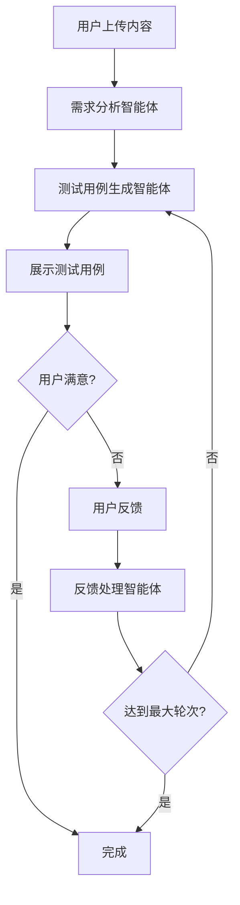

# AI 测试用例生成模块

## 概述

AI 测试用例生成模块是一个基于 AutoGen 0.5.7 的多智能体协作系统，能够自动分析用户需求并生成专业的测试用例。

## 功能特性

### 🤖 多智能体协作
- **需求分析智能体**: 分析用户上传的内容，提取核心功能需求
- **测试用例生成智能体**: 基于需求生成专业的测试用例
- **用户反馈处理智能体**: 根据用户反馈优化测试用例

### 📁 多种输入方式
- 文本描述输入
- 文件上传支持（文档、图片等）
- 混合输入模式

### 🔄 交互式优化
- 最多3轮交互优化
- 实时反馈处理
- 智能体对话历史记录

### 🎨 炫酷界面设计
- Gemini 风格的现代化UI
- 时间轴展示智能体对话
- 折叠式消息展示
- 流式响应实时显示

## 技术架构

### 后端技术栈
- **FastAPI**: Web框架
- **AutoGen 0.5.7**: 多智能体框架
- **SSE (Server-Sent Events)**: 流式响应
- **Pydantic**: 数据验证
- **Loguru**: 日志管理

### 前端技术栈
- **React 18**: 前端框架
- **Ant Design**: UI组件库
- **TypeScript**: 类型安全
- **React Markdown**: Markdown渲染
- **Vite**: 构建工具

## 业务流程



## API 接口

### 文件上传
```http
POST /api/testcase/upload
Content-Type: multipart/form-data

files: File[]
text_content?: string
conversation_id?: string
```

### 流式生成测试用例
```http
POST /api/testcase/generate/stream
Content-Type: application/json

{
  "conversation_id": "string",
  "files": [FileUpload],
  "text_content": "string",
  "user_feedback": "string",
  "round_number": 1
}
```

### 提交用户反馈
```http
POST /api/testcase/feedback
Content-Type: application/json

{
  "conversation_id": "string",
  "feedback": "string",
  "round_number": 2
}
```

## 智能体配置

### 需求分析智能体
- **角色**: 资深软件需求分析师
- **职责**: 分析用户内容，提取功能需求
- **输出**: 结构化的需求描述

### 测试用例生成智能体
- **角色**: 资深软件测试架构师
- **职责**: 基于需求生成专业测试用例
- **输出**: Markdown格式的测试用例表格

### 反馈处理智能体
- **角色**: 测试主管
- **职责**: 根据用户反馈优化测试用例
- **输出**: 改进后的测试用例

## 使用指南

### 1. 启动服务

**后端启动**:
```bash
# 安装依赖
poetry install

# 启动后端服务
poetry run python main.py
```

**前端启动**:
```bash
cd frontend
npm install
npm run dev
```

### 2. 使用流程

1. **输入需求**: 在左侧输入框中描述功能需求或上传相关文件
2. **生成测试用例**: 点击"开始生成测试用例"按钮
3. **查看结果**: 在右侧时间轴中查看智能体的分析和生成过程
4. **提供反馈**: 如果需要优化，在反馈框中输入修改意见
5. **完成**: 经过最多3轮交互后完成测试用例生成

### 3. 界面功能

- **文件上传区**: 支持拖拽上传，最多5个文件，每个不超过10MB
- **智能体消息**: 可展开/折叠查看详细内容，支持复制
- **进度步骤**: 显示当前生成进度
- **时间轴**: 按时间顺序展示所有智能体交互

## 配置说明

### 后端配置
在 `backend/conf/settings.yaml` 中配置：

```yaml
test:
  aimodel:
    model: "deepseek-chat"
    base_url: "https://api.deepseek.com/v1"
    api_key: "your-api-key-here"

  autogen:
    max_agents: 100
    cleanup_interval: 3600
    agent_ttl: 7200
```

### 前端配置
在 `frontend/vite.config.ts` 中配置代理：

```typescript
proxy: {
  '/api': {
    target: 'http://localhost:8000',
    changeOrigin: true,
  }
}
```

## 扩展功能

### 自定义智能体
可以通过继承 `RoutedAgent` 类来创建自定义智能体：

```python
@type_subscription(topic_type="custom_topic")
class CustomAgent(RoutedAgent):
    def __init__(self, conversation_id: str, service):
        super().__init__(description="自定义智能体")
        # 初始化逻辑

    @message_handler
    async def handle_message(self, message, ctx: MessageContext):
        # 处理逻辑
        pass
```

### 添加新的输入类型
可以扩展 `FileUpload` 模型来支持更多文件类型：

```python
class ExtendedFileUpload(FileUpload):
    metadata: Optional[dict] = None
    processing_options: Optional[dict] = None
```

## 故障排除

### 常见问题

1. **智能体无响应**
   - 检查 OpenAI API 配置
   - 查看后端日志

2. **文件上传失败**
   - 检查文件大小限制
   - 确认文件类型支持

3. **前端连接失败**
   - 检查代理配置
   - 确认后端服务运行状态

### 日志查看
```bash
# 查看后端日志
tail -f backend.log

# 查看前端控制台
# 在浏览器开发者工具中查看
```

## 性能优化

- 使用连接池管理数据库连接
- 实现智能体缓存机制
- 优化文件上传处理
- 添加请求限流

## 安全考虑

- 文件上传安全检查
- API 访问频率限制
- 敏感信息过滤
- 用户输入验证

## 更新日志

### v1.0.0 (2024-01-XX)
- 初始版本发布
- 支持基础的测试用例生成功能
- 实现多智能体协作
- 提供炫酷的前端界面
