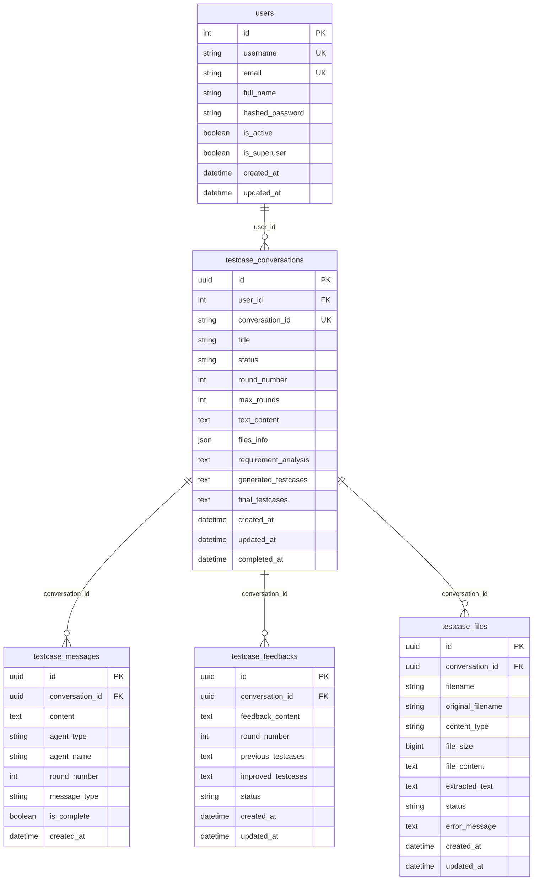

# 数据库设计文档

## 概述

AI测试实验室使用SQLite作为主数据库，通过Tortoise ORM进行数据访问，使用Aerich进行数据库迁移管理。

## 数据库架构

### 核心设计原则
- **模块化设计**: 按功能模块划分表结构
- **关系清晰**: 明确的外键关系和约束
- **扩展性**: 支持未来功能扩展
- **性能优化**: 合理的索引和查询优化

## 数据模型

### 用户系统模块

#### users 表
```sql
CREATE TABLE users (
    id INTEGER PRIMARY KEY AUTOINCREMENT,
    username VARCHAR(50) UNIQUE NOT NULL,
    email VARCHAR(100) UNIQUE NOT NULL,
    full_name VARCHAR(100),
    hashed_password VARCHAR(255) NOT NULL,
    is_active BOOLEAN DEFAULT TRUE,
    is_superuser BOOLEAN DEFAULT FALSE,
    created_at DATETIME DEFAULT CURRENT_TIMESTAMP,
    updated_at DATETIME DEFAULT CURRENT_TIMESTAMP
);
```

**字段说明**:
- `id`: 主键，自增
- `username`: 用户名，唯一
- `email`: 邮箱，唯一
- `full_name`: 全名
- `hashed_password`: 加密后的密码
- `is_active`: 是否激活
- `is_superuser`: 是否超级用户
- `created_at`: 创建时间
- `updated_at`: 更新时间

### 测试用例模块

#### testcase_conversations 表
```sql
CREATE TABLE testcase_conversations (
    id UUID PRIMARY KEY,
    user_id INTEGER,
    conversation_id VARCHAR(255) UNIQUE NOT NULL,
    title VARCHAR(500),
    status VARCHAR(50) DEFAULT 'active',
    round_number INTEGER DEFAULT 1,
    max_rounds INTEGER DEFAULT 3,
    text_content TEXT,
    files_info JSON,
    requirement_analysis TEXT,
    generated_testcases TEXT,
    final_testcases TEXT,
    created_at DATETIME DEFAULT CURRENT_TIMESTAMP,
    updated_at DATETIME DEFAULT CURRENT_TIMESTAMP,
    completed_at DATETIME,
    FOREIGN KEY (user_id) REFERENCES users(id)
);
```

**字段说明**:
- `id`: 主键，UUID
- `user_id`: 用户ID，外键
- `conversation_id`: 对话ID，唯一
- `title`: 对话标题
- `status`: 状态（active, completed, failed）
- `round_number`: 当前轮次
- `max_rounds`: 最大轮次
- `text_content`: 文本内容
- `files_info`: 文件信息（JSON格式）
- `requirement_analysis`: 需求分析结果
- `generated_testcases`: 生成的测试用例
- `final_testcases`: 最终测试用例

#### testcase_messages 表
```sql
CREATE TABLE testcase_messages (
    id UUID PRIMARY KEY,
    conversation_id UUID NOT NULL,
    content TEXT NOT NULL,
    agent_type VARCHAR(50) NOT NULL,
    agent_name VARCHAR(100) NOT NULL,
    round_number INTEGER NOT NULL,
    message_type VARCHAR(50) DEFAULT 'agent',
    is_complete BOOLEAN DEFAULT FALSE,
    created_at DATETIME DEFAULT CURRENT_TIMESTAMP,
    FOREIGN KEY (conversation_id) REFERENCES testcase_conversations(id)
);
```

**字段说明**:
- `id`: 主键，UUID
- `conversation_id`: 对话ID，外键
- `content`: 消息内容
- `agent_type`: 智能体类型
- `agent_name`: 智能体名称
- `round_number`: 轮次
- `message_type`: 消息类型（agent, user, system）
- `is_complete`: 是否为完成消息

#### testcase_feedbacks 表
```sql
CREATE TABLE testcase_feedbacks (
    id UUID PRIMARY KEY,
    conversation_id UUID NOT NULL,
    feedback_content TEXT NOT NULL,
    round_number INTEGER NOT NULL,
    previous_testcases TEXT,
    improved_testcases TEXT,
    status VARCHAR(50) DEFAULT 'processing',
    created_at DATETIME DEFAULT CURRENT_TIMESTAMP,
    updated_at DATETIME DEFAULT CURRENT_TIMESTAMP,
    FOREIGN KEY (conversation_id) REFERENCES testcase_conversations(id)
);
```

#### testcase_files 表
```sql
CREATE TABLE testcase_files (
    id UUID PRIMARY KEY,
    conversation_id UUID NOT NULL,
    filename VARCHAR(500) NOT NULL,
    original_filename VARCHAR(500) NOT NULL,
    content_type VARCHAR(200) NOT NULL,
    file_size BIGINT NOT NULL,
    file_content TEXT,
    extracted_text TEXT,
    status VARCHAR(50) DEFAULT 'uploaded',
    error_message TEXT,
    created_at DATETIME DEFAULT CURRENT_TIMESTAMP,
    updated_at DATETIME DEFAULT CURRENT_TIMESTAMP,
    FOREIGN KEY (conversation_id) REFERENCES testcase_conversations(id)
);
```

#### testcase_templates 表
```sql
CREATE TABLE testcase_templates (
    id UUID PRIMARY KEY,
    name VARCHAR(200) NOT NULL,
    description TEXT,
    category VARCHAR(100) NOT NULL,
    template_content TEXT NOT NULL,
    prompt_template TEXT,
    is_active BOOLEAN DEFAULT TRUE,
    is_default BOOLEAN DEFAULT FALSE,
    sort_order INTEGER DEFAULT 0,
    usage_count INTEGER DEFAULT 0,
    created_at DATETIME DEFAULT CURRENT_TIMESTAMP,
    updated_at DATETIME DEFAULT CURRENT_TIMESTAMP
);
```

#### testcase_statistics 表
```sql
CREATE TABLE testcase_statistics (
    id UUID PRIMARY KEY,
    date DATE UNIQUE NOT NULL,
    total_conversations INTEGER DEFAULT 0,
    completed_conversations INTEGER DEFAULT 0,
    failed_conversations INTEGER DEFAULT 0,
    total_files_uploaded INTEGER DEFAULT 0,
    total_file_size BIGINT DEFAULT 0,
    total_feedbacks INTEGER DEFAULT 0,
    avg_rounds REAL DEFAULT 0.0,
    created_at DATETIME DEFAULT CURRENT_TIMESTAMP,
    updated_at DATETIME DEFAULT CURRENT_TIMESTAMP
);
```

## 关系图



## 索引策略

### 主要索引
```sql
-- 用户表索引
CREATE INDEX idx_users_username ON users(username);
CREATE INDEX idx_users_email ON users(email);
CREATE INDEX idx_users_is_active ON users(is_active);

-- 对话表索引
CREATE INDEX idx_conversations_user_id ON testcase_conversations(user_id);
CREATE INDEX idx_conversations_conversation_id ON testcase_conversations(conversation_id);
CREATE INDEX idx_conversations_status ON testcase_conversations(status);
CREATE INDEX idx_conversations_created_at ON testcase_conversations(created_at);

-- 消息表索引
CREATE INDEX idx_messages_conversation_id ON testcase_messages(conversation_id);
CREATE INDEX idx_messages_round_number ON testcase_messages(round_number);
CREATE INDEX idx_messages_created_at ON testcase_messages(created_at);

-- 反馈表索引
CREATE INDEX idx_feedbacks_conversation_id ON testcase_feedbacks(conversation_id);
CREATE INDEX idx_feedbacks_round_number ON testcase_feedbacks(round_number);

-- 文件表索引
CREATE INDEX idx_files_conversation_id ON testcase_files(conversation_id);
CREATE INDEX idx_files_status ON testcase_files(status);
```

## 数据完整性

### 外键约束
- 所有外键关系都设置了适当的约束
- 级联删除策略：删除对话时同时删除相关的消息、反馈和文件记录

### 数据验证
- 状态字段使用枚举值限制
- 必填字段设置NOT NULL约束
- 唯一性约束确保数据一致性

## 性能优化

### 查询优化
- 为常用查询字段创建索引
- 使用复合索引优化多字段查询
- 分页查询避免全表扫描

### 存储优化
- JSON字段存储结构化数据
- TEXT字段存储大文本内容
- 合理的字段长度限制

## 备份策略

### 数据备份
- 定期备份数据库文件
- 重要操作前创建快照
- 保留多个版本的备份文件

### 恢复策略
- 快速恢复机制
- 数据一致性检查
- 灾难恢复预案

---

**相关文档**:
- [迁移管理](./MIGRATION_GUIDE.md)
- [数据初始化](./DATA_INITIALIZATION.md)
- [API文档](../api/API_REFERENCE.md)
