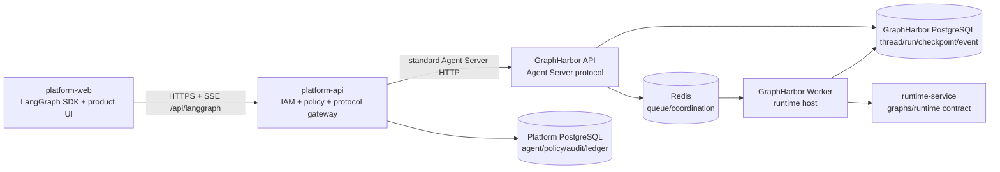
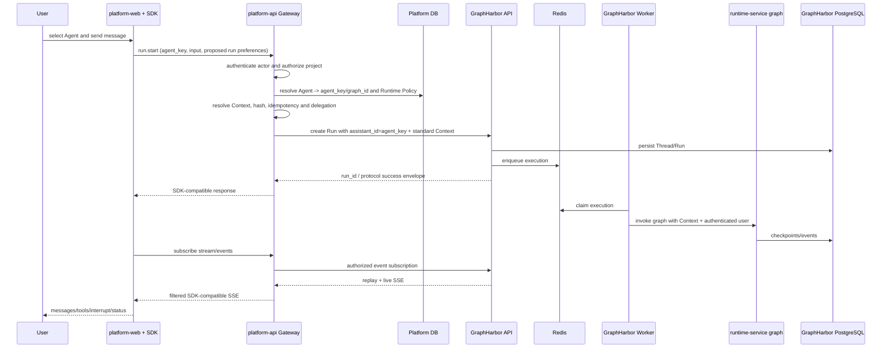

## Context

> 方案处置（2026-09-04）：本文件中旧的统一模型代理、执行引用、revision、Secret Store、RS256/JWKS、
> workload identity 和 capability probe 段落均为历史讨论，现标记为 `Superseded/Rejected`。当前设计只
> 采用七字段模型配置、API key 只写不读和服务端加密；这些历史段落不得驱动代码实现。

### 变更状态与边界

本设计是 Platform 控制面重设计的 B3 Governed 提案，owner pre-apply review 已批准，`GATE-13` 已确认；
当前按 L1（模型配置）、L2（本地最短链）、L3（恢复与安全）推进，实现状态以 `tasks.md` 和
`verification.md` 为准。
本轮只允许修改规划与 supporting knowledge，不修改 `platform-web`、`platform-api`、
`runtime-service` 或 GraphHarbor 业务实现，也不物理归档旧资料。

逐项讨论的推荐基线、术语和 owner 决策顺序见
[`04-recommended-baseline-and-open-decisions.md`](../../../apps/runtime-service/docs/knowledge/platform-runtime-integration/04-recommended-baseline-and-open-decisions.md)。
该文档是 supporting decision register，不替代本 change。D01–D12 已由 owner 逐项确认并进入 apply
contract；`GATE-10` 历史 Thread inventory、Runtime 动态读取配置和完整链路证据仍未完成；旧模型代理 owner/接口不再收集。

Runtime R0-R6 已经形成如下执行部署边界：GraphHarbor API 接收 Agent Server 请求，Redis 承担
队列和短期协调，GraphHarbor Worker 加载 `runtime-service` graph，PostgreSQL 保存 durable
Thread/Run/Checkpoint/Event。本专项的问题不是再做一个 Agent Server，而是让 Platform 控制面以稳定、
受治理且 SDK-compatible 的方式使用这个执行面。

### 已核验事实

| 表面 | 当前事实 | 影响 |
| --- | --- | --- |
| Platform Web SDK | 锁定 `@langchain/vue 1.0.29`、`@langchain/langgraph-sdk 1.9.28` | `useStream` 使用 v2-native `StreamController` |
| Protocol v2 transport | HTTP 使用 `GET /threads/{id}/state`、`POST /threads/{id}/commands` 和 `POST /threads/{id}/stream/events` | Gateway 必须保持这些路径、envelope 和 SSE 语义 |
| Protocol v2 Context | `@langchain/protocol 0.0.18` 的 `RunStartParams` 只有 `assistant_id/input/config/metadata`；v2 `StreamSubmitOptions` 和 `SubmitCoordinator` 不转发 `context` | 不能假设 `useStream.submit({ context })` 已成立 |
| Legacy SDK stream | SDK 的另一套 runs-stream orchestrator 会把 `submitOptions.context` 传给 `client.runs.stream` | 证明标准 Runs API 有 Context 表面，但不证明 v2-native transport 支持 |
| Platform Web payload | `runtime-contract.ts` 仍产生 `config.configurable.platform_runtime`、`system_prompt` 和 `enable_tools` | 与当前 Runtime `RuntimeContext` 不一致，`enableTools=false` 还会退化为“字段缺失” |
| Runtime Context | 当前字段仅为 `model_id/temperature/max_tokens/top_p/tools` | Platform 不得自行扩展 Runtime contract |
| Platform delegation | `runtime_gateway/presentation/http.py` 在依赖构造时用空 Context hash 签发通用 token | token 尚未绑定实际 Assistant/Graph/Thread/Run Context |
| Platform Run 记录 | `runtime_runs` 只有 project/thread/idempotency/digest/run/operation/status | 缺少 Agent 执行键、Graph、Policy revision、不可变 Context snapshot/hash |
| Legacy Assistant module | 当前 Platform Assistant 服务同时维护产品记录与 upstream Assistant | 形成 Platform UUID、upstream Assistant ID、`graph_id` 三套标识和双库同步 |
| GraphHarbor v2 | `protocol_api.py` 的 `run.start` 只转发 `assistant_id/input/config/metadata/if_not_exists` | 即使未来客户端带 `context` 等字段也会被静默丢弃 |

边界复核（2026-09-04）：GraphHarbor 仍是通用 LangGraph-compatible Agent Server，不承载 Platform 的
Project、Agent、Policy、模型目录、Secret 或治理记录。Platform 私有的 `run.start` 扩展字段不能直接
加入 GraphHarbor Protocol v2 handler；Gateway 必须消费这些候选值，并通过标准 Runs API 传递最终
Context/Run 选项。只有 Compatibility Profile 证明存在通用 Agent Server 兼容缺口时，才允许在
GraphHarbor 通用层提交最小 patch，并单独锁定版本和契约测试。

### 参考项目边界

Open SWE 可借鉴的是：官方 SDK 拥有当前 Thread stream、后端在标准 command 入口先做权限/归属校验、
所有 Run trigger 进入一个 durable dispatch、durability/stream 默认值集中处理、SSE 建立前鉴权。
不照搬 GitHub/Slack/Linear、Sandbox、团队模型设置及把大量产品状态放进 Thread metadata 的做法。

## Goals / Non-Goals

**Goals:**

- 让 Platform Web 只认识官方 LangGraph SDK 和 Platform 产品 API，不认识 GraphHarbor 部署细节。
- 让 Platform API 只做 IAM、项目边界、Agent/Policy、Context/delegation、审计和协议适配。
- 让 GraphHarbor 保持通用 Agent Server，Runtime Service 保持 graph/runtime owner。
- 为 Agent、Graph、Thread、Run、Context 和状态分别指定唯一 owner 与事实源；产品层不再把 Agent 拆成 Assistant 和 Graph 两个对象。
- 用一个 Run governance use case 覆盖所有正式创建入口。
- 在实施前明确旧代码、旧文档和重叠 OpenSpec 的保留、重写或归档处置。
- 建立 local、shortest-chain 和 owner acceptance 三层证据，不用 mock 冒充 GraphHarbor 集成。

**Non-Goals:**

- 不重做 Runtime 通用 contract、Middleware、Tool、Sandbox 或 MCP；仅把已注册的 `workflow_demo` 从
  确定性回显改为复用现有 Runtime 模型解析的真实 `create_agent`，保留其 Workflow/HITL 演示边界。
- 不把 Platform 业务模型放进 GraphHarbor。
- 不增加第三套 Agent RPC 或万能透明代理。
- 不在本 change 实现 Langfuse/OTLP、生产灰度、性能 SLO 或运行中自动回滚。
- 不保留永久 legacy 双轨；迁移兼容必须有 fixture、期限和删除门槛。
- 本 change 的设计更新不修改业务代码、migration 或文件归档位置；实现阶段必须按 `tasks.md` 和 `verification.md` 执行。

## Decisions

已标为 `Accepted by owner` 的决策进入 apply contract；未完成的 inventory、实现约束和验证证据不得
被写成已完成事实。项目级 Harness 记录见
[`docs/platform-runtime-integration/README.md`](../../../docs/platform-runtime-integration/README.md)。

### D1. GraphHarbor 是 Agent Server，不是 Platform API



Platform Web 使用 LangGraph SDK，GraphHarbor 实现该 SDK 所需 Agent Server Compatibility Profile。
两者不是替代关系。Gateway 可以校验、决议和适配，但对外必须保持 SDK 所需的标准路径、envelope、
SSE、取消和错误语义。

拒绝方案：前端直连 GraphHarbor。它会绕过 Platform session、project permission、policy、audit，
并把 upstream 地址和认证暴露给浏览器。

### D2. 产品 API 与 SDK Gateway 是两类接口

```text
Platform product API
  /api/projects/.../agents
  /api/projects/.../runtime-catalog
  /api/projects/.../runtime-policies
  -> 页面管理对象、选择目标、配置和审计

Agent Server compatibility gateway
  /api/langgraph/threads...
  /api/langgraph/threads/{id}/commands
  /api/langgraph/threads/{id}/stream/events
  /api/langgraph/threads/{id}/runs/{run_id}/cancel
  -> SDK transport，不承载页面展示模型
```

Gateway 不需要代理 Agent Server 的所有 endpoint。首期 allowlist 只覆盖正式 Chat 已有需求；Agent
Server 的 Assistant mutation、Cron、Store、System admin 默认不公开，且不因删除 ChatDebugPage
而新增 debug surface。

拒绝方案：一个 catch-all reverse proxy。它最省 handler，却让新 upstream API 自动越过 IAM、Policy
和审计，长期风险大于少量显式路由。

### D3. Platform 产品只使用 Agent，协议字段统一使用 agent_key

产品命名和执行标识冻结如下：

| 标识 | Owner | 用途 | 是否跨边界 |
| --- | --- | --- | --- |
| `agent_key` | Platform Agent catalog / Runtime deployment catalog | 产品稳定键和执行目标键；例如 `agent`、`reviewer` | 浏览器、Gateway、GraphHarbor、Runtime |
| `graph_id` | Runtime deployment/catalog | Agent Server 的技术字段；在本项目中取与 `agent_key` 相同的值 | Gateway 到 GraphHarbor |
| `assistantId` / `assistant_id` | LangGraph SDK/协议 | 固定协议字段名；其值为 `agent_key`，不是另一套产品对象 | SDK、Gateway、GraphHarbor |
| `thread_id` | GraphHarbor | durable conversation identity | SDK、Gateway、GraphHarbor |
| `run_id` | GraphHarbor | durable execution identity | SDK、Gateway、GraphHarbor；Platform 仅关联 |
| `project_id/tenant_id` | Platform IAM | 授权和数据 scope | 通过可信 delegation/Auth 进入执行面 |

前端把已选 Agent 的 `agent_key` 作为 SDK 的 opaque `assistantId`。Gateway 在 `run.start` 时校验
`agent_key` 的 project 归属、启用状态和 Runtime catalog，随后以同值 `assistant_id/graph_id` 调用
upstream。Platform 不维护独立 Platform Assistant UUID，也不镜像创建 GraphHarbor Assistant。

Thread 创建时只绑定可信 tenant/project；第一次被 Gateway 接受的 Run 在治理事务中绑定
`agent_key`，后续 Run 不允许切换 Agent，冲突返回 `409 AgentThreadMismatch`。这是对官方 SDK
“先创建 Thread、后提交 Run”顺序的兼容；用户切换 Agent 必须创建新 Thread。该规则当前属于
`Accepted by owner`，但实现、并发保护、跨项目拒绝和 GraphHarbor 真实链验证仍未执行。

拒绝方案：同时维护 Platform Assistant UUID、GraphHarbor Assistant ID 和 `graph_id`。这会制造三套
执行标识和双库同步；本项目的 Agent 配置、project 权限和模型默认值由 Platform policy 维护，执行键
直接使用稳定 `agent_key`。

### D4. Thread/Run 执行事实只在 GraphHarbor

| 数据 | 唯一事实源 | Platform 是否保存 |
| --- | --- | --- |
| Thread、State、History | GraphHarbor PostgreSQL | 不复制；只代理读取 |
| Run、Checkpoint、replay Event | GraphHarbor PostgreSQL | 不复制 payload；保存关联记录 |
| Queue/lease/短期 stream coordination | Redis | 不保存 |
| Agent、Catalog snapshot、Runtime Policy | Platform PostgreSQL | 保存并治理 |
| Context snapshot/hash、idempotency、actor、audit/operation 关联 | Platform PostgreSQL | 每 Run 保存不可变治理记录 |
| live messages/tools/interrupt/loading/error | 当前 SDK StreamController | 页面只做只读 view model |

Platform `runtime_runs.status` 只能是可重建 projection，不能反向覆盖 GraphHarbor Run。Thread metadata
可用于标题、来源和查询提示，但 project 授权必须由可信 scope 和持久查询过滤执行。

### D5. Context 与 Delegation 在 Run 创建时绑定

D03 已获 owner 接受：正式 Runtime `context` 只使用当前已存在的字段；浏览器不得提交 Tools；
缺失、空列表和服务端决议子集必须保持可区分；未知字段和越权输入 fail closed。`model_revision`
在 Runtime contract 明确扩展前只保存在 Platform governance snapshot 或受信模型代理边界，不能
加入当前 Runtime `context`。

目标 Context schema 只包含：

```json
{
  "model_id": "stable-model-id",
  "temperature": 0,
  "max_tokens": 4096,
  "top_p": 1,
  "tools": []
}
```

`tools` 三态保持，但只允许服务端和 Runtime 决议：缺失表示继承决议链，空列表表示 Agent/Policy
明确禁用全部，非空列表表示服务端决定的可用子集。`system_prompt` 属于 graph/Agent 能力设计，
不在当前 RuntimeContext 中；`enable_tools` 被删除，浏览器不得提交或编辑 `tools`。

决议顺序 proposed 为：

```text
deployed Runtime contract
  <- Project Runtime Policy（允许范围和 project default）
  <- Platform Agent defaults
  <- per-run user preference（只能覆盖模型和生成参数，不能提交 Tools）
  = immutable resolved Context snapshot + context_hash
```

Gateway 完成决议后才签发 delegation。Run credential 至少绑定 audience、actor、tenant/project、
permission、`graph_id`、`thread_id` 和 `context_hash`。读取 credential 按操作最小授权签发，不复用
Run write token。Runtime Provider secret 仍只在 Runtime/Worker 环境中。

### D6. Context 的 v2 传输方式必须先选定

状态：`Accepted by owner`，这是 apply 前的协议硬决策；实现和真实 Compatibility Profile 证据仍未完成。

当前官方 v2 type/runtime 不支持 `context`，因此有两个诚实选项：

| 方案 | 做法 | 优点 | 代价 |
| --- | --- | --- | --- |
| A. 通用 Protocol v2 增加可选 `context` | 向 `@langchain/protocol`/SDK 提交通用变更；GraphHarbor 同步支持并完整转发 | 端到端语义最干净，未来不需要 Platform 私有提示字段 | 在官方版本发布前需要 fork/patch，版本维护成本高 |
| B. Gateway server-side promotion | Web 通过 v2 `config` 传不可信模型/生成参数偏好；Gateway 消费并剥离后，以标准 Runs API 顶层 `context` 创建 GraphHarbor Run，再返回 v2 envelope | 不 fork SDK，不修改 GraphHarbor 产品边界；Open SWE 也采用 server-side command enrichment/durable dispatch | Web 到 Gateway 仍有一个明确的平台扩展字段，Gateway 要承担 v2-to-Runs adapter |

当前采用 B：扩展字段只存在于受治理的 Web/Gateway 契约，绝不原样传入 Runtime 或 GraphHarbor；字段可
命名为 `config.configurable.platform_runtime` 以减少迁移量，也可一次性更名，但不能同时保留两套。
该扩展只允许承载模型和生成参数候选值，不允许承载 `tools`、身份、project 或 secret。
如果 owner 要求浏览器到 Gateway 也必须纯标准 Context，则只能选 A，并把官方发布版本作为前置门禁。

按推荐基线，过渡字段更名为 `platform_run_preferences`，Gateway 消费后转为标准 Runs API 顶层
`context`；不再让 Runtime 直接读取旧的 `platform_runtime`。如果迁移盘点证明必须兼容旧字段，
兼容代码只能停留在 Gateway 输入 normalization 边界，并必须有真实 fixture。

无论选择哪项，GraphHarbor upstream 边界和 Runtime 看到的都必须是标准顶层 `context`，delegation
必须绑定最终 Context hash。不得把 Context 塞进 metadata、普通 header 或 graph state。

### D7. 所有 Run 创建进入同一 application use case

目标调用关系：

```text
Protocol v2 handler ─┐
Runs handler ────────┼─> LaunchRuntimeRun
future automation ───┘     1. authorize actor/project
                           2. load Agent -> agent_key/graph_id
                           3. resolve policy + Context + hash
                           4. reserve idempotent governance record
                           5. mint operation-scoped delegation
                           6. call AgentServerPort
                           7. bind run_id + audit/operation
```

`input.respond`、cancel、state/history 复用同一 ownership/scope helper，但不塞入 Launch use case。
Presentation 只做 HTTP/Protocol 解析，adapter 只做标准 Agent Server I/O。

拒绝方案：保留目前每个 create/stream/wait/batch/cron handler 各自注入 scope/default model 的方式。
它已经造成策略覆盖不一致，入口越多越难证明 fail closed。

### D8. GraphHarbor 只修通用 Compatibility Profile

GraphHarbor 可以且应修复：

- Protocol v2 command/event、SSE reconnect/cancel 和 envelope 兼容；
- 标准 Runs API 的 Context、durability、stream options 和 error semantics；
- API/Worker/PostgreSQL/Redis 的 durable lifecycle；
- generic Auth claims、tenant scope 与查询过滤 hook；
- 对“接受但无法执行/转发”的字段立即报兼容错误。

GraphHarbor 不得加入：Platform Project/Agent 表、Platform permission 名称、Runtime Policy merge、
页面 DTO、Platform audit 或本项目 migration。Compatibility Profile 是跨仓库合同，不是把
GraphHarbor 变成本项目专用 Server。

### D9. Platform Web 保留产品 UI，删除重复 runtime state

保留当前 workspace shell、Chat 页面和经过产品验收的展示组件；`useStream`/selector 负责当前
Thread 的 messages、values、tools、interrupts、subagents、loading 和 error。Platform service
负责 Agent、Catalog/Policy 和 Thread list/search 等产品查询。view model 只做不可写展示转换。

旧 `platform-chat-stream/actions.ts`、`helpers.ts`、手写 branching/history/interrupt 状态是否删除，
按“SDK 是否已覆盖 + characterization test 是否存在”逐项判断，不做整目录盲删。`ChatDebugPage`
不进入新架构和正式导航，调试使用 Runtime Web 或独立测试工具。

### D10. 文档先解除权威，再物理归档

新专项目录是 supporting navigation；本 OpenSpec change 的 proposal/specs/design/tasks/verification
是本次变更唯一规划真源。旧 `22`、`27` 和 Platform Chat 计划先加 `Superseded` banner 并从 Current
入口解除链接。owner 接受处置矩阵后再移动到 archive 或删除；历史 OpenSpec archive 永不改写。

<details>
<summary>D11 历史方案：统一模型代理、Secret Store 与生产身份（Superseded/Rejected）</summary>

状态：`Superseded/Rejected`（2026-09-04）。该历史决定曾尝试冻结统一模型代理、责任边界、版本执行引用、
Secret 和身份约束；相关 owner、Secret Store、JWKS、代理 endpoint 和 Provider 参数不再收集，也不属于
当前实现或验收门禁。

Platform Web 提供模型管理页面，Platform API 保存 `model_key`、显示名称、Provider、上游模型名、
Endpoint profile、能力、启用状态、`model_revision`、不可变 `execution_model_id` 和 Secret 引用。
Credential 只写不回显；浏览器、Thread、Run、Context、GraphHarbor payload、普通日志和审计详情都
不得取得 Secret 值。

管理员保存模型后，Platform API 必须在服务端执行连接验证。Gateway 在 Run 创建时将
`model_key + model_revision` 决议为不可变 `execution_model_id`，并通过现有 Runtime Context 的
`model_id` 字段传递；Runtime 只按该执行引用调用统一模型代理。当前 Runtime 的
`DEEPSEEK_PROXY_*`、`GPT_PROXY_*` 环境变量只能作为本地兼容基线，不能证明动态录入已经可用。

模型代理必须从 Secret Store 读取 Credential 并调用 Provider。Platform API 不代理模型流量，Runtime
Worker 不向 Platform 拉取 Secret，GraphHarbor 只传递标准非敏感 Context 和 delegation。

| 方案 | 做法 | 取舍 |
| --- | --- | --- |
| 统一模型代理 | Runtime 只调用一个受控代理，Platform 管理路由和 Secret | Accepted；可复用现有 Provider proxy，但必须支持版本执行引用和 fail closed |
| Runtime 受信拉取 | Runtime 按 `model_id + revision` 从内部配置 API/Secret Store 读取 | 不作为本 P1 基线；会把 Platform 配置和 Secret 读取权限传播到 Worker |

若现有 Provider proxy 只接受固定环境变量和上游模型名，则只能作为本地兼容路径，必须在其前面增加通用
模型代理适配层，不能把它误称为动态模型管理闭环。
拒绝方案：把 Base URL/API Key 放进 Context 或 GraphHarbor。它会把控制面 Secret 变成执行数据，污染
GraphHarbor 的通用边界并扩大持久化和日志泄漏面。

模型使用不可变 `execution_model_id` 和递增 revision；旧 Run、Worker 重启和 SSE 重连必须继续使用
同一个执行引用。代理 owner、Secret Store 接口、服务身份校验、本地 bootstrap 方式和现有 Provider
proxy 的兼容性是实现约束，不是重新选择交付架构。

#### D11.1 统一模型代理 owner 与责任边界

模型代理必须有一个数据面 DRI，暂用职责名 `Runtime Platform Integration Owner`；实际团队或服务
名称由 owner 在 P0 记录中填写。该 DRI 对代理 API、Provider allowlist、`execution_model_id` 路由、
Secret 读取、timeout/retry、缓存失效、错误码、fail-closed、服务身份/JWKS、SLO、runbook、
Compatibility Profile 和 Provider smoke 负最终责任。

| 组件 | 负责 | 不负责 |
| --- | --- | --- |
| Platform API | 模型目录、Policy、revision、`execution_model_id` 决议、连接验证和审计 | 不代理模型流量，不读取 Provider Secret 明文 |
| 模型代理 DRI | 受信 Provider 路由、Secret resolve、连接池、错误和数据面 SLO | 不维护页面 DTO，不持有 Thread/Run 事实 |
| GraphHarbor/Runtime Worker | 标准 Run/Context、执行恢复和薄代理 client | 不决定激活 revision，不访问 Secret Store |
| Security/Infra | Secret Store、workload identity、网络出口、JWKS 发布/轮换 | 不修改产品模型选择策略 |

Platform API 不得代替模型代理转发模型流量；Runtime/Worker 不得绕过代理读取生产凭据。一个团队可以
兼任多个角色，但不能因此合并数据面和控制面的权限。

#### D11.2 Secret Store 最小接口与权限

优先复用现有受信 Secret Store，不新造第二个平台。模型代理只依赖以下最小能力：

```text
create_or_rotate(credential_ref, secret_value, metadata)
resolve(credential_ref, revision, purpose) -> ephemeral secret
get_status(credential_ref) -> redacted status
disable(credential_ref, version)
```

`credential_ref` 必须是随机 opaque ID；Credential 替换必须创建新的 `model_revision` 和
`execution_model_id`。`resolve` 仅允许代理 workload 使用，并绑定 `purpose=model_invoke`、目标
执行引用和短 TTL。Secret 只在代理进程内存短暂存在，不能进入数据库、Context、Thread、Run、
GraphHarbor、缓存 key、日志、异常或审计详情。读取、轮换、禁用只记录脱敏关联（credential_ref、
service identity、operation/run、结果）。Secret Store 不可用时必须 fail closed。

| 主体 | 允许 | 禁止 |
| --- | --- | --- |
| Platform Model Admin | 写模型元数据、写入/轮换 Secret、连接验证、禁用 revision、读取脱敏状态 | 读取 Secret 明文，调用 Provider 数据面 |
| Model Proxy workload | 按 execution reference 读取已绑定 credential version、调用 allowlisted Provider | 枚举/修改其他凭据或模型目录 |
| GraphHarbor/Runtime Worker | 携带已签发 execution reference 调用代理 | 直接访问 Secret Store、提交 raw key/URL、选择其他模型 |
| Browser | 读取已授权的非敏感模型字段 | 接触 Secret、Provider URL/key 或内部连接参数 |

现有 Platform service account/API key 只用于 Platform API 认证，不得复用为 Provider credential 或
内部 workload identity。

#### D11.3 Platform、GraphHarbor、Runtime 的服务身份

生产链路固定为：

```text
Platform session
  -> Platform API authorization
  -> RS256/JWKS delegation (aud=graphharbor-api)
  -> GraphHarbor API/Worker
  -> workload OIDC identity (aud=model-proxy)
  -> model proxy
  -> Provider
```

Platform delegation 在最终 Agent、Thread、Policy、Context 和 `context_hash` 决议后按操作签发，
绑定 `project_id`、`agent_key/graph_id`、`thread_id`（如有）、`execution_model_id`、
`policy_revision` 和最小 scope。GraphHarbor 与代理只读 JWKS 公钥；JWT 使用 `kid`，支持双 key
overlap，生产不得接受共享 HS256。Worker 到代理优先使用 workload OIDC，必要时叠加 mTLS；不得
信任客户端 `X-User-Id` 等 header。Runtime 不持有长期服务密钥，沿用 Worker identity。

当前 `apps/platform-api/app/core/security/tokens.py` 仍以 HS256 生成 runtime delegation；这只是
现状事实，不得写成已迁移。RS256/JWKS 迁移必须有独立合同测试和双 key 轮换证据。

#### D11.4 `execution_model_id` capability probe 与最薄适配

实施前先对现有 Provider proxy 做隔离 capability probe，至少证明：合法引用能唯一解析到 provider、
upstream model 和 credential version；未知引用、已禁用 revision 和 credential mismatch 在 Provider
请求前拒绝；同一引用重复调用不会重新解析当前默认模型。

当前 Runtime `runtime_service/runtime/modeling.py` 只按 `provider:model` 拆分并读取固定
`DEEPSEEK_PROXY_*`/`GPT_PROXY_*`，因此当前判断为“不支持 execution reference 路由”。若 probe 不能
证明相反能力，在 Proxy 边界增加最薄 adapter：

```text
execution_model_id
  -> pinned binding (provider/upstream/revision/credential)
  -> Secret Store resolve
  -> provider adapter
  -> Provider
```

Runtime 只保留请求序列化、worker identity、execution reference/correlation 注入和结构化错误映射。
Provider registry、Secret Store client、SSRF、fallback、版本决议和模型目录缓存不得复制进 Runtime。
Retry 只能重试同一 Provider/revision；代理故障、未知/停用引用、Secret Store timeout 和 capability
不满足均不得切换 Provider 或环境变量直连。

#### D11.5 Local compatibility profile

本地兼容路径必须显式选择：

```text
RUNTIME_MODEL_PROFILE=local-compat | production
```

`local-compat` 可复用现有 `DEEPSEEK_PROXY_*`、`GPT_PROXY_*` 环境变量、fake model 和本地测试
token，但不能伪装成动态模型治理。推荐顺序是：使用 Git ignored env，设置 profile，运行
`apps/runtime-service/scripts/validate_runtime_config.py` 和 Runtime contract/unit tests，再按 owner 决策运行
最短链；只有 owner 明确授权且显式 `RUNTIME_E2E=1` 时才调用真实 Provider。根目录
`scripts/local-stack.sh doctor` 只做组合服务健康检查，不能替代 capability probe 或真实 smoke。

`production` 启动必须拒绝 Provider API key 直连、HS256 delegation、缺少 JWKS/Secret Store/proxy、
未绑定 revision 的 execution reference 和未经 allowlist 的 endpoint。Profile 不得根据 localhost 或
某个 env 是否存在而隐式切换。

#### D11.6 Owner 授权的 Provider smoke

一次 smoke 只使用一个 staging/隔离环境、一个 `enabled + verified` revision、一个 endpoint profile
和一个专用 credential。固定非敏感输入为 `Return exactly: smoke-ok`，参数为
`temperature=0`、`top_p=1`、`max_tokens=32`、`tools=[]`、timeout 30s、`max_retries=0`。必须证明
`execution_model_id`、Context snapshot、delegation claim 一致，返回严格为 `smoke-ok`，只发生一次
上游调用，`operation_id/thread_id/run_id` 可关联，Secret/token/完整正文不落日志/Event/GraphHarbor/
审计，smoke credential 可回收。

成功 smoke 之外，必须补齐未知 execution reference、已禁用 revision、credential 无效或 Secret Store
timeout、错误 worker identity、错误 `context_hash` 的 negative smoke；这些拒绝均应在 Provider 调用
前完成。Owner 授权单只记录环境、Provider、revision、execution reference、credential_ref、超时、
重试、数据分类、审批人和回收时间，不记录 Secret 明文。

#### D11.7 P0 apply gate（已废弃）

进入真实 staging/production 代理实现前，`verification.md` 必须具备以下非敏感输入或证据位置：实际
owner/DRI、Secret Store 四个接口和权限、服务身份/audience/JWKS 方式、真实 capability probe 结果、
local/production profile 拒绝规则、Provider smoke 授权单模板和验证命令。缺失任何一项，不得实施真实
Provider/生产代理；但允许按 supporting delivery plan 完成本地 fake proxy、Secret emulator、测试
issuer/JWKS 和 shortest chain，不得把本地结果写成生产事实。以上门禁随 D11 一并废弃。

</details>

### D11-N. 当前 V1 最小模型配置（替代历史 D11）

状态：`Accepted by owner`（2026-09-04）。当前只实现七字段：
`provider`、`display_name`、`base_url`、`protocol`、`model`、`api_key`、`enabled`。

- Platform API 负责校验和持久化模型配置；`base_url` 只允许 `http`/`https`，`protocol` 必须是已支持值。
- API key 只允许在创建/编辑请求中写入，服务端使用部署级 master key 加密；GET/list 只返回
  `credential_configured`，不返回原文。
- Run 只传逻辑 `model_id` 和生成参数；Gateway/Runtime resolver 使用 Platform 已保存的服务端配置（当前动态读取链路仍待实现）。
- API key 不进入浏览器、Thread、Run、Context、GraphHarbor、日志或审计详情；disabled 模型拒绝新 Run。
- `execution_model_id`、`model_revision`、Secret Store 编排、生产统一代理、RS256/JWKS、workload identity、
  capability probe 和 Provider 审批 smoke 均为 `Superseded/Rejected`，未来需求另立 change。

### D12. Run intent、幂等和 reconciliation

所有能创建 Run 的入口必须进入同一个 application use case。推荐顺序为：先写不可变 Run intent 和
outbox，再使用 `Idempotency-Key` 调用 GraphHarbor；上游超时后通过查询和 reconciliation 确认结果，
不能盲目重试创建。相同 key/摘要返回同一个 Run，不同摘要返回 `409 IdempotencyConflict`。该方案已由 owner 在
`GATE-13` 中确认；生产一致性实现和真实链证据仍待完成。

### D13. `get_agent({})` 与 fail-closed Auth

状态：`Accepted by owner`。当前 change 只要求按现有 delegation 实现执行目标、项目范围、scope 和
`context_hash` 校验；生产 RS256/JWKS、workload identity 和独立模型代理另立 change，不属于当前实现。

Platform 必须在目标、Policy、最终 Context 和 `context_hash` 全部决议后，针对单次 upstream 操作签发
短期 delegation。Token 至少绑定 `iss`、`aud`、`sub`、`tenant_id`、`project_id`、`agent_key`、
`graph_id`、`thread_id`、最小 `scope`、`policy_revision`、`context_hash`、
`jti`、`iat`、`nbf` 和 `exp`。读、Run create、cancel 和 interrupt/respond 使用不同 scope；Token
不得包含 Secret、完整消息或 Tool 参数。

GraphHarbor Auth 必须在持久化或调度前校验签名、issuer、audience、时间、scope、目标和 hash；Runtime
在模型和 Tool 执行前再次校验可信 `runtime_context`。拒绝分支不能进入 Redis、调用 Runtime、Provider
或 Tool，也不能从 command 的 `input/config/metadata` 猜测身份。

`get_agent({})` 只允许用于 GraphHarbor graph import、introspection 和无外部副作用的本地构图。该阶段
不得创建 Run、访问用户 Secret、调用 Provider、初始化用户专属资源或执行 Tool。真实 Run 必须经过
GraphHarbor Auth；空配置不能成为匿名执行入口。GraphHarbor 必须明确区分构图阶段与执行阶段，Runtime
不得通过用户可控的 `configurable` 标志把匿名请求伪装成本地测试。

标准业务 `context` 与内部身份 Context 必须分离：前者只携带非敏感模型/生成参数，后者只能由已验证
delegation 生成。

### D14. 最小观测边界

P1 不让 `runtime-service` 直接依赖 GraphHarbor 专属观测 SDK。GraphHarbor 提供通用 Run/Event、结构化
错误和 correlation；Platform 以 `operation_id/thread_id/run_id` 关联。Langfuse/OTLP、复杂 trace UI
和 Run Explorer 保持 deferred，不成为本专项的隐式新增范围。

### D15. 产品界面和配置入口简化（新增决策）

状态：`Accepted by owner`（2026-09-05）。本决策替代“Runtime profile + 独立 Policy/Graph 页面”的旧产品组织方式。

- 模型目录是唯一模型配置入口。用户在 Models 页面录入多个模型，并为当前 project 设置唯一默认模型；Chat
  可以使用默认值，也可以对单次 Run 选择已启用模型。
- Agent 是唯一面向用户的执行对象。Graph 仍保留在 `langgraph.json`/GraphHarbor catalog 作为技术部署目录，
  但普通用户不需要进入独立 Graph 页面。
- Runtime Policy 继续作为后端 deny-first 安全边界，模型启停/默认设置并入 Models，Agent 启停/默认模型覆盖并入 Agent；
  Tools 不提供普通用户配置入口。
- `RUNTIME_MODEL_PROFILE` 删除。启动不再通过进程 profile 选择静态模型；没有模型时允许服务启动，Models 页面显示空目录并引导录入。
- `RUNTIME_E2E` 删除。五个本地服务启动后即为完整链路；真实 Provider 测试使用独立测试目录或 pytest marker，
  不以环境变量改变服务行为。

最小用户路径为：

```text
Models -> 新增/编辑模型 -> 设为项目默认
Agents -> 选择 Agent -> Chat
Chat -> 默认模型或单次模型覆盖 -> Run
```

拒绝方案：继续保留 Runtime Hub、Graph、Runtime Policy、profile 和 E2E 五套用户/运维入口。它们会把同一
个“选择模型并运行 Agent”的动作拆成多个技术页面，且容易让用户误以为 profile 是模型录入功能。

## Request Sequence



## Risks / Trade-offs

- [Protocol v2 没有 Context] -> owner 必须先选择 D6；Compatibility Profile 用抓取到的真实请求证明，
  不能只看 TypeScript 类型。
- [Gateway 同时做代理和治理，容易继续膨胀] -> 只保留显式 endpoint allowlist；共享治理 use case，
  不做 catch-all proxy 和业务 DTO 转换。
- [Platform governance status 与 GraphHarbor Run 不一致] -> 明确 GraphHarbor 为执行真相，Platform
  状态只允许从事件/查询更新。
- [旧 Assistant 三套 ID 迁移错误] -> 先盘点 Platform Assistant UUID、upstream Assistant ID 与
  `graph_id`，回填并验证唯一 `agent_key`，再停止 upstream Assistant mutation，最后删除旧列。
- [Token 在 Context 决议前签发] -> token factory 只在 application use case 最后调用；测试断言
  upstream 未在 denial 分支被调用。
- [Thread metadata 被误当权限] -> 真实 GraphHarbor 集成覆盖伪造 metadata 和跨 project 读写/SSE。
- [一次性重写前后端难定位问题] -> 按 Compatibility -> API domain -> Gateway -> Web 顺序交付，每阶段
  保留最短可失败证据。
- [旧文档继续污染后续实现] -> 先加 Superseded banner 和新导航，再实施；物理归档只在 owner 批准后做。

## Migration Plan

### P1.0 决策与现状冻结

- owner 评审本 change 全部 artifacts，尤其 D3、D4、D6 和 endpoint allowlist。
- 为当前 Web/Gateway 行为建立 characterization tests；不把当前行为当目标正确性。
- 确认旧文档/OpenSpec 的 archive、absorb、continue 处置。

### P1.1 Compatibility Profile

- 锁定 SDK、`@langchain/protocol`、Platform Gateway、GraphHarbor 与 Runtime package 版本。
- 先证明 Thread/State/History、run.start、events、respond、cancel、reconnect 和 denial。
- 按 D6 补齐 Context 传输；GraphHarbor 修复只进入通用仓库。

### P1.2 Platform domain 与 migration

- 收敛 Platform Assistant 历史模块为 Agent 产品目录和 `agent_key = graph_id` 执行键。
- 按 D11-N 建立模型管理域和 Runtime resolver 接入，使用 Platform Catalog 的稳定 `model_id`，不引入统一模型代理、Secret Store 或 revision。
- 为 `runtime_runs` 增加不可变治理字段和 forward-only migration。
- 建立 Context resolver、hash、RS256/JWKS 和 operation-scoped delegation 的本地合同测试。

### P1.3 Gateway 收敛

- 所有 Run create 路径进入统一 application use case。
- 收缩 endpoint allowlist，SSE 建立前完成授权，保持标准 response/error/stream。
- 真实连接 GraphHarbor 验证 success 与 denial，不启动旧 `langgraph dev` 代替。

### P1.4 Platform Web 改造

- SDK 配置统一使用同源 `/api/langgraph`、Platform auth 和 project header。
- 替换旧 Runtime payload；删除 SDK 已覆盖的可写 live state 镜像。
- 保留并验证 loading/empty/error、HITL、cancel、thread switch 和响应式页面行为。

### P1.5 最短真实链验收

- `platform-web -> platform-api -> GraphHarbor API -> Redis -> Worker -> runtime-service -> PostgreSQL`。
- 覆盖真实 model、Thread reopen、interrupt/respond、cancel、API restart、Worker restart、跨 project
  denial、Context/hash 和敏感数据不落日志。
- owner 执行 Platform 页面 UAT；未通过不得删除迁移支撑或声明专项 complete。

### P1.6 清理与文档生命周期

- 删除无 fixture 的 legacy payload、route fallback、重复状态和 upstream Assistant mutation。
- 更新 Platform Current standards/architecture/diagram，再物理归档处置矩阵中已批准的旧文档。
- Accepted 后 sync delta specs，再 archive change；Rejected/Abandoned 明确 disposition 后不 sync archive。

本 change 不设计生产流量灰度或自动回滚。实施失败时停止专项切换并保留当前可运行版本；数据库只允许
forward-compatible migration，删除列必须等新链验收和数据备份门槛另行批准。

## Open Questions

1. 统一模型代理采用单一数据面 DRI、复用现有 Secret Store、生产 RS256/JWKS workload identity、
   capability probe + 最薄 adapter、显式 local-compat/production profile 和 owner-authorized smoke；
   实际团队名称、接口方法名、endpoint 与授权记录仍需在 P0 填入，交付架构不再在 Runtime 受信拉取
   与代理之间重新选择。
2. Run intent/outbox/reconciliation 是否作为专项的一致性门槛？当前建议纳入。
3. 旧有效 Thread 的支持窗口和 characterization fixture 来自哪些真实数据；没有 fixture 的 fallback
   是否同意直接删除？
4. 文档 archive 采用统一目录移动还是保留原位加 `Archived` 状态？处置矩阵批准前不执行。

## D23. Agent/Thread 统计与保留

`langgraph.json`/GraphHarbor graph catalog 是可执行 Agent 的事实源；Platform `agents` 表只表示
项目绑定和配置。GraphHarbor PostgreSQL 是 Thread/Run/Checkpoint/Event 的事实源，Platform
`runtime_runs` 只保存治理关联和不可变快照。active（包括等待 HITL 和 reconciliation）Run 不自动清理；
完成数据的窗口由 GraphHarbor retention 配置决定，未配置前本地不自动 prune。旧 Assistant 记录只在
owner 确认不存在需要保留的历史 Thread 后删除，不迁移为当前 `reference_agent`，也不因删除 Platform
Agent 级联删除 GraphHarbor Thread/Run。delegation/context hash 仍由 Platform application layer
决议和校验，GraphHarbor 不理解 Platform 业务 hash。
